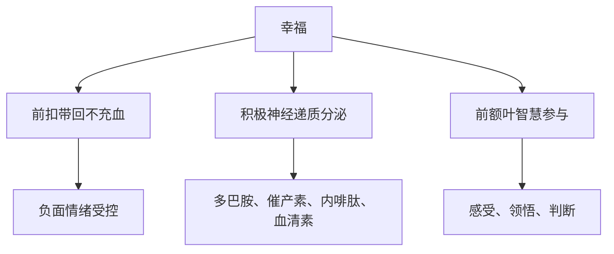
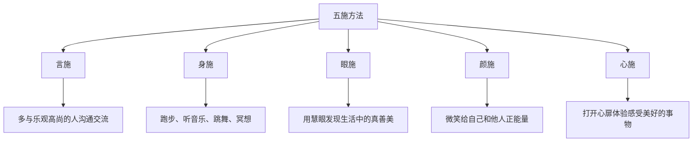

# 第17课：幸福：如何从快乐走向幸福？

## 开头引入

吃一块美味的蛋糕，让你感到快乐；但当你意识到自己已经超重时，这种快乐还能让你感到幸福吗？

收到一份礼物让你开心，但如果这份礼物来自一个你不喜欢的人，你还觉得幸福吗？

这些日常生活中的矛盾体验揭示了一个深刻的道理：**快乐不等于幸福。** 快乐是短暂的愉悦感受，而幸福是一种更深层的、有意义的情感体验。那么，如何从快乐走向幸福？

## 核心概念：幸福是有意义的快乐

中国古代文化中有最早的幸福观念——出自《尚书·洪范篇》的"五福说"：长寿、富足、健康平安、爱好美德、考善终。孟子也提出了"君子有三乐"——父母健在、兄弟无病无灾；做人光明磊落、问心无愧；能够启发引导他人有所作为。

从这些智慧中，彭凯平教授提出：**幸福是对人性的欣赏、满足和认识，幸福是有意义的快乐。**

### 幸福的三大生理要素

### 快乐 vs 幸福

| 维度 | 快乐 | 幸福 |
|------|------|------|
| 性质 | 感官愉悦 | 有意义的愉悦 |
| 持续时间 | 短暂 | 持久 |
| 大脑机制 | 奖励中枢激活 | 前额叶参与 + 意义感 |
| 必要条件 | 满足欲望 | 发现意义 |
| 示例 | 吃美食、买新衣 | 完成有价值的工作、深厚的人际关系 |

> [!quote] 意义感的本质
> 意义就是我们大脑前额叶产生的一种认知，是人类语言、理解和思想的升华。走到水边，你能想到"行至水穷处，坐看云起时"，这就是意义感；如果只是发呆，最多喊一句"这么多水"，那就是缺乏意义感。意义并不神奇，它是大脑的灵性、悟性、感性和德性。

## 幸福与财富的关系：拐点理论与幸福递减定律

### 拐点理论

普林斯顿大学诺贝尔奖得主丹尼尔·卡尼曼的研究发现，幸福与财富没有必然联系。彭凯平教授团队借鉴塞利格曼的幸福词库，构建了中文版幸福词库，并绘制了**中国幸福地图**：

> [!tip] 中国幸福地图的发现
> 杭州、成都、玉溪、烟台、扬州、嘉兴、长沙是中国幸福指数较高的城市，但它们的经济发展水平并不一定比北上广深更高——而这些经济发达的大城市都没有进入幸福城市前列。

研究发现：在经济发展初期，幸福感确实会随经济增长而上升；但当经济达到一定程度后，幸福感与财富的关系就不那么明确了。这就是**拐点理论**。

### 幸福递减定律

这个定律也叫"边际递减效应"：同样一块面包，在饥饿难耐时能带来巨大满足，但在酒足饭饱后面对满桌佳肴，这块面包就不会让你感到幸福了。

> [!warning] 幸福变了吗？
> 幸福的递减效应不是因为真正的幸福感减少了或消失了，而是**人的内心发生了翻天覆地的变化**。那些曾经带给我们快乐和满足的东西，其本身的价值和作用没有变，**变的是我们的感受**——当我们习惯了这种感受，就不再把它当作幸福了。

## 幸福者的画像

心理学研究发现，幸福的人有三大特征：

1. **积极自信**——行动积极，创造力更高
2. **充满创造力**——诺贝尔奖得主与其他人的典型差别，就是他们更快乐、积极、自信
3. **处于美好人际关系中**——结婚的人比未婚的人更幸福，不是因为性满足，而是相濡以沫的感情

哈佛医学院的研究表明：
- 单身女性平均预期寿命比已婚妇女少6-13岁
- 单身男性的死亡率比已婚男性高约20%
- 已婚人士患各种疾病和自杀的危险也更低

## 创造幸福的"五施"方法

彭凯平教授提出了创造幸福的"五施"方法：

| 方法 | 核心 | 做法 |
|------|------|------|
| **言施** | 沟通交流 | 多与乐观、朝气蓬勃、道德高尚的人谈心，多讲积极正面的话题 |
| **身施** | 身体行动 | 跑步15-30分钟，让大脑分泌积极神经递质；听音乐、闻香、跳舞、唱歌、冥想 |
| **眼施** | 用心发现 | 用慧眼禅心积极关注生活中的一点一滴的变化，发现真善美 |
| **颜施** | 学会微笑 | 微笑给自己和他人积极向上的能量 |
| **心施** | 打开心扉 | 去体验、感受、发现生活中有意义、有价值的事情 |

> [!quote] 阿姆斯特朗的《如此美好的世界》
> 幸福说来说去，就是从生活中积累那些美好的、愉悦的快乐体验。积累得越多，就越容易成为一个幸福的人。幸福并不是崇高伟大目标的实现，而是对生活点点滴滴的及时体验——就是此时此刻身心灵的愉悦感受。

## 自检练习

> [!question] 幸福反思
> 请回顾你最近一周的"幸福时刻"。哪些只是单纯的快乐（消费、娱乐）？哪些是真正的幸福感受（有意义的快乐）？你发现自己是在快乐上花的时间多，还是在幸福上花的时间多？

区分指南

- **单纯的快乐**：刷短视频、吃零食、买买买——这些通常来得快去得也快
- **有意义的幸福**：帮助同事解决了难题、和家人进行了深度交流、完成了一项有挑战的工作——这些通常伴随着满足感和价值感

试着用"五施"方法，每天做一件能产生"有意义快乐"的小事。

> [!question] 幸福递减诊断
> 你身边有没有"身在福中不知福"的现象？比如对伴侣的关心习以为常，对父母的爱视而不见？请思考：如果明天这些"习以为常"的幸福突然消失了，你会有什么感受？今天你可以做些什么来重新感受这些幸福？

## 小结

幸福不是快乐的简单累积，而是**有意义的快乐**。它与财富没有必然关系，与美好的人际关系却密切相关。通过"五施"方法——言施、身施、眼施、颜施、心施——我们可以在日常生活中积累幸福的体验。记住：**幸福不是终点，而是旅途本身。** 发现意义、感受当下、与人联结，就是通往幸福最可靠的路径。