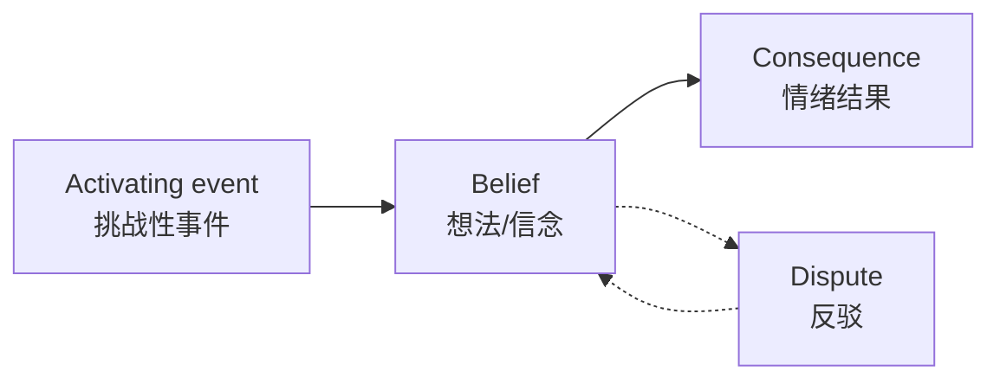

# 第18课：宽恕：如何放下仇恨？

## 开头引入

有人说，婚姻中"恨得咬牙切齿，拿起刀来想杀人；过了几天，气消了又记上心头"。这种又爱又恨的情绪，在我们的亲密关系中并不少见。

面对伤害，我们常常听到两种声音：一边说"以德报怨"，另一边说"有仇不报非君子"。到底是该放下仇恨选择宽恕，还是该记恨在心讨回公道？心理学家告诉我们：**宽恕不是示弱，而是一种更智慧的选择。**

## 核心概念：什么是宽恕？

1980年，美国心理学家斯考特·考夫曼提出：**宽恕就是放弃怨恨。**

著名心理学家鲍迈斯特和艾克斯林认为，宽恕是情绪和行为的一种混合状态——既代表受害者负面情绪的逐渐减弱，也代表行动者积极正面的反应。

> [!quote] 宽恕的本质
> 宽恕的本质，在于受害者对于施害者在动机上有趋于**利他的改变**。这种改变削弱了怨恨和报复的消极动机，同时增加了善待对方的积极动机，有利于二者之间的和解。

宽恕是一种**亲社会的行为**，是一种积极心理资本，是转化过去的负面体验、恢复内心宁静和谐的重要能力。

## 宽恕的性别差异

尤斯拉·尤斯兰博士做过七项关于宽恕的研究，先后调查了1400多名大学生，发现了一个出乎意料的结果：

> [!tip] 谁更记仇？
> 在固有观念中，人们认为女性更容易小心眼、记仇。但研究发现：**男性比女性更不容原谅别人！**

| 比较维度 | 男性 | 女性 |
|----------|------|------|
| 原谅他人的倾向 | 较低 | 较高 |
| 对过失的耿耿于怀 | 倾向更高 | 相对较低 |
| 有自责时的报复性 | 降低 | — |
| 面对轻微冒犯 | 容易原谅 | 容易原谅 |
| 对方道歉时 | 容易原谅 | 容易原谅 |
| 固定交往对象冒犯时 | 容易原谅 | 容易原谅 |

值得注意的是，外向的男性受到冒犯时，比内向的男性更容易忘记。

## 科学依据：宽恕的大脑机制

### 宽恕会启动"遗忘机制"

英国圣安德鲁斯大学的研究人员让30名受试者阅读40种伤害他人的场景，然后评估自己原谅对方的可能性。两周后再次阅读相同内容，发现：

- 一开始**选择原谅**的人，事后回忆细节时出现困难（记忆变得模糊）
- 一开始**选择不原谅**的人，细节回忆仍然相当深刻

研究同时记录生理指标：选择不原谅时，平均心率从每4秒1.75次增加到每4秒2.6次，血压也随之升高。

> [!warning] 宽恕是"忘记"的开始
> 人做出原谅的决定后，大脑会启动**遗忘机制**，让人忘记那些对自己不利的痛苦记忆。即使一下子做不到真正原谅，但只要选择原谅，遗忘那些记忆会变得相对容易。

### 斯坦福宽容计划

美国斯坦福大学进行的"斯坦福宽容计划"发现，参加计划的人中：

- **70%** 的人受伤害的感觉明显降低
- **20.3%** 的人因怨恨带来的身体不适也由此下降

## 宽恕的常见误解

| 误解 | 真相 |
|------|------|
| 宽恕是软弱无能的表现 | 宽恕是一种更智慧的选择 |
| 宽恕是纵容和迁就 | 宽恕不是姑息错误，真正的宽恕是"记得"——提醒我们不要重蹈覆辙 |
| 宽恕等于放弃正义 | 宽恕不否认法律公正的重要性 |
| 只有圣人才能做到 | 宽恕是一种可以学习和培养的能力 |

> [!quote] 真正的宽恕
> 真正的宽恕是**记得**——它提醒我们不要重蹈痛苦和不公正的类似行为。宽恕展示的是一种爱和一种坚强的心理力量，是积极主动、善良伟大的同义词。

## 关键方法：如何做到宽恕？

### 第一步：打破自我宽恕定律

由于人性中趋利避害的特点，我们总是：

- 容易忽略自己的失误
- 容易理解自己的错误
- 轻而易举地原谅自己
- 但会**把更多责任推卸给别人**

这就是心理学中的**自我宽恕定律**。中国古话"只许州官放火，不许百姓点灯"说的正是这个道理。

> [!tip] 打破的方法
> 以责人之心责己，以恕己之心恕人——对人对己，都要多一些理解和宽容。

### 第二步：运用ABCD认知调节法

心理学家艾利斯提出的**ABC理论**可以帮助我们调节情绪：

| 步骤 | 含义 | 示例 |
|------|------|------|
| **A** | 挑战或负面事件 | 一直很要好的朋友，突然做了对不起你的事 |
| **B** | 想法和信念 | "我是不是得罪他了？他是不是变坏了？" |
| **C** | 情绪结果 | 不开心、自我否定 |
| **D** (新增) | 反驳 | "他是不是误伤了我？他的本意也许不是要伤害我" |

> [!warning] ABC vs ABCD
> 在实际运用中，人们容易陷入**消极的ABC循环**，很难有力量去改变自己的想法B。因此在ABC理论基础上，积极心理学提出了**升级版ABCD理论**——加入D（Dispute，反驳）这一步。通过给自己一个反驳的机会，引导自己改变认知模式，久而久之，你会发现自己身上有了更多的宽恕和仁慈。

## 自检练习

> [!question] 宽恕反思
> 想一想：你心中是否有一个一直无法原谅的人或一件事？请尝试用ABCD模式来分析这个事件——特别是D（反驳）环节：有没有另一种可能性？你的痛苦记忆是否因为"不原谅"而被反复强化？

ABCD分析模板

1. **A事件**：具体发生了什么？（客观描述，不加评判）
2. **B想法**：你对这件事的解释是什么？（通常是自动产生的负面想法）
3. **C结果**：这种想法带来了什么情绪？（愤怒、委屈、伤心？）
4. **D反驳**：有没有其他可能的解释？有没有可能是误伤？对方的背景和动机是否有你不了解的部分？

即使最终不能完全原谅，这个分析过程本身就能减轻情绪负担。

> [!question] 自我宽恕检视
> 你是否也对自己"宽以待己，对别人严以律人"？想一想最近一次你生气别人的某个行为——你自己是否也曾经做过类似的事情？

## 小结

宽恕不是软弱，不是示弱，更不是投降。它是一种**积极的心理资本**，一种转化痛苦体验、恢复内心宁静的能力。当我们选择宽恕时，大脑会启动"遗忘机制"，帮助我们放下痛苦记忆。通过打破自我宽恕定律、运用ABCD认知调节法，我们可以学会真正的宽恕。宽恕那些伤害我们的人，最终受益的不是他们，而是我们自己——它让我们更加卓越、优秀、快乐和幸福。