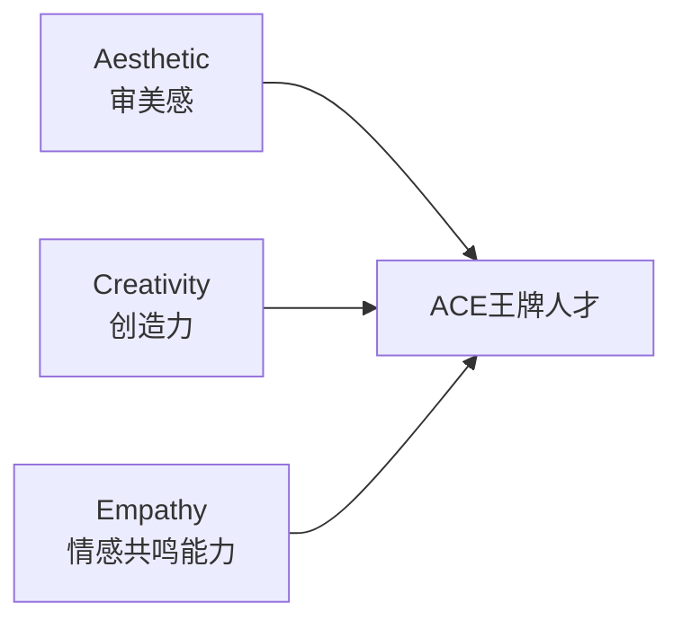

# 第20课：欣赏：为什么欣赏别人会让自己变得更好？

## 开头引入

陶渊明说："奇文共欣赏，疑义相与析。"

你有没有这样的经历：看到一幅画、听到一首歌、读到一段文字，内心突然被触动，有一种说不出的愉悦感？或者，当你真诚地赞美别人的才华或品格时，自己反而感到了一种莫名的满足和提升？

欣赏不只是对他人的赞美，更是一种**深刻的心理能力**。它不仅让我们发现世界的美，更让我们自己变得更好。这是为什么？

## 核心概念：欣赏之心与审美体验

### 美是什么？

神经心理学研究发现：**美就是大脑容易加工的东西。**

| 美的特征 | 大脑加工特点 |
|----------|-------------|
| 平均 | 代表"典型"原型，易于识别 |
| 对称 | 减少处理负荷，提高效率 |
| 纹理脉络 | 提供结构化信息 |
| 透视 | 深度信息处理 |
| 黄金分割比例 | 最优视觉处理比例 |

美的事物之所以让我们产生愉悦感，是因为它们能够**激发多巴胺的分泌**，让我们的大脑感受到舒适和放松。

### 欣赏的深层作用

积极心理学把欣赏美作为人类**24项品格优势之一**。美感强的人不仅会欣赏美，还会创造属于自己的美。美对人类的心智有启蒙作用——当我们的眼睛能看见、耳朵能听见、双手能触摸、心灵能感受，我们的心理就会变得越来越柔软，越容易被感动，成为一个自由而敏感、极富创造力的人。

> [!quote] 蔡元培的美育观
> 著名教育家蔡元培先生强调：美育是最重要的、最基础的人生观教育。

## ACE理论：21世纪王牌人才

彭凯平教授提出，21世纪需要培养的杰出人才是**ACE（王牌）人才**：

| 维度 | 含义 | 重要性 |
|------|------|--------|
| **A - 审美感** | 看到别人看不到的东西，领悟别人领悟不到的东西 | 发现美的能力 |
| **C - 创造力** | 分析问题、解决问题、创造新概念和新事物 | 创新的能力 |
| **E - 情感共鸣能力** | 敏锐感受并影响他人的情感 | 协作和领导力 |

> [!tip] 为什么21世纪更需要ACE？
> 19世纪是工业时代，20世纪是信息时代，而21世纪是**感性时代**。在这个时代，拥有欣赏之心、意义感、快乐感、同理心、共鸣心的人，才是时代的主人。我们缺的不是工人、农民、会思考的人，我们缺的是有审美感、创造力和情感共鸣能力的王牌人才。

## 两个著名的"难题"

### 李约瑟难题

英国著名学者李约瑟编著的《中国科学技术史》提出：从公元6世纪到19世纪，中国在世界重大科技成果中占比一直在54%以上；但到了19世纪，这个比例下降到仅0.4%。为什么科学和工业革命没有在近代中国发生？

### 钱学森之问

钱学森曾问："这么多年培养的学生，还没有哪一个的学术成就能够跟民国时期培养的大师相比——为什么我们的学校总是培养不出杰出的人才？"

杨振宁先生对此有独到见解：科学是人类知性文化的最高成就，以逻辑概念概括事物的本质和因果联系；而审美则是以意象把握事物的形式及秩序。我们的教育注重培养抽象思维，但在**审美能力的培养上有所欠缺**。

> [!quote] 杨振宁的建议
> "我以为年轻朋友们应该对科学的不同层次的美拥有鉴赏力。常常有年轻朋友问我，应该研究物理还是研究数学？我的回答是：这要看你对哪个领域的美和妙有更高的判断能力和更高的喜爱。"

## 科学依据：阅读小说提升审美与同理心

加拿大多伦多大学的认知心理学家凯斯·奥特雷用数十年时间研究了小说的心理学效应，发现：

**人物情节丰富的故事能够提升心智和人的同理心与共情能力。**

测量方法——"眼睛智力测试"：让参与者观看36张人眼的照片，从四个词语中选择照片上的人在想什么、感受到什么。

结果发现：

- 读小说的人比没读小说的人**得分显著更高**
- 即便控制了个体差异和性别差异，效果仍然存在
- 小说甚至能让读者形成针对不同民族和文化的人的同理与共鸣

> [!tip] 欣赏的机制
> 当我们阅读他人的故事时，会产生代入感——想象自己在故事中的位置或角色。这让我们更好地理解他人的感情、感受、欲望和行动倾向，从而产生合作的意愿。**能够欣赏别人的美好，可以让自己变得更加美好。**

## 如何提升欣赏之心？

### 方法一：去除功利心

不要把艺术学习当作谋生手段或加分方法。把艺术当作一种生活方式、一种欣赏、一种个人的休闲体验——这才是审美的真正用途。

### 方法二：多读好故事

读小说、看电影、听故事——通过代入他人的世界来提升自己的同理心和审美能力。

### 方法三：培养"慧眼禅心"

- **慧眼**：关注生活中的真善美，看到一点一滴的变化
- **禅心**：用心去感受、领悟、升华这些美的体验

## 自检练习

> [!question] 欣赏之心自检
> 今天你发现了什么美好的事物？一片好看的云、一首动人的歌、一个温暖的微笑？试着用文字记录下你今天的"美的发现"——你看到了什么？感受到了什么？它触动了你内心的哪个部分？

美的日记示例

- **看见**：下班路上看到夕阳把天空染成了橙红色
- **感受**：突然感觉内心很平静，一天的疲惫都消散了
- **触动**：意识到生活中其实有很多这样的美好时刻，只是平时太匆忙，错过了

每天记录一个"美的发现"，一周后你会发现自己的幸福感和欣赏能力都提升了。

> [!question] 突破李约瑟难题的思考
> 杨振宁先生说选择研究方向要看"对哪个领域的美和妙有更高的判断能力"。你目前从事的工作或学习中，最让你觉得"美"和"妙"的是什么？这种审美感受是否曾经帮助你做出过更好的判断或决策？

## 小结

欣赏是一种深刻的心理能力——它让我们发现世界的美，也让自己的心智得到提升。美是大脑容易加工的东西，美能激发多巴胺，美能产生心灵的震撼。作为21世纪的"ACE人才"——审美感、创造力、情感共鸣能力——欣赏之心是这一切的起点。美国学者丹尼尔·平克在《全新思维》中将美感的欣赏之心列为人类决胜未来的**六种基本能力之首**。培养欣赏之心，不仅能让我们自己变得更好，也是提升整个民族创造力的重要途径。