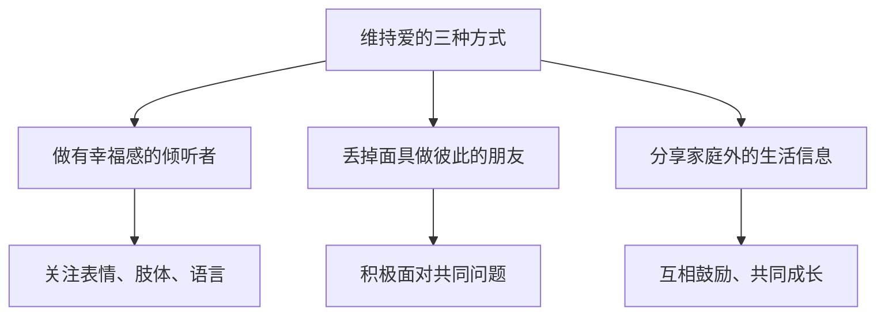

# 第21课：爱：如何维持爱的感受？

## 开头引入

"我爱的"还是"爱我的"——这个经典的爱情难题，你站在哪一边？

美国宾州州立大学的研究发现了一个有趣的性别差异：超过一半的男性在认识对方几周后就会说"我爱你"，而女性通常要交往好几个月才会有这种冲动。**一见钟情，绝大多数发生在男人身上。**

但无论男女，都对爱心生渴望。爱不是一种虚无缥缈的感觉，而是有深刻的心理学和神经科学基础的。那么，爱到底是什么？我们如何选择爱人？又如何维持爱的感受？

## 核心概念：爱情的心理学理论

### 性别差异：谁更爱？

| 维度 | 男性 | 女性 |
|------|------|------|
| 说"我爱你"的速度 | 几周后 | 数月后 |
| 对婚姻的态度 | 更憧憬，婚后更不愿离婚 | 更为谨慎，不太乐观 |
| 为爱牺牲的比例 | **高达75%** | 约25% |

> [!quote] 
> 莫道男儿多无情，殉情往往是须眉。

虽然男女在爱情态度上存在差异，但爱情本身是人类灵性的产物，是一种基本的情绪体验。爱情不仅仅是一种积极情绪，它也和饥饿感、性欲望、求生本能一样，是**人类最原始的生命本能**。

### 爱情三角理论

认知心理学家罗伯特·斯腾伯格提出了著名的**爱情三角理论**——爱情由三个核心成分组成：

```mermaid
graph TD
    subgraph ”爱情三角”
        A[亲密 Intimacy] --> D[完美的爱]
        B[激情 Passion] --> D
        C[承诺 Commitment] --> D
    end
    A --> A1[情感联结<br>分享与理解]
    B --> B1[生理唤醒<br>吸引力]
    C --> C1[决定与责任<br>长期维持]
```

| 成分 | 含义 | 特点 |
|------|------|------|
| **亲密** | 情感上的联结、分享和理解 | 相对稳定，可以持续增长 |
| **激情** | 生理上的唤醒和吸引力 | 最强烈的感受，但也是最容易消失的 |
| **承诺** | 维持关系的决定和责任 | 需要意志力维持，越经营越深厚 |

三种成分的组合形成了不同类型的爱：

| 组合 | 类型 | 说明 |
|------|------|------|
| 只有激情 | 迷恋 | 一见钟情，但难以持久 |
| 只有亲密 | 喜欢 | 朋友之爱 |
| 只有承诺 | 空洞之爱 | 没有感情的关系 |
| 激情 + 亲密 | 浪漫之爱 | 热恋期 |
| 亲密 + 承诺 | 伴侣之爱 | 长期稳定的关系 |
| 激情 + 承诺 | 愚蠢之爱 | 草率的决定 |
| **三者兼备** | **完美之爱** | 最理想的状态 |

> [!warning] 激情会消退
> 当激情长期持续时，会产生激情的消退。这就是为什么有人说"婚姻是爱情的坟墓"——其实不是婚姻本身，而是因为在一起时间太长，激情很难一直保持高亢奋状态。但激情只是爱的一个成分，亲密感和承诺感同样是美满婚姻的重要组成部分，而且是不容易消失的部分。

### 爱情风格理论

美国心理学家亨德里克夫妇提出了爱情六类型：

| 类型 | 特点 | 选"我爱的"还是"爱我的" |
|------|------|----------------------|
| **浪漫型** | 追求理想爱情 | 我爱的 |
| **游戏型** | 把爱情当游戏 | 不一定 |
| **伴侣型** | 从友情发展而来 | 爱我的 |
| **现实型** | 讲究实际条件 | 爱我的 |
| **实用型** | 注重实用价值 | 爱我的 |
| **奉献型** | 全身心付出 | 我爱的 |

> [!tip] 怎么选？
> 作为社会心理学家，彭凯平教授的回答是：选择适合自己的爱人。适合自己的、与自己匹配的爱人，就是最好的终身伴侣。爱情不是一个人的独角戏，双方的爱风格会互相影响。要听从自己的内心，探寻哪种互动方式更舒服。

### 最优停止理论

经济学中的**最优停止理论**给了我们一个启示：一百万人口中大约有6000人可以算作你的"最佳配偶"，但我们不可能一辈子去寻找。经济学家认为，最优的"停止点"在**37%** 的时候——也就是在你探索了所有可能选项的37%之后，就应该做出选择。

> [!warning] 完美是良好的敌人
> 不要选择等待，也不要追求完美。我们有时候相信"下面还有更好的"，但事实上，偶然间错过的可能就是我们最好的选择。追求完美，可能就会错过良好的配偶，最后找到的也不一定是真爱。

## 关键方法：维持爱的三种方式

斯腾伯格指出，爱情不仅可以用三角理论来解释，还可以被看作一个**故事**——每个人都拥有属于自己的故事类型，人们基于自己的故事去建构亲密关系。

> [!quote] 故事的相容性
> 如果一对情侣的故事是相辅相成的，即使他们的关系在外人看来很糟糕，也会持续很久；如果故事是不相容的，即使关系看起来美好，也会结束。

那么，如何维持爱的感受？彭凯平教授给出了三个建议：



### 1. 做有幸福感的倾听者

沟通交流时，关注对方的面部表情、肢体语言和语言表达，体现对彼此的关注和欣赏。

### 2. 丢掉面具，做彼此的朋友

不要把对方仅仅当作人生伴侣或事业伙伴，最重要的是把对方看成自己最亲密的朋友。一起面对问题，而不是回避问题。公开说出自己的爱好、经历、关系中的问题以及对婚姻的梦想和追求。

### 3. 分享家庭之外的生活信息

与伴侣分享工作上的项目进展、与领导同事的关系等家庭之外的信息，让伴侣了解你在社会生活中的状态。借此相互鼓励肯定，增加彼此对自己社交能力的自信。

> [!tip] 爱的精髓
> 爱的精髓就是**互相联系、互相表达、互相认同**。两个自我能够维持自己的个人特性，同时还能共同生活，增加彼此的相似性，欣赏对方、支持对方。谈情说爱，一定要把爱的感受**说出来、做出来、聊出来**。

## 自检练习

> [!question] 爱情三角诊断
> 审视你当前的（或理想中的）亲密关系，用爱情三角理论来诊断：你在亲密、激情和承诺三个维度上各得几分（满分10分）？哪一个维度最强？哪一个最弱？你打算如何加强最弱的维度？

<details>
<summary>三角平衡指南</summary>

- **亲密感不足**：试着每周安排一次没有手机的深度对话，分享各自的感受和想法
- **激情消退**：一起尝试新事物——新的餐厅、新的运动、新的旅行目的地——新奇感能唤醒激情
- **承诺感薄弱**：共同规划未来——哪怕只是下个月的周末计划，也能加强"我们一起"的感觉
</details>

> [!question] 故事相容性反思
> 你和伴侣（或你理想的伴侣）之间的"爱情故事"是否相容？你们对爱情的理解、期待和表达方式是否一致？如果不完全一致，你们是否愿意了解彼此的故事，找到一个共存的方式？

## 小结

爱是人类最原始的**生命本能**之一，也是需要用心经营的**心理能力**。斯腾伯格的爱情三角理论告诉我们，完美的爱需要亲密、激情和承诺三者兼备——激情虽易消退，但亲密和承诺可以通过经营不断加深。选择爱人时，适合自己的才是最好的，不必追求完美。维持爱的感受，需要我们做有幸福感的倾听者、做彼此的朋友，并主动分享生活中的喜怒哀乐。好的婚姻关系，需要我们减少批评、鄙视、辩解和冷战，通过积极沟通增加了解，营造彼此信任、相互扶持的亲密感。