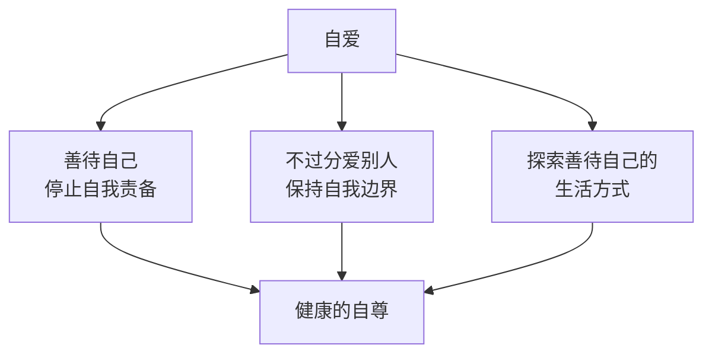

# 第22课：自爱：如何做到爱自己？

## 开头引入

我们从小就被告知要"爱人如己"，要关心他人、照顾他人。但有没有人告诉过你：**不爱自己，就没有能力真正爱别人？**

有一个真实的故事：一位牧师，竭尽全力照顾患抑郁症的妻子和两个无所事事的儿子——帮他买新车、付保险费、陪妻子进城听歌剧（尽管自己讨厌进城），甚至帮他们打扫房间。然而，一家人却都痛苦不堪，全部成了心理治疗的患者。

问题出在哪里？牧师接受心理治疗后终于意识到：**爱绝不是无原则地接受，也包括必要的冲突、果断的拒绝和适当的批评。让家人健康，先要爱自己。**

这是一个关于"爱自己"有多么重要的典型案例。

## 核心概念：自爱是什么？

积极心理学认为，**自爱**不是追求高人一等、瞧不起别人，也不是孤芳自赏、自怜自艾。自爱是一种**自我关怀**，包括对自己优缺点的理解和接受，对快乐与痛苦的坦然面对。

| 概念 | 特征 | 与自爱的区别 |
|------|------|-------------|
| **自爱（Self-Love）** | 自我关怀，肯定自我价值 | —— |
| **自恋（Narcissism）** | 自我陶醉，傲慢骄狂 | 自恋是过度膨胀，自爱是客观认识 |
| **自卑（Inferiority）** | 否定自我价值，缺乏信心 | 自卑是自爱的缺失 |
| **自私（Selfishness）** | 只考虑自己利益 | 自爱不意味着损害他人 |

> [!quote] 自爱的实质
> 自爱是以慈悲之心，理解、接受自己的优点和不足、快乐与痛苦。它是对自我价值的一种肯定，是一种**健康的自尊**。它提醒我们：我们的生命具有价值，应该得到别人的尊敬，我们是有能力实现幸福和个人目标的。

### 自爱的三个层次

## 自爱不等于自我陶醉

美国心理学家、现代自我评价运动之父纳撒尼尔·布兰登深耕自尊研究近50年。他认为：

> [!quote] 布兰登论自尊
> 积极的自尊是一种觉得自己能够应付生活中的基本挑战、值得享受快乐的感觉。健康的自尊不是自我陶醉或傲慢骄狂，而是对自己的能力和弱点有客观认识，并且发挥长处、努力克服问题。

健康的自尊与以下积极体验相关联：

| 积极品质 | 表现 |
|----------|------|
| 理性与现实感 | 客观看待自己与环境 |
| 直觉与创造性 | 相信自己能创造价值 |
| 独立与灵活性 | 不盲从，能应变 |
| 知错就改 | 不自欺，能成长 |
| 合作与善良 | 既爱自己，也爱他人 |

## 自我关怀的科学依据

美国德克萨斯大学人类发展与文化教授克里斯汀·内夫（Kristin Neff）是自我关怀研究领域的先驱。她认为：**自爱是自尊的基础。** 虽然我们自己存在缺陷和不足，但我们仍会认为自己是有价值的，喜欢真实的自己。

### 生理层面的效果

来自埃克塞特大学和牛津大学的研究，将135名大学生分成五组，每组听不同的指令：

- **自爱组**：对自己和所爱的人进行积极思考
- **批判组**：听触发内心批判性声音的指示
- 等对照组

结果发现：

| 测量指标 | 自爱组 | 批判组 |
|----------|--------|--------|
| 心率 | **每分钟少2-3次** | 加快 |
| 心率变异性 | 更大（心脏能适应不同情况） | 更小 |
| 出汗 | 较少 | 更多（焦虑表现） |
| 自我同情心 | 更高 | 更低 |
| 与人联结感 | 更强 | 更弱 |

> [!tip] 自爱让心脏更健康
> 心率过快会使身体输血效率降低，氧气供给效率下降，长期下去心脏细胞甚至可能因缺氧而死亡，增加心脏病发作风险。自爱之心让我们关闭危险的自动反应，增强免疫力，让身体有最好的康复机会。

## 关键方法：如何做到爱自己？

### 方法一：善待自己，停止自我责备

美国路易斯安纳州立大学和杜克大学的心理学家做了一个实验：邀请关注自身体重的年轻女性参加"糖果味道测试"。实验前，一半参与者收到一条消息："你们有时会因为吃了一整个甜甜圈而产生罪恶感，但不要苛求自己，要记住每个人都有放纵的时候。"另一半没有收到。

结果：

- 收到**自我关怀信息**的女性：只吃了**28颗**糖果
- 吃了甜甜圈后产生**罪恶感**的女性：吃了近**70颗**糖果

> [!warning] 自责的陷阱
> 放弃了自责的人，反而更注意自己的身体；而自我责备的人，反而更容易放纵欲望。抵抗诱惑的能力在自我责备时会下降，在自我关怀时会增强。

### 方法二：不要过分爱别人

内夫副教授的调研发现：
- **70%** 的人对别人比对自己好
- 只有 **2%** 的人对自己比对别人好
- **20%** 的人待别人和待自己差不多

人本主义心理学家艾瑞克·弗洛姆在风靡全球的《爱的艺术》中指出：**自爱是爱他人的基础。** 如果一个人有能力爱他人、爱世界，那他必然也爱自己。但如果一个人只爱别人，他其实没有爱的能力——因为你无法给别人你自己没有的东西。

> [!quote] 《少有人走的路》中的故事
> 心理治疗大师斯科特·派克在他的书《少有人走的路》中记载了牧师的案例。牧师在无微不至的照顾下，一家人却都很痛苦。接受建议后，牧师不再有求必应，而是把更多注意力放在自己身上。不久后，大儿子回大学就读，小儿子找到工作，妻子也感受到了独立自主的好处。牧师本人也大大提高了工作效率，感受到了真正的快乐。
>
> **爱得过分，其实还不如不爱。该拒绝时一味给予，不是仁慈，而是伤害。**

### 方法三：探索善待自己的生活方式

| 做法 | 具体行动 |
|------|----------|
| **原谅自己** | 事情未必每次都能成功，这不代表努力白费 |
| **自我倾诉** | 不如意的一天过后，写一些对自己说的话 |
| **反思负面想法** | 把负面想法写下来，分析它可能带来的伤害 |
| **善待感官** | 闻花香、看景色、听音乐、触摸自己 |
| **找到专属方法** | 花时间找到那些能让你爱护自己的方式 |

## 自检练习

> [!question] 自爱程度自检
> 请诚实地问问自己：你对自己好，还是对别人好？当犯错时，你对自己说的话和对朋友说同样的话时，语气有什么不同？你是否经常在心里对自己说"我不够好"、"我太差了"？

自爱改善计划

1. **语言替换**：当你听到内心的批评时，试着把语气换成对朋友说话的语气——"你已经尽力了"比"你怎么这么差"更有效
2. **每天写三个"我欣赏自己的地方"**——哪怕是"今天我没熬夜"这样的小事
3. **设立边界**：在答应别人之前，先问自己："我有没有精力？我愿不愿意？"
4. **自我关怀时刻**：每天留出10分钟，做一件只为自己做的事——听歌、泡茶、散步

> [!question] 关系反思
> 你身边有没有像牧师一样"爱得过分"的人——或者你自己就是？回想一下，你是否曾经因为"为对方好"而包办了一切，结果反而让双方都不开心？如果重新来过，你会做出哪些不同的选择？

## 小结

自爱不是自私，不是自恋，而是**健康自尊的基础**。它是理解、接受自己的优点和不足，是相信自己有价值、值得被爱。科学研究证明，自爱不仅对心理有益——减少焦虑、抑郁，还能直接影响身体健康——降低心率、减少压力激素、增强免疫力。通过善待自己、停止责备、不过分牺牲自我、探索善待自己的生活方式，我们可以更好地爱自己，进而才有能力真正地爱他人。正如弗洛姆所说：**自爱是爱他人的基础。你无法给别人你自己没有的东西。**

从今天开始，对自己好一点——这不是自私，这是爱的起点。