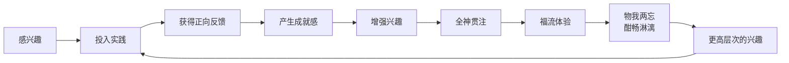
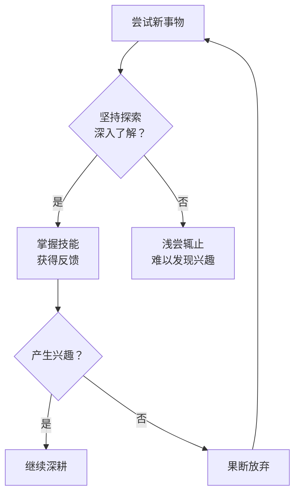

# 第23课：兴趣：从感兴趣到福流体验

## 开头引入：你真正喜欢的是什么？

每个人都有自己的兴趣——有人热爱音乐，有人痴迷运动，有人醉心阅读。但你是否想过：**兴趣究竟从何而来？** 是天生的，还是后天培养的？

彭凯平教授分享了自己的亲身经历：1979年他考入北京大学时，第一志愿是物理学和地球物理学系，梦想研究地震。不料却被调剂到刚成立的心理学系——没有任何学生报考，只能从各院系"调配"。招生老师一句"心理学和物理学差不多，都是理学"把他"骗"了进去。

结果第一次普通心理学考试，他只考了60分。**他对心理学毫无兴趣。**

然而，后来的他却成为中国心理学界的领军人物。这一切是如何发生的？

## 核心概念：兴趣的本质

### 兴趣是强化的结果

现代心理学认为，**兴趣是后天形成的**——它是人们经过努力得到回报之后的强化结果。努力了，有收获，就会产生自我成就感，增强自信心，进而产生兴趣。

研究发现：
- 孩子的兴趣与**亲生父母**的相关性很大，但与**养父母**的相关性不明显——这证明兴趣受遗传影响
- 但**后天影响更大**——兴趣是经验与回报共同作用的结果
- 职业兴趣大约在**高中或高中以后**才会正式形成

> [!tip] 给父母的启示
> 最重要的不是替孩子决定兴趣，而是**让孩子有更多不同的经验，得到不同的回报**，从而发展自己的兴趣。

### 霍兰德的职业兴趣理论

美国约翰·霍普金斯大学的约翰·霍兰德教授在1959年提出了具有广泛影响的职业兴趣理论。他认为人格类型、兴趣与职业发展密切相关，将职业兴趣分为六种：

| 类型 | 特点 | 典型职业 |
|------|------|---------|
| 现实型 | 动手操作，实际务实 | 技工、修理工、农民 |
| 研究型 | 思考探索，分析推理 | 教师、工程师 |
| 艺术型 | 创意表达，审美感受 | 演员、画家、作家 |
| 社会型 | 人际互动，助人关怀 | 社会工作者、心理咨询师 |
| 企业型 | 领导管理，影响他人 | 管理人员、营销人员、项目经理 |
| 常规型 | 条理有序，规范执行 | 会计、办公室文员、公务员 |

### 兴趣与创造力的关系

许多科学研究证明，**有兴趣爱好的科研工作者**，其生理和心理指标往往优于没有兴趣爱好的人——血压水平、幸福感水平都更优。世界上很多科学家指出，兴趣为他们提供了重要的放松渠道，同时还能获得成就感和满足感，偶尔还能从中获得科学灵感。

2019年一项名为"当缪斯罢工时"的研究发现，在物理学家和作家中间，创造性的见解往往是在**锻炼、洗澡、散步或体育活动时**获得的——这样的兴趣活动让大脑有了漫游的自由。

> [!warning]
> 尽管兴趣爱好的好处如此之多，依然有很多人把兴趣爱好视为"不务正业"。2016年《自然》杂志调查显示，超过三分之一的研究人员每周工作时间超过60小时。加拿大阿尔伯塔大学副校长阿里克斯·克拉克指出："关键是不应该因为除了研究工作还有其他兴趣爱好而感觉不好。"

## 福流体验：兴趣的巅峰状态

### 什么是福流？

美国心理学家米哈伊（Mihaly Csikszentmihalyi）在1975年发表了他长达15年的追踪研究报告，提出了**澎湃的福流体验**（Flow）。

他发现：凡是那些把自己的事业做到极致的人，往往不是因为智商、情商、家境、学历比别人卓越，而是因为他们**特别喜欢做自己喜欢做的事情**。如果一个人做一件事情能够沉浸其中、物我两忘、心无旁骛、酣畅淋漓，那就说明这件事让他产生了澎湃的福流体验。

### 福流体验的特征

当人们做自己喜欢做的事情时，最容易产生福流：
- **忘掉时间**：完全意识不到时间的流逝
- **忘掉空间**：感知不到周围环境的变化
- **愉悦沉浸**：特别开心，特别欣赏行动本身
- **酣畅淋漓**：完成后有一种快感

孔子说："**知之者不如好之者，好之者不如乐之者。**"知道它的人不如爱好它的人接受得快，爱好它的人不如以此为乐的人接受得更快。

## 关键方法：如何培养兴趣并获得福流

### 方法一：开放心态，不要浅尝辄止

斯坦福大学心理学家卡洛尔·德维克的研究表明，**培养兴趣比寻找兴趣更重要**。美国心理学家安吉拉·达克沃斯认为，兴趣不仅仅是爱好，也包括**坚韧不拔的坚持**。

一开始对事情可能没兴趣，可能是因为不了解。等逐渐了解并掌握了一项技能之后，会觉得原来通过自己的努力可以战胜困难，事情就会变得有趣起来。当然，如果做完之后依然不感兴趣，那就放弃——说明这确实不是你的真正兴趣。

### 方法二：关注当下，聆听福流的声音

在尝试了解一件事情时，需要**专注当下，感受内心**。心理学提倡的"专念练习"——分分秒秒地意识到过程本身。比如练习乐器时，与其三心二意地敷衍了事，不如静静感受指尖划过琴弦、琴弦振动发出的悦耳琴声，甚至可以感觉到琴声在指尖流淌的过程。

如果你通过努力感受到了福流，那么恭喜你，你真的找到了自己的兴趣所在。**体验过福流的人，时间就会成为祝福**，让你把喜欢做的事情越做越好。

## 案例：彭凯平教授的"发现兴趣之旅"

1979年，彭凯平教授从湖南岳阳考入北京大学。初中时他对地震研究特别感兴趣，甚至发明了一种简单的地震检测仪——把一个电极圈放在平板上，中间放一个酒瓶，每当板子震动，瓶子就会掉落撞击电极圈，电极圈连着一个铃铛。第一次地震检测仪就响了，把左邻右舍都惊动了——后来发现原来是一只老鼠把瓶子撞倒了。

进入北大心理学系后，他完全不感兴趣。但通过认真学习，他发现心理学其实非常科学——特别是实验心理学，大量使用数量计算和自然科学范式。后来他去图书馆找了很多心理学书籍，发现这个学科真的很有意义。

恰逢1979年是德国心理学家**威廉·冯特**创建科学心理学一百周年纪念年。当年的《心理学报》在光明日报上刊登了目录，有著名心理学家荆其诚教授的颜色光谱分析，还有邵郊老师的老鼠动物学习模型。看了这样的目录，他觉得"这个学科非常自然科学，真的跟物理学差不多"。

1984年，他在北大任教时接待了密歇根大学的访问教授**Richard Nisbett**。Nisbett教授讲社会心理学，他用自然科学方法研究社会问题，让彭凯平第一次知道还有这样的学问。以前上课从不记笔记的他，这次全神贯注，记下了密密麻麻的笔记——**说明他已经开始对心理学产生了兴趣。**

> [!quote]
> "我们在发现兴趣的道路上，要尽量保持开放的态度，征询内心的感受。特别是如果你能够意识到自己能够进入一种物我两望、酣畅淋漓、如痴如醉的状态的时候，那么这个事情可能还真的就是你的兴趣所在。"——彭凯平

## 自检练习

> [!question] 反思练习一：你的兴趣地图
> 回顾你过去一年中，哪些活动让你进入了"忘记时间、沉浸其中"的状态？列出3-5件这样的事情，然后问自己：我是如何发现这些兴趣的？是偶然接触还是刻意培养？

探索提示

**福流活动的共同特征**：
1. 有明确的目标
2. 有及时的反馈
3. 挑战与技能相匹配
4. 行动与意识融为一体
5. 不受外界干扰
6. 不担心失败
7. 自我意识消失
8. 时间感扭曲

对照这些特征，看看你的活动符合几条。

> [!question] 反思练习二：培养 vs 寻找
> 你是一个"寻找者"（等待兴趣从天而降）还是"培养者"（愿意投入时间深入了解后再判断）？尝试选择一件你原本不太感兴趣但有益的事情（如某项运动、一门学科），坚持投入两周，每天记录自己的感受变化。

参考答案

很多人的误区是等待"一见钟情"式的兴趣。达克沃斯的研究告诉我们：**激情往往是从坚持中生长出来的，而不是先有激情再坚持。** 尝试用"培养者"的心态对待新事物，你可能会发现意想不到的兴趣领域。

## 小结

- **兴趣是后天形成的**，是努力得到回报后的强化结果
- **霍兰德的六种职业兴趣类型**帮助我们理解兴趣与职业的匹配
- **福流体验**是兴趣的巅峰状态——物我两忘、酣畅淋漓
- **培养兴趣比寻找兴趣更重要**——保持开放心态，专注当下
- **体验过福流的人，时间会成为祝福**