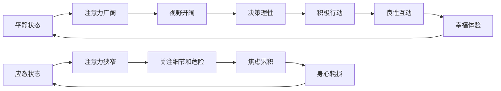
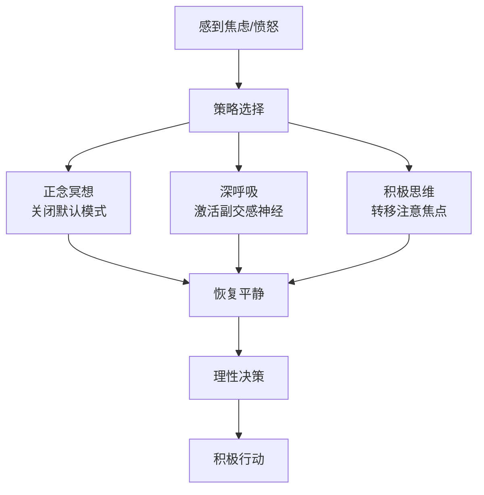

# 第24课：平静：让自己淡定的三类策略是什么

## 开头引入：为什么你总是静不下来？

你是否遇到过这样的场景——被领导当众批评，脸瞬间发烫，心跳加速，呼吸急促，恨不得找个地缝钻进去？或者在等待重要消息时，坐立不安、手心出汗、脑子里一片混乱？

这些反应并不是你的错，它们是**人类进化留下的本能——应激反应**。但问题是，现代社会让我们长期处于这种应激状态中，平静反而成了一种稀缺能力。

南怀瑾先生曾说："人间最大的修行是**弘毅练心**。"所以做人、做事、修行，心是最重要的。中国的心学强调：**世界万事万物，以心为主**——"我心即宇宙，宇宙即我心"。

## 核心概念：什么是平静？

在积极心理学中，**平静指的是一种身心平衡、和谐安全的状态**。它不仅仅是一种生理反应，更是一种平心静气的心理状态。平静可以理解为"平心"和"静气"二者之间的和谐统一。

### 平静的力量

历史上伟大的领导者、思想者、艺术家、运动员和作家，大多具备一个闪亮的品质——**自制力**（Equanimity），一种能够帮助他们控制情绪、保持理智与专注、避免分心，同时加深认知力及洞察力的能力。

查普曼大学的学者皮克耶尔指出，只有时时刻刻保持内心的宁静，才能让人找到自己人生真正的方向，从而把世界看得更加清楚，获得内心的从容感。他比喻说：**每个人在骨子里都需要一个留白的空间——就像一段音乐，正是有了休止符，才能让人产生共鸣。**

### 费斯廷格法则

社会心理学家费斯廷格提出了著名的判断：**生活中的10%是由发生在你身上的事情造成的，而另外的90%是由你对所发生的事情如何反应所决定的。** 所思即所见，所见即所得。

内心平和的人，在面对生活的不顺心时能保持冷静，避免沉浸在消极想法和情绪中无法自拔，从而保持积极心态，反而为他们赢得了生机。这就是《大学》之道所说的：**"知止而后有定，定而后能静，静而后能安，安而后能虑，虑而后能得。"**

## 关键方法：三类让自己淡定的策略

进化心理学家、全球最有影响的思想家之一罗伯特·怀特，经过多年研究与实践，提出了三类让自己平静下来的方法。

### 策略一：正念冥想

怀特的研究发现，**正念冥想可以让人进入放松状态**，关闭头脑中的一些默认模式。当我们能够降低默认模式，进入深度安宁状态时，就能获得极度的快乐、安稳和狂喜。

| 冥想的好处 | 科学证据 |
|-----------|---------|
| 放松身心 | 降低默认模式网络的活跃度 |
| 拓展思路 | 三个月训练后注意力更广阔 |
| 重塑大脑 | 重新创造神经回路 |
| 深度安宁 | 获得极度的快乐和安稳 |

著名神经心理学家、加州大学伯克利分校至善科学中心高级研究员**里克·汉森**博士，从1974年开始冥想，他的研究发现：**冥想能够让我们的大脑回路产生不一样的感觉，重新创造神经回路。**

### 策略二：深呼吸

让自己慢慢地把气吸进来——通过鼻子，通过心肺内脏——能够让我们慢慢地安静下来。

> [!tip] 简单小技巧
> 孩子生气的时候，不妨告诉他"慢慢吸气"；自己在着急的时候，也可以深深吸几口气。这个简单的方法背后有着深刻的生理机制：深呼吸可以激活副交感神经系统，抑制应激反应。

### 策略三：积极思维

多去想一些让我们感到愉悦、快乐的事情，能够让我们放松的事情。这样的积极思维能够使情绪得到很大的缓解，不至于那么激动、亢奋。

"无论海角与天涯，大抵心安即是家。"任何身心合一的练习——比如中国的气功、太极、形意、八卦——其实都可以让我们收获这种心安理得的感觉。

## 科学依据

### 梦中的平静

芬兰图尔库大学和瑞典乌普萨拉大学的心理学教授研究发现，**梦境中的经历能够反映一个人的心理健康水平**。研究人员要求552名身体健康的志愿者连续三周填写问卷，评估情绪和压力水平，并记录前一晚做梦的情况。

结果显示：
- **心态平和的人**：在做梦期间的情绪更积极
- **焦虑程度高的人**：负面情绪更多
- **梦境内容是精神健康程度的衡量标准之一**

> [!tip]
> 日常多注意情绪控制力，减轻焦虑，保持平静，真的可以帮助你**睡个稳稳的美梦**。

### 母乳喂养母亲的启示

研究发现，母亲的平静心态可能会影响孩子一生的命运。如果家长情绪不稳、暴躁，当孩子长期遭受父母的言语打击或怒吼之后，智商都会降低，这些伤害可能还无法逆转。正如马丁教授所说：**"父母无法通过甜言蜜语来弥补那些伤害性的语言。"**

## 为什么我们很难保持平静？

### 应激反应的本能

遇到危险时，我们的交感神经系统被激活，肾上腺释放肾上腺素和去甲肾上腺素，引起心率、血压和呼吸频率上升，体表血流量减少，大量血液运往肌肉。在应急状态下，全身肌肉紧张起来，随时准备做出反应。

古代人类大部分时间处于平静状态，只有紧张时才会出现应激反应。但进化到现代社会，我们**平和的状态越来越少，应激的状态越来越多**，这给生理和心理带来很多问题。应激状态下我们更关注细节，而看不到大的格局；平静时注意力是广阔的。

### 二手焦虑

人是社会性生物，我们的应激状态很容易被感染。美国心理学家杰罗姆·凯根和哈佛大学教授伊能南格的研究发现：人类有**15%到20%** 属于高敏感的人——大约每四到五个人就有一个容易处在不稳定的情绪状态中。这些不稳定反应能感染我们，因为看到别人紧张，我们自己也会紧张；看见别人焦虑，我们也会焦虑。

> [!warning] 二手焦虑
> 要培养一个情绪稳定的孩子，**父母亲的心平气和才是真正的关键**——因为孩子能够很快地感染到、接受到父母的情绪。

## 自检练习

> [!question] 反思练习一：你的应激触发点
> 回顾过去一周，你有哪些时刻突然感到紧张、焦虑或愤怒？是什么触发了这些反应？如果用"10%是事情本身，90%是你的反应"这个框架重新看待这些时刻，你会如何调整？

思考方向

尝试在应激反应发生时**停顿3秒**，做三次深呼吸。这个简单的间隔可以让你从"反应"模式切换为"回应"模式——前者是本能的，后者是经过选择的。

> [!question] 反思练习二：平静练习计划
> 从今天开始，尝试连续七天每天做5分钟正念冥想或深呼吸练习，记录你的感受变化。你觉得哪种策略最适合你？

操作指南

**正念冥想起步指南**：
1. 找一个安静的角落，坐在椅子上或垫子上
2. 闭上眼睛，专注于呼吸——感受空气进入和离开鼻腔
3. 当走神时（这很正常），温柔地将注意力带回到呼吸上
4. 不要评判自己，每次走神都是练习的机会
5. 从每天5分钟开始，逐渐延长

研究表明，连续八周的正念练习就可以改变大脑结构，减少杏仁核的活跃度——这是大脑的恐惧中枢。

## 小结

- **平静是身心平衡、和谐安全的状态**，对创造力、决策力、健康都有积极影响
- **费斯廷格法则**：10%是发生在你身上的事，90%是你的反应
- **三类策略让自己淡定**：正念冥想、深呼吸、积极思维
- **应激反应是进化本能**，但现代社会让它过度活跃
- **二手焦虑**说明平静具有社会传染性——情绪稳定的父母是给孩子最好的礼物
- 任何身心合一的练习都可以帮助我们收获心安理得的感觉