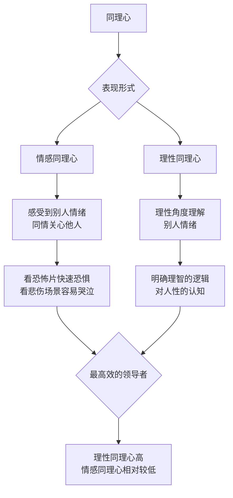

# 第25课：同理心：真正的高情商，是拥有同理心

## 开头引入：一场改变微软命运的面试

1992年，萨提亚·纳德拉（Satya Nadella）去微软面试。在最后一轮面试中，面试官问他："你在路上看到一个小孩在哭，你会怎么做？"

纳德拉想了想说："我会叫警察。"

面试官说："你是个需要培养同理心的人。路上看着一个小孩哭，你应该做的第一件事情就是把他抱起来。"

这场面试彻底改变了纳德拉的命运。他被认为是微软最聪明的工程师之一，从最初的经理到部门副总裁，再到CEO——上任三年后，微软市值翻番，达到17年来的历史新高。

萨提亚认为，自己取得的成绩**很大程度上归功于同理心**。他在员工大会上不止一次讲过这个故事：当我们掌握工具和信息的时候，怎么能够设身处地地为对方着想？纳德拉用他的同理心重塑了微软。他与创始人比尔·盖茨最大的不同在于——**盖茨会说"我来讲讲你今天做错的20件事情"，而纳德拉是善于从那泥潭里发现玫瑰花瓣的鼓励者。**

> [!quote]
> "对合作和建立关系来讲，感知别人的想法和感受是一件至关重要的事情。"——萨提亚·纳德拉

这就是同理心的力量。

## 核心概念：什么是同理心？

同理心（Empathy）是**能够感受到别人的感觉、感情和感受的能力**。

研究发现：
- **一岁的孩子**就能感受到别人的痛苦而去安慰别人
- **两岁半的孩子**开始猜测别人的心理

所以同理心是人类的天性，是社会关系的基础，是道德的前提条件，也是文明的象征。

能够理解别人的感受，我们就有了**自制之心**——能够自觉自愿地控制自己的欲望、冲动和本能。有了这样的本能，道德之心油然而生。这就是**"己所不欲，勿施于人"**——它正是良知的基础。



### 两种同理心

| 类型 | 定义 | 表现 | 优势 | 风险 |
|------|------|------|------|------|
| 情感同理心 | 感受到别人的情绪 | 看恐怖片快速恐惧，看悲伤场景容易哭泣 | 深度共情他人 | 同理心疲惫 |
| 理性同理心 | 理性角度理解别人情绪 | 明确的、理智的、逻辑的人性认知 | 有效领导力 | 可能显得冷漠 |

**实证研究发现：最高效的领导者，往往是理性同理心高、而情感同理心相对较低。**

## 同理心的积极意义

### 道德与良知的基础

美国心理学家、纽约大学的著名心理学教授马丁·霍夫曼指出，**道德问题的答案就在于同理心**。同理心中设身处地为他人考虑的力量，使得人类遵守一定的道德规则——如果会伤害你所爱的人，其实是可以把真实感情隐藏起来，代之以伤害没有那么大的善意谎言。

### 解决人际冲突的入口

心理学发现，无论在人际交往中发生什么问题，只要坚持**设身处地、将心比心**，尽量了解并重视他人的想法，就容易找到解决问题的路径。尤其是在发生冲突和误解时，如果能够把自己放在对方的处境中想一想，也许就可以了解他的立场和初衷，进而求同存异、消除误会。

有了同理心，我们就不会处处挑剔对方，抱怨、责怪、嘲笑、讽刺也会大大减少，取而代之的往往是赞赏、鼓励、谅解、扶持。

### 未来职场的核心竞争力

在未来，人工智能可能会取代很多人类的工作，但**拥有同理心的人**能够以出色的沟通能力、斡旋能力和人际交往能力，在竞争中**获得无可取代的优势**。

### 对儿童发展的影响

社会心理学发现，同理心是人的社会化的一个重要环节。同理心较强的孩子：
- 比别人更善于解决问题
- 表现出更积极的社会行为（分享、关心、帮助、合作）

同理心较差的孩子：
- 更倾向于出现反常、不可控、自私自利的极端行为

美国杜克大学和宾夕法尼亚大学的教授针对同理心做了一项长达**20多年的追踪研究**，记录了750个孩子的成长过程。发现：**在幼儿时期就具有同理心的孩子，长大后大多进入一流学校，顺利毕业，并获得不错的工作。**

华盛顿大学医学工程教授约翰·马蒂拉通过研究发现，**同理心甚至可以改变一个人的学习成绩**——当一个孩子开始接受同理心训练时，你会看到成绩产生非同寻常的变化。

## 同理心的陷阱

耶鲁大学心理学家保罗·布罗姆（Paul Bloom）反对同理心的滥用。他讲过一个故事：

一个名叫谢利·沙默斯的十岁女孩患有一种致命疾病。医生将她列入等待新治疗方法的名单。布罗姆问研究参与者：如果你有机会把她排在名单第一位，你会怎么做？

大约**四分之三的人**要求把她从后面移到前面。但布罗姆指出：这样做就意味着名单上本来排在她前面的每一个孩子都要等待更长时间——其中许多人可能情况比她更紧急。

这就是心理学家所说的**"可识别受害者效应"**——我们对一个特定的人产生怜悯时，却对一堆需要帮助的人无动于衷，因为那些人只是数字。

### 同理心的黑暗面

美国西北大学凯洛格管理学院的亚当·韦茨教授和芝加哥大学的尼古拉斯·艾普利教授合作研究发现：与朋友坐在一起的参与者，更明显地愿意折磨那些所谓的恐怖分子。对内部人的同理心，可能导致对外部人的攻击。

> [!warning] 同理心的偏袒
> 对自己人的同理心，可能损害我们一视同仁的公正心，很可能使我们失去跨部门和跨组织的合作机会。

```mermaid
flowchart LR
    subgraph ”同理心的光明面”
        A1[道德基础]
        A2[冲突解]
        A3[核心竞争力]
        A4[儿童发展]
    end
    subgraph ”同理心的黑暗面”
        B1[可识别受害者效应]
        B2[偏袒自己人]
        B3[同理心疲惫]
        B4[影响公平判断]
    end
```

## 关键方法：如何培养同理心

### 方法一：学会换位思维

能够从对方的角度去理解言谈、举止和行动。一个有效的方法是进行**跨文化沟通**——了解对方的背景、价值观念和行为习惯，尽量追求共同之处。

正如常说的"碰撞的心声"：喜怒哀乐愁、烦愁悲心忧，这是人类情绪的共同之处。**同理心并不是要你去迎合别人的感情，而是希望你能够理解和尊重别人的感情**，在做出决定时充分考虑到别人的感受。

同理心也能让别人理解自己。**真情流露的人，才能得到真情的回报。**

> [!tip]
> 一个国家和地区最重要的且最稳定的影响力，不是震慑、吓唬、强迫别人，而是**感化、感动、感召别人**。

### 方法二：欣赏文学和艺术作品

法国作家罗曼·罗兰说过："艺术的伟大意义，基本上在于它能显示人的真正感情、内心生活的奥秘和热情的世界。"

了解这种情感、行为和社会生活的世界，能够潜移默化地提升我们的同理心。所以经常陪孩子读一读文学作品、欣赏一些艺术创作，不是简单地丰富业余生活，最核心的是**提升他们的同理心**，从而间接提升他们社会生活的能力。

## 自检练习

> [!question] 反思练习一：你的同理心类型
> 思考一下，你是偏情感同理心还是理性同理心？你在什么情况下容易过度使用同理心导致疲惫？又是什么情况下你的同理心不足？

<details>
<summary>自我评估</summary>

**情感同理心强**的迹象：看电影容易哭，看到他人痛苦感同身受，容易情绪被他人感染。
**理性同理心强**的迹象：能理解他人处境但不被情绪裹挟，善于客观分析问题，做决策时能兼顾多方利益。

理想的状况是在两者之间找到平衡。
</details>

> [!question] 反思练习二：同理心培养计划
> 本周找一部文学作品或电影，尝试从其中一个角色的角度重新理解整个故事。写下这个角色的感受、动机和困境。你从这个练习中学到了什么？

<details>
<summary>阅读建议</summary>

推荐阅读：余华《活着》、迟子建《额尔古纳河右岸》或观看电影《绿皮书》《幸福来敲门》。注意观察那些让你产生情绪共鸣的瞬间——那是你的同理心正在工作。
</details>

## 小结

- **同理心是感受到别人感觉的能力**——一岁孩子就具备
- 分为**情感同理心**和**理性同理心**，高效领导者通常后者更高
- 同理心是**道德的基础、冲突解决的入口、未来职场的核心竞争力**
- **可识别受害者效应**提醒我们同理心也有偏袒和陷阱
- **换位思维**和**欣赏文学艺术**是培养同理心的有效方法
- 真情流露的人，才能得到真情的回报