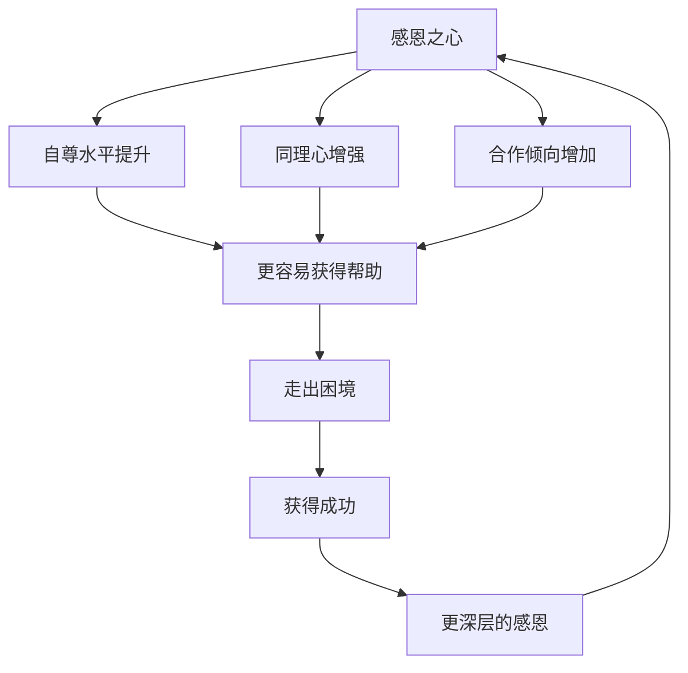
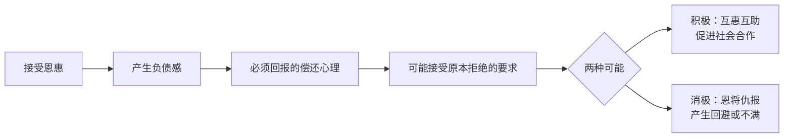

# 第26课：感恩：感恩到底应该在成功之前还是之后

## 开头引入：成功之后才感恩吗？

"等我成功了，一定要好好感谢那些帮助过我的人。"——这是很多人常说的话。

人们通常认为，感恩是**成功之后的事情**——一个人取得成功了，必然感恩，这是很常见的现象。

但积极心理学的研究发现了一个截然相反的结论：**感恩之心，其实是逆境中的生机。** 不是因为你成功了才感恩，而是因为你感恩，才更容易获得帮助、走出困境、取得成功。

这个颠覆性的结论，将彻底改变你对感恩的理解。

## 核心概念：什么是感恩？

感恩（Gratitude）是**对生活中美好事物的感激和欣赏**，是积极心理学中一个很重要的情绪。

哈佛大学医学院的研究员、神经生理学博士禅奇·康言经过研究发现，感恩不仅能让人心灵安定，还会给我们带来四个好处：

1. **增加人与人之间的亲近感、信任感**
2. **消除压力**
3. **增加幸福感**
4. **抑制血压上升，提升心脏功能**

当我们受人感谢和主动感谢别人时，大脑就会分泌**催产素**。催产素能够增加我们的同理心，有益于沟通，是良好人际关系的助推器。

## 科学依据：感恩带来身体变化的证据

美国加州大学伯克利分校的研究人员曾经做过一项有关感恩的研究。研究人员对一群健康的大学生进行了检测，将他们分为两组：感恩组和控制组。感恩组每天记下让他们感动的事情，而控制组则记下日常琐事。

研究结果表明，感恩组的大学生其**下丘脑的活跃水平明显高于**其他人。下丘脑是人体的控制中枢之一，负责调节身体机能——包括饥饿、睡眠、体温、新陈代谢以及身体的生长。**这意味着感恩能促使新陈代谢和其他自然身体机能运行得更顺畅。**

这些人的新陈代谢功能得到提升，饮食中摄入的脂肪量也**平均降低了25%**。

## 感恩与成功的关系

### 感恩是成功的原因，不是结果

彭凯平教授和他的学生刘冠明博士研究发现，**感恩之心往往与一个人的强大的自尊水平、同理心、合作的倾向有直接的相关**，而这些心理品质恰恰是一个人能够得到帮助、从而走出困境、获得成功的关键因素。

用通俗的话来说：**不是因为别人帮助了你，你应该感恩；而是因为你感恩，才可能容易得到别人的帮助。** 感恩心强的人容易让人喜欢，也因此有更多走出逆境的可能。

### 感恩者的优势

美国加州大学的心理学教授、《积极心理学》杂志主编**罗伯特·埃蒙斯**博士将感恩比喻为"成功花朵的快乐种子"。研究表明，怀有感恩之心的人：

| 维度 | 感恩者的表现 |
|------|------------|
| 积极情绪 | 更高水平的积极情绪，更乐观、更快乐 |
| 负面情绪 | 更少的负面情绪 |
| 生活满意度 | 更高 |
| 目标感 | 生活中的更大目标感 |
| 宽恕 | 更多的宽恕 |
| 人际关系 | 更好的人际关系质量 |
| 睡眠 | 睡眠质量更好 |

这些都是人成功所必需的成分。

### 运气与成功的关系

美国康奈尔大学的经济学和管理学教授**罗伯特·弗兰克**博士写了一本书叫《成功与运气》。他认为很多人的成功带有很大的运气成分，因此获得成功的人应该带有一颗感恩和回馈社会的心。

弗兰克强调，运气非常重要，但他不否定努力的作用——绝大多数成功人士都是非常努力的。但很多成功人士没有注意到：**这个世上像他们一样努力的人太多了。** 一个公平的社会应该尽量给每个人平等的机会，如果你经过努力获得了成功，就应该有所回馈，让那些比你不幸的人也有机会品尝成功的滋味。

日本著名企业家**稻盛和夫**就表示，他就是凭借一颗感恩之心才走到了今天，才有可能在这样的价值观下取得如此成就。

## 核心辨析：感恩 ≠ 报恩

很多人经常把感恩之心和愧疚之心、亏欠之心联系在一起。愧疚和亏欠代表的是受惠人对施惠人的一种心理上和情感上的义务。这种愧疚义务之心，在中国文化中常以**报恩、报答**的方式表达出来。

### 互惠法则

美国康奈尔大学的心理学教授丹尼斯·雷根做过一个有趣的实验：

他邀请一些志愿者给画打分。第一组实验人员出去买了一些饮料分给评画的每个人；第二组正常评分。实验结束后，实验人员说自己在帮朋友销售彩票，能不能买几张。

- **第一组（收到饮料）**：很爽快地答应购买
- **第二组（没有饮料）**：千方百计拒绝请求

**雷根教授提出著名的"互惠法则"**：小恩小惠会给人造成一种负债感，而这种负债感会使人们更轻易地接受在平时可能会拒绝的要求。即使是对自己讨厌的人也是如此。

按照进化心理学的观点，**互惠具有进化上的适应性**——在进化过程中，最可能生存下来的人往往是那些能与邻居互惠互利、守望相助的祖先。

### 两者的根本区别

| 感恩 | 报恩 |
|------|------|
| 对拥有的满足 | 对亏欠的偿还 |
| 快乐的、轻松的、幸福的体验 | 有压力的义务感 |
| 心灵放松 | 心理压力 |
| 伴随快乐、神圣、热情、同情 | 可能伴随焦虑、伤心、孤独、后悔 |

真正的感恩是对人们所拥有的事物的一种满足，**伴随的是心灵的放松，而不是心理的压力。**

> [!warning] 警惕感恩教育的误区
> 当前有些感恩教育过于强调报答之心，特别是给年轻人灌输"感恩就是报答"，这其实是一种**思想控制**，而不是真正培养感恩的心态。真实的感恩不应该让人感受到压力、焦虑、伤心、孤独。

## 关键方法：如何培养真正的感恩之心

### 方法一：每天记录值得感恩的事情

提醒自己生活中那些美好的体验。这样的**感恩日记**能够增加心理动机，将感恩融化在每一天的每一件小事中，容易让人忘掉痛苦和疲倦。

### 方法二：写一封感恩信或打一个感恩电话

美国社会学家亚瑟·布鲁克斯建议：用信件和电子邮件向你所爱的人和同事表达感激之情，让感激之情像早上喝咖啡一样成为生活的习惯。

**永远不要低估你的感激之情会对他人产生的积极影响。** 《心理科学》杂志的一项研究发现，许多收到感谢信的人往往觉得**欣喜若狂**。

> [!tip] 也不要忘记感谢自己
> 所有值得开心的事情都值得感谢。更应该感谢的，其实是我们自己。**多多想想自己的进步、提升价值和贡献**，不妨给自己写一封充满感恩的信，表达自己对自己的善意。爱己及人，自我关怀，让我们感受到与他人和世界的连接。

### 方法三：养成回馈社会的习惯

这种回馈不是简单地回报给施恩的人，而是**仿效他们的精神和行动来回答社会、回馈其他人**。

真正有道德善良的人，都不是施恩望报的人——他们不希望也不需要别人的回报，但肯定很乐意看到其言行对别人的影响，**让爱流传下去**。

> [!quote]
> "感恩不是一种回报和义务，而是一种**感染和升华**。当我们把自己的注意力集中在我们和别人之间正面积极的沟通时，彼此之间产生的就是我们通常所说的正能量。"——彭凯平

## 自检练习

> [!question] 反思练习一：感恩日记实践
> 从今天开始，连续一周，每天睡前写下三件让你感因的事情——可以很大（升职加薪），也可以很小（今天的阳光很好，同事帮你倒了杯咖啡）。一周后回顾，你的情绪有什么变化？

感恩日记示例

**第一天**：
1. 感谢同事帮我整理会议资料
2. 感谢家人做了可口的晚餐
3. 感谢今天天气很好，散步很愉快

**第二天**：
1. 感谢自己完成了本周重要报告
2. 感谢朋友的鼓励电话
3. 感谢地铁上有人给我让座

注意：感恩日记的关键不是记录大事，而是培养**发现美好的眼睛**。

> [!question] 反思练习二：感恩 vs 报恩
> 回想一个你觉得自己"需要报恩"的人际关系。如果用"感恩"而不是"报恩"的心态来看待这段关系，你的感受会有何不同？

指导思路

**报恩心态**："我欠他人情→我必须还→还了才轻松→如果还不了就有压力"
**感恩心态**："别人对我好→我很幸运→我也想把这份善意传递下去→传递的过程本身很愉悦"

两种心态的关键区别在于：报恩看向过去（还债），感恩看向未来（传递）。

## 小结

- **感恩是成功的原因，不是结果**——感恩的人更容易获得帮助、走出困境
- 感恩带来四个好处：亲近感、消除压力、幸福感、抑制血压
- **感恩 ≠ 报恩**——感恩是心灵的放松，报恩是压力的偿还
- **互惠法则**告诉我们小恩小惠会造成负债感，而真正的感恩应该超越这种负债感
- **三种方法培养感恩**：感恩日记、感恩信/电话、回馈社会
- 不要忘记感谢自己——爱己及人，自我关怀