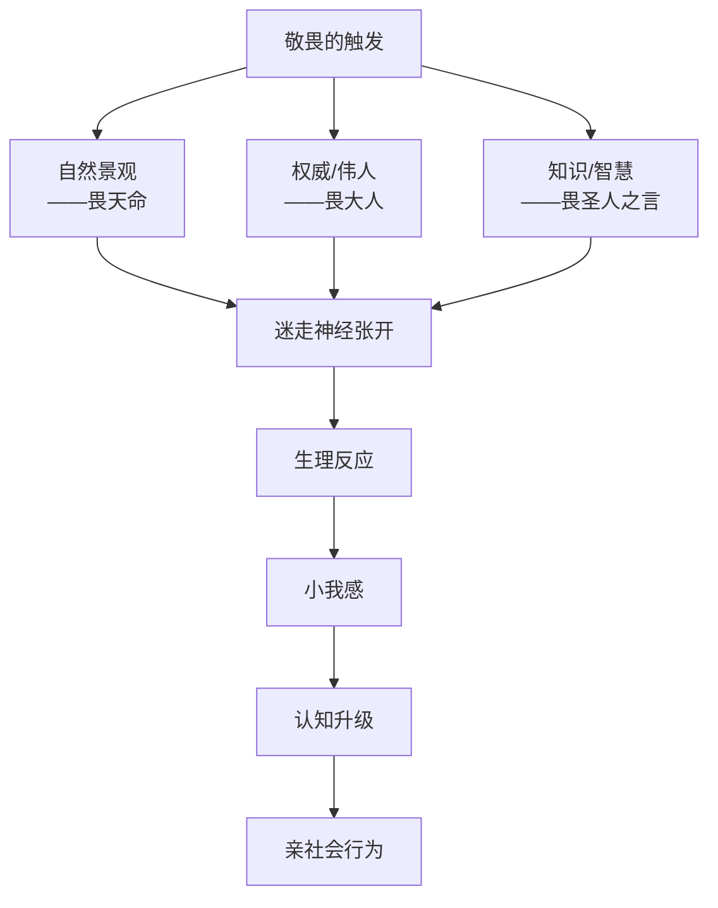
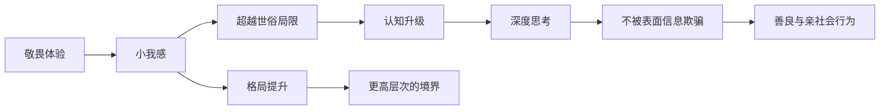

# 第27课：敬畏：为什么孔子提倡君子三畏？

## 开头引入：你是否曾有过这种感觉？

当你站在巍峨的山巅俯瞰云海，当你仰望浩瀚的星空，当你走进庄严的古建筑，或者当你在音乐厅中被气势恢宏的交响乐包围——你是否体验过一种**油然而生的崇高感**？

那种感觉让你觉得自己渺小，却同时让你精神振奋；让你瞬间安静下来，却内心澎湃涌动。这种奇妙的情绪，就是**敬畏**。

积极情绪研究领域的杰出学者芭芭拉·弗雷德里克森教授在其著作《积极情绪的力量》中这样描述敬畏：

> [!quote]
> "当你偶然发现一尊巨大的神像，那种油然而生的肃然敬意，可称之为敬畏。相比之下，你自我感觉渺小卑微，突如其来的敬畏之感不由得使你停下脚步，顷刻之间动弹不得。天地之间的边界似乎消融，感觉身体仿佛融入到某种超然置身的事物之中，你的精神也随着融入当下，这一逍遥浩大之境。"

**敬畏与感激和灵感一样，是一种超越自我的情感。**

## 核心概念：什么是敬畏？

敬畏是一种混合了困惑、钦佩、惊奇、服从等不同情绪的高级情感。当人们看见崇高美好的事物时，就会感受到一种积极的力量——这是由于大脑中**迷走神经张开**的缘故。

### 敬畏的生理表现

当我们产生敬畏时，身体会有自然的反应：
- 嘴唇张开
- 下巴下垂
- 眉毛扬起来
- 眼睛瞪大
- 头向前倾
- 浑身起鸡皮疙瘩

### 敬畏的三种触发源

加州大学伯克利分校的著名心理学家达克尔·卡特教授和纽约大学的乔纳森·海特教授的研究发现，引发敬畏感的外在环境主要有三个：

| 触发源 | 具体内容 | 孔子对应 |
|--------|---------|---------|
| **大智慧** | 鬼斧神工的自然景观——浩瀚江河、巍峨山岗、星辰大海 | **畏天命** |
| **权威** | 上帝、神和伟人，特别是生活中很厉害的领导 | **畏大人** |
| **知识** | 思考、伟大的人类创造 | **畏圣人之言** |

这恰好与孔子提倡的**"君子三畏"**有异曲同工之妙。孔子说："**畏天命，畏大人，畏圣人之言。**"知道这三畏、懂得敬畏，是君子的处世之道。

## 科学依据：敬畏的研究

### 照片分享研究

有调查发现，**《纽约时报》刊登的照片中，那些壮观的宇宙照片被转发的次数是最多的。** 有学者认为，这说明人们喜欢体验敬畏感。

彭凯平教授和他的学生王飞、胡成豪做过一项研究：给志愿者免费送一些自然景观的照片——比如长城、金字塔等。结果发现，**欣赏这些照片会让志愿者产生积极的愉悦的体验**，他们变得更加开心、更加积极。

### 书写敬畏体验的实验

2012年斯坦福大学的心理学家做了一项研究：研究人员随机选派了86名学生，请他们分别撰写一篇有关个人体验的记述文——选题一是**敬畏感**，选题二是**幸福感**。

结果显示：**那些撰写敬畏感的学生，急躁的情绪很快得到缓解，他们也更愿意在有价值的事物上投入更多时间和金钱。** 敬畏感让人们变得更加善良、更加亲社会。

## 案例：宇航员的"总观效应"

彭凯平教授的博士生、中国第一位女宇航员刘洋说，当她在太空中凝望地球的时候，感觉就很不一样——浩瀚无边的地球在太空中就那么一点点，宇宙如此之大，一下子对宇宙的敬畏油然而生。

大多数曾经从太空中俯瞰过地球的宇航员都表示，这种体验使自己产生了深刻的变化。有宇航员这样描述：

> "当我接近顶部后，时间似乎都停滞了。我心中各种情绪和意识在翻腾，但当我低头看见地球时，我被惊世的景色触动了——脆弱而巍峨的绿洲，还有被赋予给我们的岛屿，保护着我们免于外太空的严酷。然后一股深深的抑郁的情绪袭来，我的大脑被一系列无可制范的、使人冷静的矛盾占据。"

这种现象被称为**"总观效应"**（Overview Effect）——当我们从一个从未有过的角度来审视自己、审视之前的生活环境，会突然生出一种**自己太渺小、世界太宏大**的感觉，认知会不知不觉地受到影响并发生改变。

调查发现，很多飞天的宇航员重返地球之后，对人类充满了慈悲之爱，不再追求英雄主义，反而成了环境保护主义者。

### 彭凯平教授的亲身经历

1990年1月，彭凯平教授第一次去美国洛杉矶的环球影城，体验了"外星人回家"（ET Come Home）项目。排队很长时间，他好几次都想一走了之。终于排到了，骑上自行车模样的游乐车，不用踩，模拟外星人飞天。

刚开始觉得没什么了不起，可是当游乐车一拐弯，他被眼前的景象震撼了——

> "前面是一轮明月，闪闪生辉；脚下是万家灯火。自己处在天地之间，俯瞰万物。当时我一下子产生了敬畏感：世界如此浩大，人类一直都在同一片星空之下。作为一个学者，我知道自己微薄的力量不足以撼动整个时代的变化，但我依然坚定地认为，所有的大海都是由一滴一滴的水聚集而成的，而我们就是那汇聚大海的一滴水。上善若水——我们应该像水一样，迎接变化、适应变化、创造变化。"

一种大爱和慈悲在心中油然而生。

## 敬畏与格局

彭凯平教授的学生博洋的博士论文研究的就是敬畏的心理效应。他的研究发现：**当人产生敬畏的情绪之后，会产生一种"小我"的感觉**——让我们忘掉自己现在的处境，融入到一种伟大的境界中，不再关注自己的困境，超越世俗生活的局限，达到超凡脱俗的目的。

所谓的"格局"，可能就是敬畏感的体现。

> [!tip]
> **格局不是思维训练的产物，而是情感体验的结果。** 一个人学习知识，如果没有产生豁然开朗的感受，那其实就等于没有真正掌握。境界、格局、视野，都可以靠敬畏来修炼和修行，否则就只能是纸上谈兵。

## 关键方法：如何培养敬畏之心

### 方法一：接触自然与艺术

并不是每个人都能切身体会从太空遥望地球的敬畏感，但当我们来到认知范围之外，也能产生非常难得的美好体验——看艺术展、听音乐会、游览山川，都可以体验到敬畏感带来的美妙。

### 方法二：体验"重生"（升华）

心理学家海特·卡德勒发现，我们人类原始的敬畏情绪可以迁移到我们敬仰和敬佩的英雄身上。海子说"面朝大海，春暖花开"，就是敬畏的升华作用——当你进入黑暗屋子足够长时间，然后开灯让灯光慢慢亮起来、音乐缓缓响起来，重建光明之后，你会发现自己心思澄明，世界与你同在。

### 方法三：跨出舒适区

短暂的离开平时熟悉的环境和事物，我们会有一种新的高度，能从全新的角度看待问题——这就是"总观效应"给我们的启发。

彭凯平教授的学生Machiel Souto做了一个试验：召集两组消费者分别向他们销售牙膏，一组是明星代言之类的表面信息，另一组是牙膏的成分、作用等真实内容。结果发现：**一般人容易被表面信息说服，而怀有敬畏之心的人不那么容易。** 在敬畏之心的加持下，人们往往更容易做一些深刻的思考。

> [!warning]
> **心神敬畏**绝不是打击人们的信心，更不是叫人们今后缩手缩脚、畏手畏尾，而是希望人们在心灵深处始终保持一种对自然、对法律、对良知、对世界万物的由衷的敬畏，一生都可以挺起腰杆做人，做一个真正受人敬重、自得其乐的君子。

## 自检练习

> [!question] 反思练习一：你的敬畏时刻
> 回顾你的人生经历，找出三个让你产生敬畏感的时刻。它们是与自然相关？与伟人相关？还是与知识相关？这些时刻如何改变了你的认知或行为？

思考框架

**敬畏体验的三个维度**：
1. **感知到的宏大**：让你感到"很大"的事物（星空、海洋、建筑）
2. **需要适应的认知**：无法立即用已有知识框架解释的新体验
3. **自我渺小感**：个体自我在宏大面前的谦卑感

当你同时体验到这三个维度时，敬畏感就产生了。

> [!question] 反思练习二：创造敬畏
> 这个周末，刻意安排一次"敬畏体验"——可以是去一个你从未去过的地方，看一场宏大的演出，或者读一本让你感到震撼的书。记录下来你的身心感受。

行动计划

**推荐方式**：
- 自然型：去山顶看日出、海边看日落、夜间观星
- 人文型：参观博物馆、艺术展、历史建筑
- 知识型：读一本跨学科的经典著作、听一场高水平讲座

关键是要**暂时离开日常生活的小圈子**，让自己暴露在"宏大"面前。

## 小结

- **敬畏是混合了困惑、钦佩、惊奇、服从的高级情感**，由迷走神经张开触发
- **孔子"君子三畏"**：畏天命、畏大人、畏圣人之言——与心理学研究发现的三类敬畏触发源高度吻合
- **"总观效应"**：从全新角度审视生活，产生自我渺小感，进而带来认知改变
- **敬畏提升格局**——格局不是思维训练，而是情感体验的结果
- **敬畏让人更善良、更亲社会、思考更深刻**
- **心神敬畏**是保持内心操守、做正直君子的心理基础