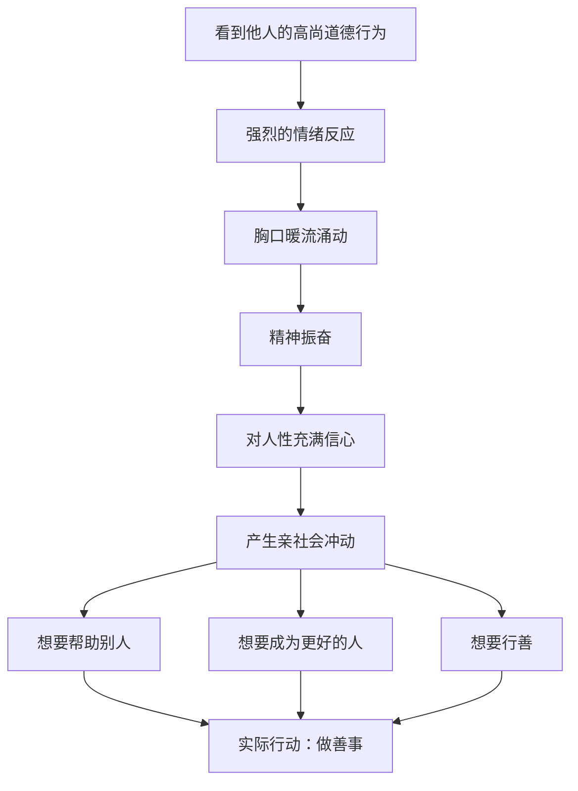

# 第28课：升华：如何让自己感到高尚？

## 开头引入：你是否曾被感动到热泪盈眶？

想象这样一个场景：你看到某个人做了一件极其善良、极其高尚的事——比如陌生人毫不犹豫地跳入河中救起落水儿童，比如有人默默资助贫困学生多年却从不留名。

当看到这些画面时，你的内心是否会有一种**温暖、振奋、胸口暖流涌动**的感觉？眼眶可能湿润，喉咙有些哽咽，内心深处升起一种"我也想像他一样"的冲动？

这种体验，就是心理学中所说的**升华感**。

## 核心概念：什么是升华感？

**升华感**（Elevation）是由他人的崇高、道德、善良、忠诚的事迹所引发的一种强烈的情绪反应。典型的身体体验包括：

- **精神振奋**
- **胸口暖流涌动**——这股暖流流经四肢
- 对人性充满信心
- 产生"我也要成为这样的人"的愿望

看到他人的道德行为，欣赏他人的美德，并感到自己的道德情操被提升的情绪，就是积极心理学所说的升华感。

### 海特教授的"楼梯"比喻

纽约大学的乔纳森·海特教授曾经用"上升和下降"做比喻来解释这种感觉：

> [!quote]
> "如果你把思维想象成一顿有很多房间的房子，大多数房间我们都很熟悉。但有时候，突然有一个门打开——不知从哪儿冒出来的——在我们面前呈现的，就是一排楼梯。我们走上楼梯，并且经历一种意识被改变的过程。就好像我们在攀登精神的楼梯，在攀登的过程中，这个楼梯把我们从一个世俗的或者是普通的底层，带到了一个神圣的高度——一种更高层次的相互连接的高度。"

这就是升华感——**一种上升的感觉，一种被提升的感受。**



## 英雄崇拜：升华的重要形式

斯坦福大学著名的心理学家菲利普·津巴多教授——曾做过著名的"斯坦福监狱实验"——长期坚持做**英雄想象计划**。他说：在人们心中树立一个精神的榜样，这就是**内驱力的来源**。

津巴多教授发现，**穷人家的孩子要摆脱贫穷的困境，一个特别有效的方法就是英雄崇拜**——要给他传播英雄的精神，让他有个榜样，给他内在的精神力量，敢于奋斗，敢于向上。

英雄崇拜是所有文化、所有民族共同的社会心理现象。英雄崇拜产生的升华感，是社会变迁、社会进步、社会发展的**重要心理动力**。这种积极的精神力量能激励个体去学习英雄、效仿榜样、克服困难，努力成为一个更优秀的人。

> [!tip] 给父母的建议
> 在对孩子的家庭教育中，除了挖掘天赋、积极支持和欣赏之外，**给孩子树立一个升华的榜样**——或者说能引起升华感的榜样——是培养孩子内驱力的一种很有效的方法。

津巴多教授还发现：**英雄不一定是那些做出惊天动地伟大事业的人**——在生活中存在着平凡的英雄主义，每个人都可以成为日常的英雄，每天通过做一些小小的善行，让这个世界变得更加美好。

## 科学依据：升华感的生理机制

### 催产素与哺乳研究

研究表明，当我们看到他人的美德行为时，体内会自然产生大量的**催产素**。这种激素让我们安静、温暖，产生爱的感觉。此时人们也更愿意做出利他的行为，更有道德意识，更加善良。

海特教授团队招募了**42名哺乳期的母亲**，要求她们带着孩子一起参加实验。他们将母亲和孩子分成两组——**感动组和娱乐组**。实验前让母亲们带一个哺乳棉质吸奶垫，实验开始后分别观看感人的视频和娱乐的视频。

结果：

| 指标 | 感动组 | 娱乐组 |
|------|--------|--------|
| 报告感动、流泪、默默哭泣 | 显著更多 | 更少 |
| 吸奶垫重量 | 显著增加 | 较少 |
| 主动喂奶比例 | **45%** | 13% |
| 拥抱行为 | 显著更多 | 较少 |

这一行为的生理机制是因为感动的情绪会导致**后叶催产素**分泌增加，从而影响到女性的哺乳行为和拥抱行为。**被感动的母亲更愿意爱孩子、抚摸孩子、给孩子喂奶**，因为分泌的催产素让她们产生爱的感觉。

### 升华感对行为的促进

大量的心理学研究表明，升华感可以让人怀有仁爱和宽恕之心。经历过升华感的人：
- 更有可能去帮助他人
- 更愿意给慈善机构捐钱
- 更愿意做善事成为更好的人

## 升华感与巅峰体验

美国心理学之父威廉·詹姆斯这样描述升华感这样的一种精神动力：**升华感能帮助人们推倒内心的石墙，融化冰硬的内心，从而将过失与道德上的停滞、堕落一扫而光。**

从这个意义上说，**升华感就是人类心灵的平衡器。**

升华感产生的大脑神经系统、自主神经和内分泌系统的反应，让我们人类有一种自发的亲社会冲动，拥有更积极的社会认知，对自己的认识也更加积极一些。

### 马斯洛的"巅峰体验"

升华感的最高境界，就是人本主义心理学家马斯洛所说的**"巅峰体验"**（Peak Experience）——一种瞬间产生的压倒一切的敬畏情绪，也可能是狂喜私制的极度强烈的幸福感，或者是一种欣喜若狂、如痴如醉、烦恼自消的感觉。

> [!quote]
> 凡是声称产生过这种体验的人，都觉得自己在这种体验中感到自己窥见了真理，发现了事物的本质和深层的奥秘，仿佛遮掩知识的帷幕一下子拉开，像突然步入了天堂，实现了奇迹，达到了尽善尽美。

这种"登天"的感觉——**"醍醐灌顶"、"茅塞顿开"、"灵光四射"、"柳暗花明"**——都是人类升华的最高状态的一种切身体会。

### 弗洛伊德的升华 vs 积极心理学的升华

弗洛伊德的精神分析理论也谈过升华，但指的是**心理防御机制**——把内心一些不太好的欲望和冲动转移升华为社会赞许且有意义的行动和思想。

**例子**：歌德写过《少年维特之烦恼》，原因是他失恋了。在这种失恋的状况下感到郁闷、难受，他就把自己这种不被社会接受的恋情转移升华为艺术创作，留下了一部流传后世的世界名著。

积极心理学谈的升华则是**看到他人道德行为后产生的积极向上的体会**——不是防御，而是提升。

```mermaid
flowchart LR
    subgraph ”弗洛伊德的升华（防御机制）”
        A[不被接受的欲望] --> B[转移转化] --> C[社会赞许的行为]
    end
    subgraph ”积极心理学的升华（道德情绪）”
        D[看到他人美德] --> E[暖流涌动/感动] --> F[积极向上的体验]
    end
```

## 关键方法：如何提升升华感

### 方法一：阅读真善美的故事

美国康涅狄克大学的心理学教授杰弗逊·辛格经过研究发现，**伟大的著作可以通过引发道德情绪来促进年轻人的道德发展**，从而产生升华的感受。

### 方法二：记录回忆美善行为

研究表明，当让被试回忆并写下体验到无私行为的情绪时，被试在自我报告中多次提到**想要积极行善、想要做好事、成为更好的人**。

### 方法三：参加社会公益活动

**自己的善行也能感动自己。** 去做公益，去帮助残疾人、帮助弱势群体、帮助那些需要帮助的人——在这个过程中，会自发地产生升华的感受。

> [!tip]
> 孔子的"**仁者无忧**"——当我们善良的时候，当我们愿意成全别人的时候，当我们为别人做好事的时候，看起来好像吃亏，其实心里感觉特别舒服，因为这时有一种超凡脱俗的升华感。

如果孩子有一些抑郁的倾向，建议带他去做一些公益的事情——**升华的感受会转移他心里的忧愁。**

## 自检练习

> [!question] 反思练习一：你的升华时刻
> 回想一个你被某人的善举或高尚行为深深感动的时刻。当时你的身体有什么感受？胸口有没有暖流涌动？你有没有产生"我也想这么做"的冲动？

<details>
<summary>升华体验的身体信号</summary>

升华感的典型身体信号：
- **胸口发热或暖流涌动**
- **喉咙哽咽或想哭**
- **不由自主地微笑**
- **起鸡皮疙瘩**
- **深呼吸或叹气**
- **内心充满温暖和振奋**

如果你有过这些体验，恭喜你——你已经经历过升华感。
</details>

> [!question] 反思练习二：成为日常英雄
> 津巴多教授说"每个人都可以成为日常的英雄"。今天，尝试刻意做一件小小的善事——可以是对陌生人微笑、帮同事一个小忙、给家人一个拥抱。记录下你做善事时的感受，以及事后你的情绪变化。

<details>
<summary>行动建议</summary>

**日常善行清单**：
1. 真诚地赞美一个人
2. 在公共交通上让座
3. 帮邻居提重物
4. 给父母打电话说"我爱你们"
5. 在网上留下正面的评论
6. 匿名捐一笔小额善款
7. 耐心倾听朋友的烦恼

做完后问自己：**感觉如何？** 如果感觉很好——这就是升华感在起作用。
</details>

## 小结

- **升华感**是由他人的崇高道德行为引发的强烈情绪反应——胸口暖流涌动、精神振奋
- **英雄崇拜**是升华感的重要来源，也是内驱力的来源——津巴多的英雄想象计划
- **催产素**是升华感的生理基础——感动时分泌增加，让人更愿意行善
- **弗洛伊德的升华**（心理防御）与**积极心理学的升华**（道德情绪）有本质区别
- **马斯洛的巅峰体验**是升华感的最高境界——醍醐灌顶、茅塞顿开
- **三种方法提升升华感**：阅读真善美故事、记录回忆美善行为、参加公益活动
- **仁者无忧**——善良时的超凡脱俗感，是升华感的美妙之处