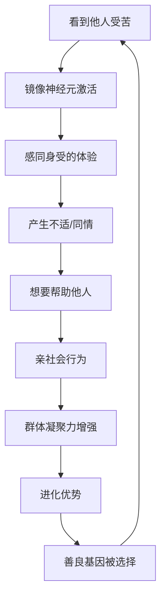
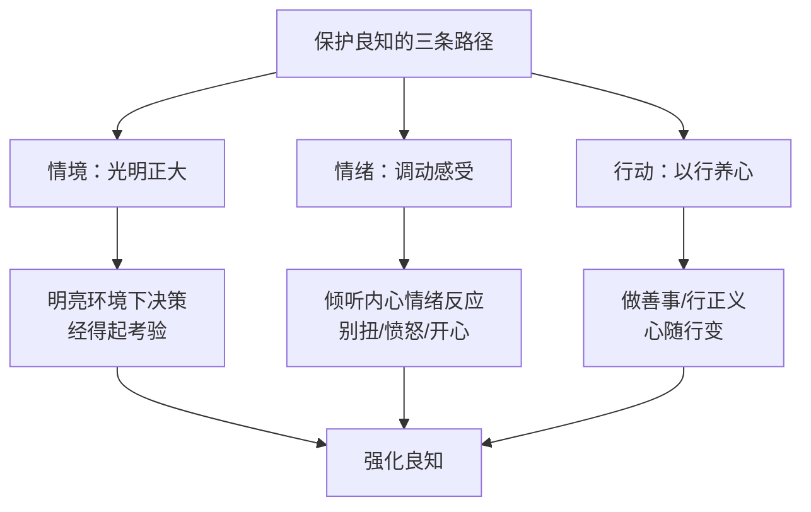

# 第29课：良知：到底什么是人性？

## 开头引入：人的本性是善还是恶？

"人之初，性本善"——这是《三字经》开篇的第一句话。但古今中外，关于人性善恶的争论从未停止。

王阳明认为，**良知就是不用觉察就觉得对还是不对的一种感受**——它是一种知善知恶的情绪体验。

美国著名的心理学家、美国总统科学奖获得者**乔纳森·海特教授**做过很多有关道德心理学的研究，他用一系列堪称"奇葩"的实验，为这种观点提供了建设性的证据。

## 核心概念：什么是良知？

### 海特的"道德恶心"实验

海特的实验从一堆让人不舒服的提问开始。他让人们判断一些行为是不是不道德：

- **问题一**：有一家人家的狗在家门口被撞死了，他们听说狗肉很香，所以决定把狗的尸体煮了吃。没有任何人看到他们所做的一切。你觉得他们做的事情道德吗？
- **问题二**：一个女性清理橱柜时发现了一面旧的美国国旗，她决定将它绞碎做成拖把用来拖厕所的地板。你觉得她做得对吗？

人们在听到这些故事时，会很快做出判断——**认为这种行为是错误的**。但当心理学家询问为什么认为这些是错误的时候，大多数人都会沉默良久，做不出任何解释，只能说"我就是知道这是错误的"。

> [!quote]
> 这项研究让海特教授得出一个很重要的发现：**人类道德判断的依据，并不是法律、原则、政策、规定，而是人类朴素的、自然的、本能的情感反应。**

绝大多数人都会觉得这么做是不对的——恶心、别扭、怪诞、荒谬，因此不值得去做，也不应该去做。海特的道德心理学实验研究，在某种程度上**证明了中国心学的伟大——良知，就是天然道德情感反应。**

### 布卢姆的婴儿实验

耶鲁大学的心理学家**保罗·布卢姆**教授以婴儿为对象做了很多有关道德心理学的研究。他的结论是：**小孩天生就有寻求公平、正义和善良的倾向。**

他请一些一岁左右的孩子分别去看两个不同的视频：
- **视频一**：一个玩偶在玩球，球滚到右边去了，右边的玩偶友好地把球还了回来
- **视频二**：一个玩偶在玩球，球滚到左边去了，左边的玩偶拿着球就跑了

结果：

| 行为 | 对友好玩偶的反应 | 对不友好玩偶的反应 |
|------|-----------------|-------------------|
| 注视时间 | 更长时间（更感兴趣） | 较短时间 |
| 触摸行为 | 用自己的小手去抚摸 | 用力敲打 |

**一岁的孩子就已经具备了辨别善恶的能力**——而这个年龄段的孩子甚至还没有产生自我意识（自我意识大约在出生后18到24个月才会出现）。

> [!tip]
> 这个研究说明：孟子是对的——"**恻隐之心，是非之心，源自自然，人皆有之。**"《三字经》也是对的——"**人之初，性本善。性相近，习相远。**"

## 科学依据：良知的进化生物学基础

### 镜像神经元：良知的生理机制

人类大概在20到30万年前在进化上发生了一些突飞猛进的变化，其中一个特别重要的标志就是**镜像神经元**的出现。

什么是镜像神经元？举个例子：如果我当着你的面用针刺或者火烧我的手臂皮肤，你会有什么感觉？一定会很难受——哪怕你明明知道魔术师没有在伤害自己，你还是会咬紧牙关，甚至闭上眼睛不想去看。

这是因为人类的大脑有一个**镜像神经元系统**，这个系统会模拟眼睛看到的动作，让我们认为自己也在经历眼睛看到的事情。这种**感同身受**的情感，让人类天生就不喜欢看到别人受苦、受累、受伤害。

### 善良是进化选择的结果

科学研究证明：**进化选择的应该是善良，而不是邪恶。** 善良是人类特别重要的一种积极天性。

事实上，并不是因为我们善良所以我们采取合作和帮助别人，而是因为**我们合作和帮助别人，人类才有机会活下来**，使得我们逐渐掌握了善良的基因。

哈佛大学的心理学教授**罗伯特·托沃斯**发现：善良应该是写在人类基因里面的遗传密码。这里的"善"就是人对道德、助人、信任、亲社会等促进人与人之间关系的行为的一种偏爱。

### 心理学家长寿的秘密

彭凯平教授曾经做过一个研究：中国在1952年时，很多大学的心理学系被取消，当时全国共有83位心理学教授。彭凯平教授花了将近五年的时间找到了其中的76位，对照了这些教授们的出生和去世日期——结果令人震惊：

**这76位心理学家的平均寿命达到了84岁。**

现在还有六位心理学教授健在，生命力极其旺盛，不少人已经近百岁高龄。没有特意的养生，也没有经常去锻炼。

> [!quote]
> 彭凯平教授问这些教授们："你们长寿的秘密是什么？"
> 所有人都说到一句话：**"遵从自己的良心。"**
> 良心是什么呢？就是天理道德，就是致良知——**不害人、不伤人、不骗人、不欺人**——一定能健康长寿。

## 良知也有沉睡时：反社会人格

不过，哈佛大学医学院的临床精神病学专家**马莎·斯托特**经过近30年的临床研究发现：**良知也有沉睡的时候。**

他告诫我们：判断什么人可以信任时，要牢牢记住——如果一个人一直在伤害他人或是做出过分的行为，就经常装可怜来唤起你的同情，那么你就要小心——**他极有可能就是没有良知的人。**

拥有这两个特征的人，不见得就是杀人狂或生性凶残，但你不应该把他们当好朋友、跟他们合伙做生意、请他们帮忙照顾孩子，或者和他们结婚。

从统计角度来看，全球大约有**4%**的人存在反社会人格障碍——大约100人里有4个人就有这样的问题。

### 反社会人格者的特点

研究发现，反社会人格者在解读与情感有关的词汇时，脑部血液更多地流向**颞叶**而非前额叶——在这些人眼里，别人的感情不过是一道数学题目。他们更加善于伪装，一副讨好和可爱的外表下很可能掩盖邪恶的嘴脸。

> [!warning] 如何辨认？
> 马莎·斯托特在《当良知沉睡：辨认身边的反社会人格者》一书中提出了一个有趣的辨认方法——**看他有没有"装可怜"**。有无良知是正常人和反社会人格者之间的区分标准。

令人欣慰的是，研究指出了两个事实：
1. **缺乏良知的反社会人格者往往会走向自我毁灭**
2. **提升道德和良知可能让我们生活更加幸福**

## 关键方法：如何保护与培养良知

### 方法一：认识情境的力量——光明正大

所有的良知都是**情境的**。一些特别小的情境改变就可以改变人的道德意识和判断。

> [!tip]
> **让灯光变得亮一点，人就变得正大光明。** 做一个特别重要的决定时，一定要在一个明亮的环境里来做——相对而言，这个决定就经得起别人的考验。而在一个混乱阴暗的环境里做出的决定，真的容易出问题。**光明而正大，就是这个简单的道理。**

### 方法二：调动情绪的力量

所有的良知都是**情绪的**。良知不是抽象的原则判断，良知激发的是情绪反应。

- 听到一个七十多岁的老人娶了一位十几岁的姑娘——我们肯定感到**别扭、愤怒**
- 听到一个被冤枉的好人平反昭雪——我们肯定感到**开心**

这就是良知的反应。**调动我们自己的情绪，能够帮助我们培养良知。** 中国人说"为人不做亏心事，半夜敲门心不惊"——这就是良知的应用。

### 方法三：通过行动培养良知

所有的良知都是**行动的**。二者之间其实是相辅相成的。

彭凯平教授的团队做过一个简单的试验：让人去捏一个**硬**的东西，或者捏一个**软**的东西——

| 触摸物 | 心理效果 |
|--------|---------|
| 捏**软**的东西 | 人心也会变得柔软，对别人的判断不那么严苛 |
| 捏**硬**的东西 | 人心也会变得坚硬，判断相对严苛 |

**"知心合一"**讲的就是这个道理。

## 自检练习

> [!question] 反思练习一：你的良知反应
> 回想一个你最近遇到的"觉得不对劲但说不清为什么"的情景。你的身体有什么反应？（心跳？胃部收紧？直觉的不安？）试着不依赖理性分析，纯粹感受这种直觉判断。

理解提示

海特的研究表明，**道德判断很多时候是直觉先于理性**。良知发出的信号往往不是"因为...所以..."的推理，而是一种直接的身体感受。学会相信这种直觉——它是几十万年进化的产物。

> [!question] 反思练习二：光明的力量
> 尝试一个简单的实验：今晚做决定时，先把房间灯光调亮，然后想一想"如果这个决定被公之于众，我会不会不安？"记录下来你的感受。

光明法则

这是康德的"**普遍化原则**"的简化版——只做那些可以成为普遍法则的事情。灯光调亮不仅是一个物理操作，更是一种心理暗示：**我在光明中，我无须隐藏。** 如果你发现自己在暗处做的决定在亮处让你不安——那可能就是良知的信号。

## 小结

- **良知是天然的道德情感反应**——王阳明的"知善知恶"在海特的实验中得到了科学印证
- **婴儿天生有辨别善恶的能力**——"人之初，性本善"有科学依据
- **镜像神经元**是良知的生理机制——感同身受让人类不喜欢看到他人受苦
- **善良是进化选择的结果**——合作和帮助使他人才让人类活下来
- **心理学家长寿的秘密**：遵从自己的良心——不害人、不伤人、不骗人、不欺人
- **反社会人格者**约占人口4%，通过"装可怜"辨认
- **三条路径保护良知**：光明正大（情境）、调动情绪（感受）、以行养心（行动）