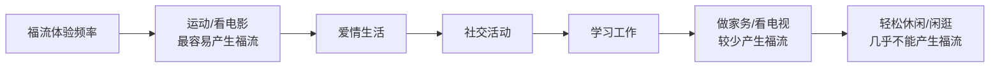
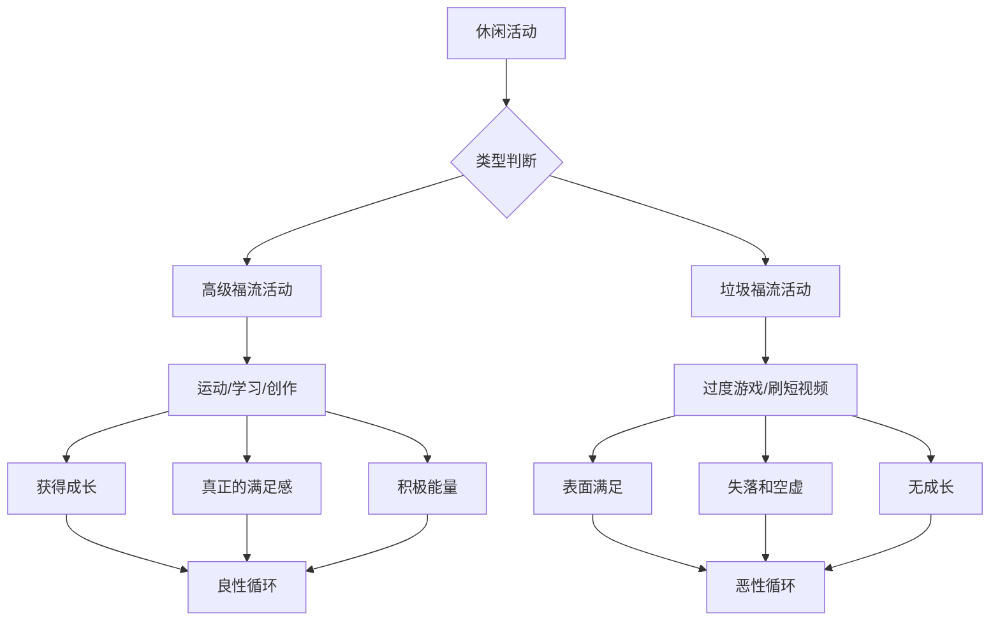
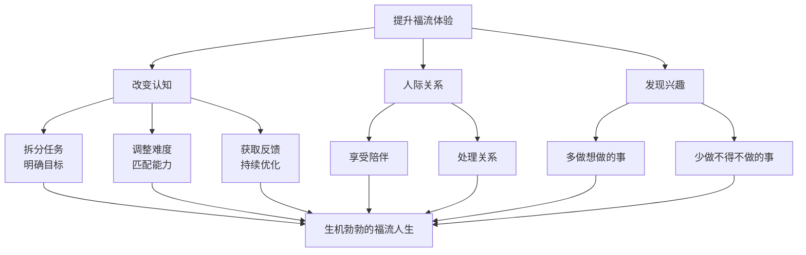

# 第30课：情绪福流：生机勃勃的感受从何而来？

## 开头引入：你是否体验过这种状态？

你有没有这样的经历——做某件事情的时候，完全沉浸其中，忘记了时间流逝，忘记了周围的一切，甚至忘记了自我的存在？当你回过神来，发现几个小时已经过去，但你丝毫不觉得疲惫，反而感到**神清气爽、酣畅淋漓**？

这种状态，就是心理学中所说的**福流**（Flow）。

彭凯平教授分享了自己的体验：他白天工作很繁忙，著书立说经常在晚上进行。有很多次写着写着，推开窗帘发现天已经亮了。正是一种神清气爽的幸福感向他袭来——即使是在寒冷的冬天，心中也荡漾着朝气蓬勃的生机。

## 核心概念：什么是情绪福流？

**福流**（Flow）是美国心理学家米哈伊（Mihaly Csikszentmihalyi）提出的概念。他发现人们在做自己喜欢的事情时，投入的时候会有一种**沉浸其中、物我两忘、酣畅淋漓、如痴如醉**的心理体验。他用"flow"这一概念来描述这种状态。

### 为什么翻译为"福流"？

彭凯平教授认为，flow翻译成"心流"不如翻译成"**福流**"更好，原因有三：

1. **音译**：flow发音与"福流"相近
2. **历史考证**：战国时期先秦时代的占谱中曾经用"福流"这个词。《四库全书提要》说明，汉代东方朔所著的《灵棋经》中第七十三卦就是"福流卦"——"遇上君臣相得的太平盛世，不仅当时的百姓得其恩惠，子孙后代也获益不浅"，意指一切顺遂、事事称心如意
3. **文化深意**：中华文化中的"福"字更具体——幸福、福气、福运，福流就是一种心潮澎湃的感觉

> [!quote]
> "如此美好的中国概念，一定要穿越到当代社会，赋予它新的生命和意义。"——彭凯平

### 福流的情绪特征

福流是一种以**积极情绪为主**的全身心投入带来的状态，包括：

| 积极的情绪 | 消极的反面 |
|-----------|-----------|
| 愉悦 | 烦躁 |
| 兴趣 | 无聊 |
| 忘我 | 冷漠 |
| 兴奋 | 着急 |
| 充实 | 焦虑 |

### 福流与巅峰体验

福流类似于马斯洛提出的**"巅峰体验"**——都是一种来自心灵深处的欣然与愉悦。

心理学家做过统计调查，结果发现从事自己喜欢的事情时，最容易产生福流体验的频率排序：

> [!tip]
> **衣来伸手、饭来张口、饱食终日、无所事事的日子，并没有人们想象中的那么快乐。**

## 垃圾福流：一个重要的警示

与真正的福流相对的反面状态是**乏味**——对自己行为和时间的过分关注，每分每秒都变得漫长无比，度日如年，没有生机。

许多人将休闲时间用于玩游戏、浏览娱乐新闻、看短视频等各种各样的娱乐活动，无法自拔。当人们把精力投入到这些娱乐活动中时，也常常会完全融入其中，甚至达到废寝忘食、不想做其他任何事情的程度。

但与其他有意义的活动相比，此时人们**沉溺于福流开始时带来的表面好处，而没有从福流中得到成长**。这种福流被称为"垃圾福流"——娱乐活动其实并不会让人获得真正的振奋和满足，反而会体验到更多的失落和空虚。

> [!warning] 垃圾福流
> 生活中有很多人埋首于这种垃圾福流，尤其是青少年，更容易被这种虚假的表面好处所俘虏——比如玩电子游戏或刷手机。

### 如何应对垃圾福流？

心理学家布莱恩·萨顿·史密斯教授提出的解决方法：**你不需要改变你玩的游戏，你只需要专注游戏让你进步的方式。** 当你这么做的时候，你就会更相信你玩游戏时建立的强项就是你能应用在日常挑战上面的强项。

任何人只要开始思考游戏让他们可以变得更好的方式，就能够**学会在面对艰难挑战的时候，在精神上和情绪上变得更有适应力。**

哲学上的"**善假于物**"也是同样的道理——游戏其实也可以产生正向的高级福流。世界上的很多运动项目，比如足球、篮球、围棋等，其实都是从最初的游戏形态演化而来的。

哲学家伯纳德·苏茨肯定了游戏的积极作用：**游戏是自愿尝试克服种种生活中并不需要的障碍**——但这种克服过程培养的心理技能，还是有正向的迁移效应的。

## 福流与工作

很多人屈从于主流文化，认为工作是被迫的、强制的，不去理性地比较自己工作与休闲的状态。但米哈伊引用弗洛伊德的话来表明这一观点：**"快乐的秘诀在于工作与爱。"**

我们通常忽略了一点：**工作比我们整天所做的大部分事情都更接近游戏**——它有明确的目标及实行规则，我们可以通过完成工作、销售业绩和上市评价获得回馈。工作也常常能使人全神贯注、心念集中，给人不同程度的掌控力，而且至少在理想状态下，工作难度与工作者的能力也是相匹配的。

## 关键方法：如何提升福流体验

### 方法一：改变认知，从平常生活构建小福流

小溪汇成大海。并不是只有艺术家、运动员、科学家才有福流，我们普通人在工作中也可以构建福流：

- **将工作任务拆分**——确定更明确的目标
- **获取更迅速的反馈**
- **匹配更适宜的难度**
- **无聊时**——提升挑战的难度，加快速度，钻研技术，提升质量
- **把挑战看成又一个获得高水平福流的机会**

### 方法二：在人际关系中构建福流

亲密关系、亲子关系和友谊，处理得当也能带来满满的福流。社会心理学调查一致认为：**人在有朋友、家人或者任何人陪伴的时候最快乐。**

因此，学会处理人际关系是生活品质提升的关键。既能享受独处，也能与朋友家人和乐融融，便是获得福流的源泉。

### 方法三：发现自己真正感兴趣的事情

爱做什么，喜欢做什么，在哪些活动中能够产生福流的感觉？**尽量多做自己想做的、喜欢做的事，而不是做自己不得不做的事情。**

> [!quote]
> "世上的万事万物，无所谓对错，关键在于我们喜欢不喜欢。"——莎士比亚

这就是情绪福流对于生活的影响，也是情感对于我们行为的限定。

## 自检练习

> [!question] 反思练习一：高级福流 vs 垃圾福流
> 回顾过去一周，列出你花时间最多的三项活动。对每一项进行"福流审计"：这项活动让你获得了成长还是只带来了短暂的快感？之后是感到满足还是空虚？

福流审计表

| 活动 | 时长 | 有明确目标？ | 有及时反馈？ | 挑战匹配？ | 事后感受 |
|------|------|------------|------------|-----------|---------|
| 例：刷短视频 | 3小时 | 否 | 是 | 否 | 空虚 |
| 例：跑步 | 30分钟 | 是 | 是 | 是 | 充实 |

**关键判断标准**：活动结束后，你觉得自己是"变强了"还是"被掏空了"？

> [!question] 反思练习二：工作福流改造计划
> 选择你工作中的一项常规任务，尝试：1) 设定一个比平时更高的目标；2) 给自己设定时间限制；3) 专注于过程而非结果。完成后记录你的感受——你是否进入了更接近福流的状态？

改造思路

米哈伊的**福流通道模型**告诉我们，福流发生在"挑战"和"技能"的平衡点上：

- **挑战高、技能低** → 焦虑
- **挑战低、技能高** → 无聊
- **挑战低、技能低** → 冷漠
- **挑战高、技能高** → **福流**

所以如果你觉得工作无聊，提升挑战；如果你觉得焦虑，提升技能。

## 课程结语

这是本系列课程的最后一课。回顾整个课程，我们从愤怒、自卑、焦虑、孤独等**消极情绪**的疏导，到希望、快乐、幸福、勇气、宽恕、幽默、欣赏、爱等**积极情绪**的培养，再到兴趣、平静、同理心、感恩、敬畏、升华、良知、福流等**高级情绪体验**的提升——

情绪管理不是压抑情绪，而是**理解情绪、疏导情绪、善用情绪**。

彭凯平教授希望大家记住：**情绪福流是一种生机勃勃的感受，它来自于全神贯注的投入、来自与他人和世界的深度连接、来自做自己真正热爱的事情。**

祝愿大家都能活出生机勃勃、活力四射的人生境界——**福流澎湃，心花怒放。**

## 小结

- **福流**（Flow）是米哈伊提出的概念——一种全神贯注、物我两忘、酣畅淋漓的心理体验
- **"福流"优于"心流"**——音译、古汉语考证、文化深意三者合一
- **垃圾福流**（过度游戏/刷短视频）让人沉溺于表面满足而无成长
- **工作也可以产生福流**——明确目标、及时反馈、匹配难度
- **三种方法提升福流**：改变认知构建小福流、人际关系中构建福流、发现真正感兴趣的事
- **快乐的秘诀在于工作与爱**——弗洛伊德
- 本课程至此结束，祝福大家福流澎湃