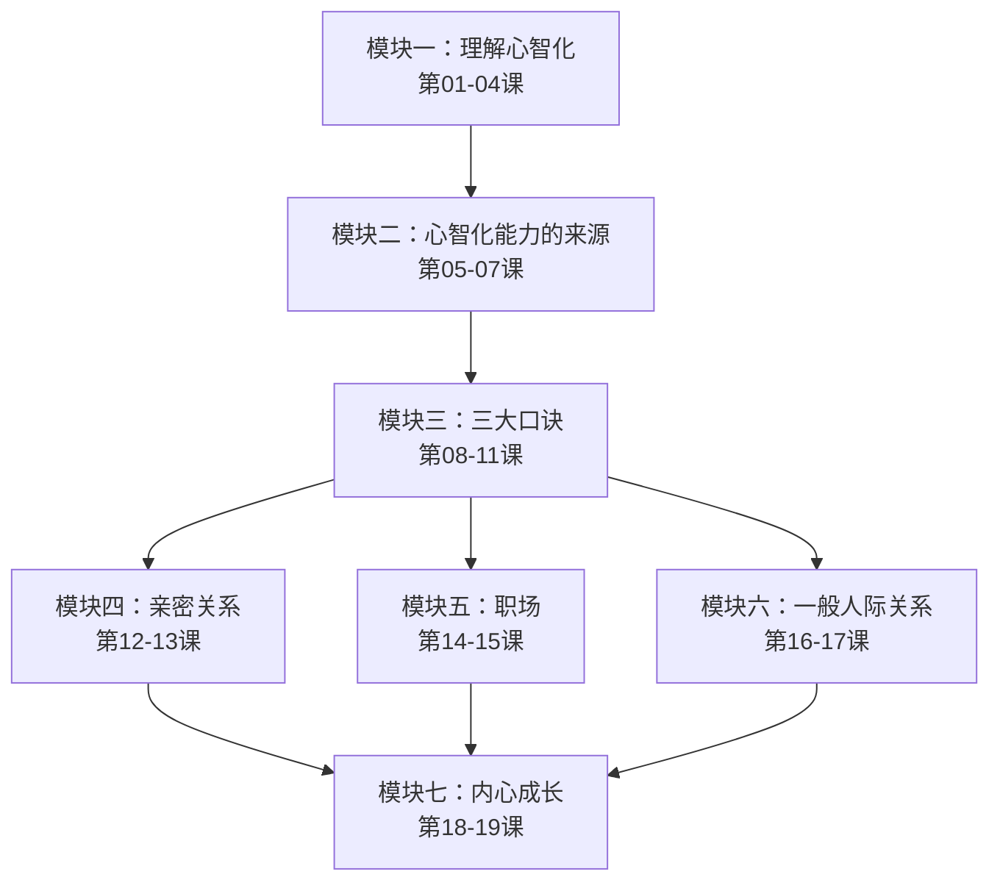
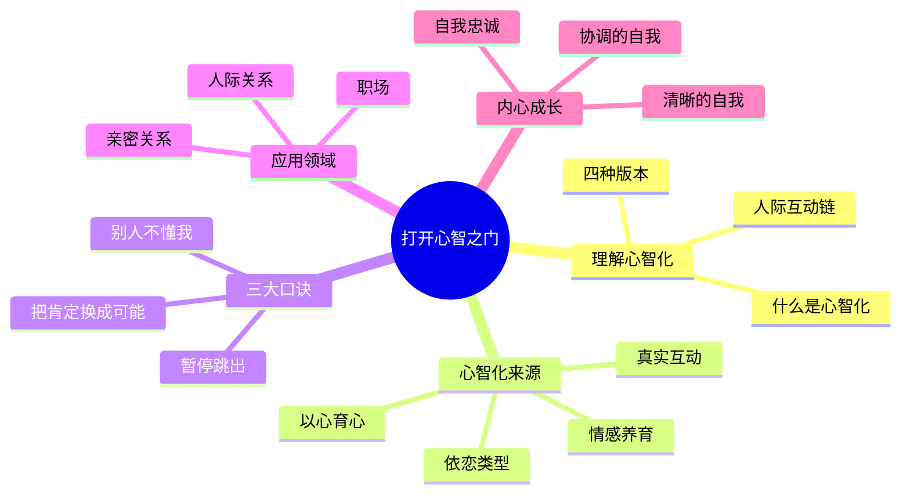

# 课程地图

## 学习路径

本课程共19课 + 13个健心房练习，分为七个模块。建议按模块顺序学习。

## 模块依赖

| 模块 | 前置依赖 | 说明 |
|---|---|---|
| 模块一：理解心智化 | 无 | 起点模块，建立基础概念 |
| 模块二：心智化来源 | 模块一 | 理解心智化如何形成 |
| 模块三：三大口诀 | 模块一、二 | 核心工具，需要基础概念 |
| 模块四：亲密关系 | 模块三 | 应用口诀于亲密关系 |
| 模块五：职场 | 模块三 | 应用口诀于职场 |
| 模块六：人际关系 | 模块三 | 应用口诀于一般人际关系 |
| 模块七：内心成长 | 模块四~六 | 综合应用与深度成长 |

## 主要内容结构

## 健心房索引

健心房练习与各模块对应关系：

| 健心房 | 主题 | 关联模块 | 练习类型 |
|---|---|---|---|
| 1-3 | 三大口诀思考题 | 模块三 | 反思写作 |
| 4-6 | 亲密关系练习 | 模块四 | 观察 + 反思 + 表达 |
| 7-8 | 职场练习 | 模块五 | 情景分析 + 思维训练 |
| 9-11 | 人际关系练习 | 模块六 | 行为改变 + 情绪觉察 + 安全空间 |
| 12-13 | 内心成长练习 | 模块七 | 正念 + 自我探索 |