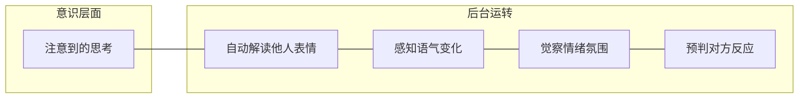
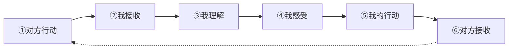
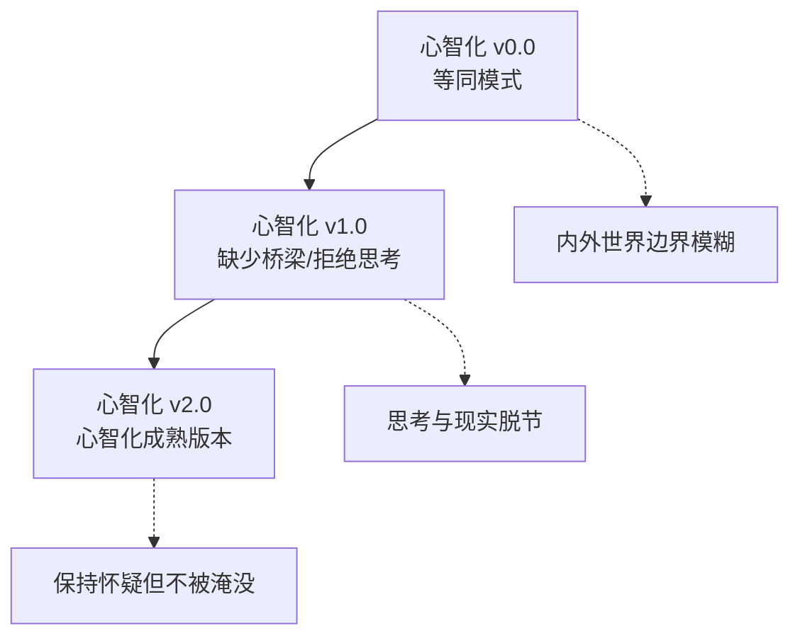

# 第01课：什么是心智化？

## Learning Objectives

- 定义心智化的双重含义：作为能力与作为过程
- 区分"聪明人"与"明白人"，理解智力不等于心智化能力
- 识别心智世界的六个核心维度
- 掌握人际互动链的六个环节及其在心智化中的作用
- 理解心智升级的版本隐喻

## Core Idea

### 心智化的定义

**心智化（mentalization）**，简单来说，就是**理解行动背后心智世界的能力和过程**。

这包含双重含义：

| 层面 | 含义 | 举例 |
|------|------|------|
| **作为能力** | 一个人能够认识到他人的行动背后有心智世界驱动 | 看到同事突然沉默，你能意识到"他可能有心事" |
| **作为过程** | 一个人去主动思考和理解那个心智世界的过程 | 你进一步思考"他是生我的气了，还是遇到了什么困难？" |

心智化既是"拥有这种能力"，也是"运用这个能力"——二者缺一不可。

### 心智世界的维度

我们每个人内心都有一个丰富而复杂的心智世界。这个世界包含哪些维度呢？

| 维度 | 说明 | 日常表达 |
|------|------|----------|
| **想法** | 头脑中的观念、判断、信念 | "我觉得……"、"我认为……" |
| **感受** | 情绪和身体感觉 | "我感到焦虑/开心/疲惫" |
| **需要** | 对某事物的依赖或渴求 | "我需要被理解/休息/安全感" |
| **渴望** | 深层的愿望和向往 | "我渴望被爱/自由/认可" |
| **目标** | 有意追求的成果 | "我想要升职/学会这个技能" |
| **信念** | 对世界的基本假设 | "人性本善/努力会有回报" |

理解一个人，就是理解上述多个维度如何在ta内心交织，最终驱动了ta的行动。

### "聪明人"不等于"明白人"

> [!WARNING] Common Misconception
> 很多人误以为智商高就等于心智化能力强。事实并非如此。

**5岁小朋友 vs 谢尔顿博士**

- **5岁小朋友**：虽然认知能力有限，但能敏锐地察觉到"妈妈不开心了"，会用自己的方式去安慰——这需要理解他人的内心状态。
- **谢尔顿博士**（《生活大爆炸》）：拥有极高的智商和专业知识，但在理解他人的感受、意图、需要方面经常碰壁，难以理解为什么别人会生气或伤心。

这个对比说明了一个关键道理：

> **智力（IQ）≠ 心智化能力**

"聪明人"指的是智力出众的人，而"明白人"指的是能理解人心、洞察他人心智世界的人。两者可能重叠，但并不等同。

### 心智总在后台运转

心智化就像电脑的后台程序——我们通常不会意识到它正在运行，但它始终在工作。

大多数时候，心智化在后台自动运作：你不需要刻意思考就能感觉到对方语气不善、或者察觉到房间里紧张的气氛。只有当后台程序"卡住"时，我们才会意识到它的存在。

### 人际互动链：六个环节

人与人之间的每一次互动，都包含一条完整的链条：

**六个环节详解：**

| 环节 | 说明 | 心智化的关键 |
|------|------|-------------|
| ① 对方行动 | 对方做出某种行为 | 行为是心智世界的外在表现 |
| ② 我接收 | 我通过感官接收这个信息 | 接收是否完整？有没有遗漏？ |
| ③ 我理解 | 我推测对方行动背后的心智世界 | 这是心智化的核心环节 |
| ④ 我感受 | 这个理解引发了我的情绪感受 | 感受会反过来影响理解 |
| ⑤ 我的行动 | 基于我的感受做出回应 | 回应是否基于准确理解？ |
| ⑥ 对方接收 | 对方接收到我的回应 | 互动完成，但链会继续 |

任何一个环节出问题，都会导致互动失谐。心智化就是在③环节发挥作用——帮助我们从行动推断背后的心智世界。

### 心智升级如同游戏升级

心智化能力的发展，就像游戏版本的升级迭代：

重要的是：**新版本不覆盖旧版本**。即使在成年人身上，在某些压力情境下，我们仍然可能退回到最原始的版本——这完全正常。

> [!TIP] Key Insight
> 心智化不是一种"全有或全无"的能力，而是一个连续的光谱。我们每个人都在这条光谱上的不同位置，而且位置会随着情境、情绪状态、关系质量而变化。接纳自己的不完美，是提升心智化的第一步。

## Worked Example

**场景：** 小美精心准备了一份报告，在团队会议上呈现。汇报过程中，她注意到主管皱着眉头，一直在看手机。小美心里一沉。

**非心智化反应：** "主管一定觉得我的报告很烂，他都不愿意看我。我完蛋了。"

**心智化过程：**

| 环节 | 内容 |
|------|------|
| 对方行动 | 主管皱眉、看手机 |
| 我接收 | 我注意到这些行为 |
| **我理解（心智化）** | **主管可能有多种可能：①他对报告不满意；②他正在处理紧急邮件；③他昨晚没睡好；④他的皱眉只是习惯性表情** |
| 我感受 | 我有点不安，但不急于下结论 |
| 我的行动 | 继续汇报，结束后可以主动询问反馈 |

心智化不是要"猜对"对方在想什么，而是**保持开放的态度**，认识到对方的行动有多种可能的解释。

## Practice

> [!QUESTION] Self-check
> **自测题一：**
> 下面哪种情况最能体现"心智化"？
>
> A. 小红看到朋友哭了，立刻递上纸巾说"别哭了"
> B. 小明看到同事皱眉，心想"他可能对这个方案有疑虑，但也可能只是在思考"
> C. 小张看到领导脸色不好，心想"领导一定是对我不满"
> D. 小李看到陌生人微笑，没有多想就走过去了

查看答案

**正确答案：B**

选项A虽然表现了关心，但没有体现出对朋友内心世界的理解过程。选项C是典型的"等同模式"——把一种可能性当成确定的现实。选项D完全没有心智化。选项B最符合心智化的定义：认识到他人行动可能有多种原因，保持开放性。

---

**自测题二：**
判断以下说法是否正确："高智商的人一定擅长理解他人的感受和想法。"

查看答案

**正确说法：错误。**

"聪明人"不等于"明白人"。智力（IQ）和心智化能力是两个不同的维度。一个智力出众的人可能在心智化方面并不擅长，反之亦然。正如5岁小朋友虽然认知能力有限，却能敏锐地感知他人的情绪，而谢尔顿博士虽然智商超群，却经常无法理解他人的感受。

## 关键术语回顾

| 术语 | 定义 |
|------|------|
| 心智化 | 理解行动背后心智世界的能力和过程 |
| 心智世界 | 由想法、感受、需要、渴望、目标、信念等维度构成的内心世界 |
| 人际互动链 | 从对方行动到我接收、理解、感受、行动、对方接收的六个环节链条 |
| 版本隐喻 | 心智化能力像软件版本一样迭代升级，新版本不覆盖旧版本 |

## 下一课

你已经理解了心智化的基本概念。在下一课 [[0002-deng-tong-mo-shi|第02课：等同模式——心智即现实]] 中，我们将学习心智化最原始的版本——当内外世界的边界变得模糊时，会发生什么。

**复习任务：** 观察今天你与三个人的互动，尝试在每次互动后有意识地停下来，回顾人际互动链的六个环节，看看哪个环节最自然、哪个环节最容易出问题。