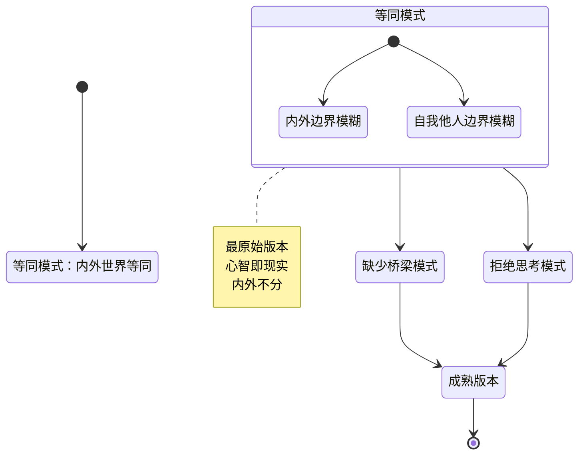

# 第02课：等同模式——心智即现实

## Learning Objectives

- 识别等同模式的核心特征：内外世界、自我与他人的边界模糊
- 理解等同模式如何影响日常的人际互动和判断
- 区分"通过自己的感受理解他人"与"把自己的感受等同于他人的感受"
- 掌握从等同模式升级的关键要点

## Core Idea

### 心智化版本的层次

心智化能力的发展，就像软件版本迭代一样，有不同的成熟度。最不成熟的版本是**等同模式（equivalence mode）**。

在等同模式下，**内心世界和外部现实之间没有清晰的边界**——我所想的、所感受的，就是事实本身。

### 柜子里有老虎的故事

精神分析学家博拉斯（Christopher Bollas）讲过一个经典故事：

> 一个小男孩被独自留在房间里睡觉。父亲告诉他："柜子里没有老虎，不用担心。"但小男孩却说："爸爸，柜子里就是有老虎。如果你把门关上，老虎会吃掉我。"

从成人的视角看，柜子里当然没有老虎。但对小男孩来说，**他内心的恐惧如此真实，以至于恐惧本身就是现实的证据**。他的内心世界（"我害怕柜子里有老虎"）和外部世界（"柜子里真的有老虎"）之间，没有明确的边界。

> [!WARNING] Common Misconception
> 许多人认为"这不过是小孩子才会这样"。然而，等同模式并不仅仅出现在儿童身上。成年人在压力、焦虑、疲劳或亲密冲突中，也可能退回到这种模式。

### 内外世界的边界模糊

等同模式最核心的特征之一，就是**内心世界和外部世界的边界模糊**。

**梦境影响现实**

小吴有这样一个经历：他梦见一位同事在聚餐时抢走了他最喜欢的蛋糕，醒来后一整天都对那位同事感到莫名的恼火。理智上他知道那只是一个梦，但情绪上却难以摆脱。

这就是等同模式的典型表现——梦境中的事件（内心世界）与现实中的同事（外部世界）之间的边界变得模糊。梦中的感受被直接等同于现实中的感受。

### 自我与他人的边界模糊

等同模式的第二个核心特征，是**自我与他人的边界模糊**——把自我的感受直接等同于他人的感受。

> **"有一种冷叫你妈觉得你冷"**

这句流行语完美地诠释了等同模式。妈妈自己觉得冷，于是认定孩子也一定冷，必须加衣服。在这个过程中，妈妈没有建立"我觉得冷 → 我在用我的感受推测孩子可能也冷 → 孩子可能确实冷，也可能不冷"这一系列心智化步骤，而是直接把"我冷"等同于"你冷"。

**小苏的职场案例**

小苏是一位非常有能力和经验的项目经理。她有一个习惯：当团队成员遇到困难时，她会直接给出自己认为最有效的解决方案。她常说："这个方法对我特别有效，对你们也一定有用。"

小苏的问题不在于她的方法不好——她的方法确实很好。问题在于她**默认自己的感受和需要等同于他人的感受和需要**。她喜欢直接解决问题，就认为所有人都喜欢；她在压力下需要更多信息，就认为所有人都需要。这种"以己度人"且不加审视的做法，正是等同模式在成人世界的典型表现。

### 关键区别：通过自己理解他人 vs. 等同于他人

这里有一个极其重要的区分：

| 维度 | 通过自己去理解他人（心智化） | 等同于他人（等同模式） |
|------|------------------------------|------------------------|
| 起点 | "我感受到……" | "事情就是这样" |
| 过程 | "我在用我的感受**推测**对方" | "我的感受**就是**对方的感受" |
| 态度 | 保持开放性，允许不同可能 | 确信自己的判断就是现实 |
| 结果 | 可能接近，也可能需要修正 | 往往忽略对方的独特性 |

> [!TIP] Key Insight
> 升级的关键不在于"不再用自己的感受去理解他人"——因为我们别无选择，只能通过自己的心智去理解他人。升级的关键在于**意识到"我是在用我的感受去推测对方的感受"**。这个"意识到"本身，就在内外世界之间建立了一座桥梁。

## Worked Example

**场景：** 阿强和女朋友小丽约好周末一起看电影。到了周六，小丽发信息说："今天不太想出门，好累。"阿强看到信息后感到很沮丧。

**等同模式下的反应：**
- "她说累了就是不想和我在一起。她一定是不爱我了。"（把"累了"直接等同于"不爱了"）
- 阿强没有区分：小丽的疲惫（她的内心状态）和他因此感到被拒绝（他的感受），而是直接把两者混为一谈。
- 结果：阿强回复冷淡，两人吵架。

**心智化升级后的反应：**
- "她说累了。我因此感到被拒绝。但这是我的感受，不一定等于她的意图。"
- "我在用我的感受推测她——她可能真的很累，也可能有别的顾虑。我需要确认。"
- "可以问她：'是不是最近工作太忙了？要不要改天？'"
- 结果：给予空间，关系更加融洽。

## Practice

> [!QUESTION] Self-check
> **自测题一：** 请判断以下情境是否属于"等同模式"：
>
> 小王在会议上提出了一个建议，领导没有当场表态。小王心想："领导没有立即同意，说明我的建议很差劲，领导对我有意见。"

查看答案

**属于等同模式。**

小王把"领导没有立即表态"这个外部行为，直接等同于"我的建议很差劲"和"领导对我不满"。他没有考虑其他可能性：领导可能需要时间思考、可能需要和其他人商量、或者只是一个中性的反应。小王的内心感受（"我的建议不好"）被当成了客观事实。

**修正思路：** "领导没有立即表态，这让我有些不安。可能意味着很多种可能性——我需要进一步了解领导的看法，而不是直接下结论。"

---

**自测题二：** 请阅读以下案例，选出最能体现从等同模式升级到心智化的选项。

晓琳发现好朋友最近回复信息很慢，从以前的秒回到现在可能要半天才回。

A. "她一定是对我有意见了，不想理我了。我们还是保持距离吧。"
B. "她回得慢，可能有她的原因。但我感觉有点失落，这是我自己需要处理的感受。"
C. "她回得慢说明她不在乎这段友谊，那我也不用在乎了。"
D. "不回信息就是人品有问题。"

查看答案

**正确答案：B**

选项A和C都是等同模式——把"回复慢"直接等同于"对我有意见"或"不在乎"，没有留出其他可能性的空间。选项D更是极端的外归因。选项B体现了心智化：承认自己的感受（"我有点失落"），同时认识到这是自己的感受而非对方的意图，并保持开放态度去理解对方可能有其他原因。

---

**自测题三：** 将以下等同模式的表述改写成心智化表述：

**等同模式表述：** "你生气是因为我做错了。我道歉了你还不原谅我，就是你的问题了。"

查看答案

**心智化改写参考：**

"你现在的表现让我感觉你可能还在生气。我在想，是不是我之前的某些行为让你不舒服了。我道歉了，但可能这个道歉没有触及到真正让你受伤的地方。或许你需要的不仅仅是道歉，而是我能真正理解你的感受。我愿意听听你的想法。"

**改写要点分析：**
1. 把自己的感受表述为推测（"让我感觉你可能……"），而非事实
2. 加入了不确定性（"我在想"、"可能"、"或许"）
3. 从"你的问题"转向"对方可能有自己的需要"
4. 保持开放和好奇的态度

## 关键术语回顾

| 术语 | 定义 |
|------|------|
| 等同模式 | 最不成熟的心智化版本，内心世界与外部现实没有清晰边界 |
| 内外边界模糊 | 把内心感受直接等同于客观事实 |
| 自我他人边界模糊 | 把自己的感受直接等同于他人的感受 |
| 升级关键 | 意识到"我是在用我的感受推测对方"，而不是"我的感受就是事实" |

## 下一课

等同模式让我们看到心智化能力最原始的状态——内外不分。下一课 [[0003-que-shao-qiao-liang-yu-ju-jue-si-kao|第03课：缺少桥梁与拒绝思考]] 将介绍另外两种不成熟版本：当内外世界被截然分开时，以及当人们拒绝思考内在世界时，会发生什么。

**复习任务：** 回想最近一次你对他人的行为快速下结论的时刻。试着问自己：我的结论是基于客观事实，还是基于我的感受？有没有其他可能的解释？