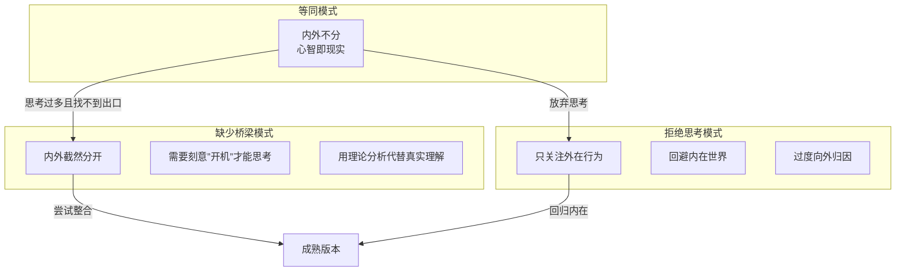
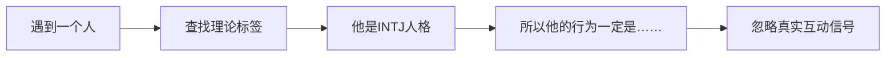

# 第03课：缺少桥梁与拒绝思考

## Learning Objectives

- 识别"缺少桥梁模式"的特征：内外世界截然分开，思考与现实脱节
- 理解"拒绝思考模式"的特征：只关注外在因素，忽视内在世界
- 区分向内归因与向外归因在心智化中的不同角色
- 认识在不同情境下横跳于两种不成熟版本之间的现象

## Core Idea

### 两种不成熟版本总览

在第02课中，我们学习了等同模式（内外不分）。但心智化不成熟的版本不止一种。当内外世界走向另一个极端——**内外截然分开**——就会出现"缺少桥梁模式"和"拒绝思考模式"。

这两种模式虽然表现形式不同，但根源相通：**内外世界之间缺乏有效的桥梁**。

### 缺少桥梁模式：内外世界截然分开

如果说等同模式是内外不分，那么缺少桥梁模式就是**内外世界被截然分开**——内心世界和外部现实之间有一堵墙，需要刻意"撞开"才能建立联系。

**需要喊"开机"才能开始想象**

想象一个孩子玩奥特曼游戏。一个处于缺少桥梁模式的孩子可能会说："奥特曼不会真的出现啊，这只是个玩具。"他需要被引导、需要有人对他说"假装现在奥特曼来了"才能开始进入想象的世界。

这不是因为他缺乏想象力，而是因为他**需要明确的信号才能在内外世界之间建立连接**。一旦没有这个信号，他就很难从外部现实切换到内心世界。

**思考与现实脱节：照本宣科式理解他人**

另一种常见表现是：用理论、书籍、公众号文章来"理解"他人，而不是用真实的感受和观察。

**示例：** 小李学了一些心理学知识后，开始用"原生家庭""依恋类型""防御机制"来分析身边的每个人。他给朋友贴标签："你是回避型依恋，所以你不敢进入亲密关系。"但他从来没有真正停下来问朋友："你现在的感受是什么？"

这不是真正的心智化，而是**用知识替代了理解**。思考与现实之间有一座"书"砌成的墙，而不是桥梁。

### 在有洞察力和无法理解的两极横跳

一个更有趣的现象是：同一个人可能在两个极端之间来回跳跃。

**艾米的案例**

艾米是一个非常敏感的人。在和闺蜜聊天时，她经常能精准地说出对方的感受："你是不是觉得被忽略了？"这让闺蜜觉得被深深理解。

但在和男朋友吵架时，艾米却完全无法理解对方。男朋友说"我需要一点空间"，艾米的反应是："你不需要空间，你就是要和我分手！你不爱我了！"

这是怎么回事？艾米不是不具备心智化能力，而是在某些情境下（尤其是亲密关系冲突中），她的心智化能力会"掉线"。她从一个敏锐的理解者，变成了一个被情绪淹没的等同模式者。

这种**横跳现象**说明两件事：
1. 心智化能力不是固定不变的——它受情境、情绪、关系质量的影响
2. 在不成熟版本之间横跳，说明还没有建立起稳定的心智化能力

### 拒绝思考模式：只关注外在因素

拒绝思考模式走向了另一个极端：**只关注外在的、可见的因素，刻意回避内在世界**。

**四铭先生的故事（鲁迅《肥皂》）**

鲁迅的小说《肥皂》中，四铭先生在街上看到一个十八九岁的女乞丐。他回到家后不断提起这个"孝女"——一个年轻女子在街头乞讨为母亲治病。他的太太非常生气。

四铭先生对自己内心的真实感受毫无觉察：那个年轻女子吸引了他，但他无法面对这种欲望。于是他把所有的注意力都放在"社会的堕落""世风不古"这些外在话题上，用"道德批判"来回避审视自己的内心。

这就是拒绝思考的典型表现——不是没有内心活动，而是**拒绝承认和面对自己的内心世界**，把所有注意力转向外部。

> [!TIP] Key Insight
> 拒绝思考不等于"没有内心活动"。很多时候，拒绝思考是对内心世界的**防御**——因为某些感受太痛苦、太令人不安，所以选择不看、不想、不面对。这种防御本身是有意义的，但长期来看会削弱心智化能力。

**"神经大条"类型：大飞的例子**

大飞在朋友圈里以"神经大条"著称。朋友失恋了找他倾诉，他说："别想那么多，出去吃顿好的就好了。"同事遇到工作压力，他说："压力大？那就别干了呗，换一份工作。"

大飞不是故意冷漠，而是他真的不太习惯去思考自己和他人内心的复杂世界。对他而言，问题都是外在的、简单的、可解决的——解决了外部问题，内部问题自然消失。

这种"神经大条"在短期看似乎很轻松（不内耗），但也带来了问题：大飞的人际关系很难深入，朋友们觉得"和他说了也白说"，亲密关系中也因为缺乏情感理解而屡屡受挫。

### 向内归因 vs 向外归因

拒绝思考模式在归因方式上有鲜明的特点。以下是两种归因方式的对比：

| 维度 | 向内归因（心智化） | 向外归因（拒绝思考） |
|------|-------------------|---------------------|
| 关注焦点 | 内在动机、感受、信念 | 外在环境、他人行为、客观条件 |
| 解释行为 | "他迟到可能是因为焦虑/忘了/害怕" | "他迟到就是因为不负责任/路况不好" |
| 理解冲突 | "冲突可能源于双方的误解或需要" | "冲突就是他的错/都是客观条件造成的" |
| 自我反思 | "我为什么会这样反应？我在担心什么？" | "我就是这样的人/环境逼我这样的" |
| 情感深度 | 承认并探索复杂情感 | 简化或回避情感 |
| 人际关系 | 理解关系的动态性和双向性 | 把问题归结于对方或外部因素 |

> [!WARNING] Common Misconception
> 这不是说"向外归因总是错的"。实际上，很多情况下外部因素确实是重要的原因。问题不在于归因的方向，而在于**是否排他性地只使用一种归因方式**。真正的心智化能够同时考虑内外因素，并在二者之间找到平衡。

## Worked Example

**场景：** 一份工作项目出了问题，团队开会复盘。

**缺少桥梁模式的反应：**
- 某成员引用了一本管理学书籍里的理论："根据XX模型，项目失败的原因是沟通层级过多。"
- 分析本身并没有错，但却脱离了这个团队的具体情况和每个人的实际感受
- 没有人去问："当时大家是怎么想的？遇到了什么困难？"

**拒绝思考模式的反应：**
- "都是因为甲方临时改需求"或"都怪技术部没有按时交付"
- 所有注意力都放在外部因素上，忽略了团队内部的决策过程、沟通问题和个人感受

**心智化整合后的反应：**
- "项目出了问题，既有外部原因，也有我们团队内部的因素。"
- "我在想，当时我们做决策时是不是太乐观了？有没有人担心但没说出来？"
- "大家现在感觉如何？有什么想法？我们可以怎么避免下次再出现类似问题？"

## Practice

> [!QUESTION] Self-check
> **自测题一：** 以下哪个描述最符合"缺少桥梁模式"？
>
> A. 小王看到朋友皱眉，立刻感到内疚，觉得一定是自己说错了话
> B. 小李在读了一篇关于"依恋类型"的文章后，断定男朋友是"回避型"，并以此解释他的所有行为
> C. 小张和同事发生矛盾后，只在心里生气，从不表达，也不思考对方为什么那样做
> D. 小赵看到伴侣心情不好，直接说"你心情不好就是因为你太敏感了"

查看答案

**正确答案：B**

选项A是等同模式——把朋友的皱眉直接等同于"我的错"；选项C是拒绝思考——回避内心世界的探索；选项D也是拒绝思考——把对方的情绪直接归因于"太敏感"这个外在标签。选项B是典型的缺少桥梁模式：用理论分析替代了对这个具体人的真实理解，思考与现实之间隔着一堵"理论墙"。

---

**自测题二：** 请判断以下对话中，大飞的表现属于哪种模式？如果你是心智化教练，会怎么回应他？

> **朋友：** "我最近真的很焦虑，总觉得工作做不好，老板随时会开了我。"
> **大飞：** "焦虑什么呀！你工作能力那么强，老板又不是傻子。你想太多了。"

查看答案

**模式判断：拒绝思考模式。**

大飞完全回避了朋友的内在感受（焦虑、不安），直接将焦点转向外部（"你工作能力强""老板不傻"），并用"你想太多了"来否定朋友的情感体验。

**心智化教练的回应参考：**

"我能理解你想安慰朋友的心情。不过，我们试试换一种方式——先承认他的感受：'听起来你最近压力很大，很担心工作的事情。'然后可以好奇地追问：'你觉得自己哪些方面做得不够好？有没有具体的事情让你特别担心？'这样既没有否定他的感受，又帮助他梳理内心的想法。"

---

**自测题三：** 鲁迅《肥皂》中的四铭先生，他的行为主要体现了什么？

A. 等同模式——他把自己的欲望等同于事实
B. 缺少桥梁模式——他无法把内心的欲望和外在的道德批判联系起来
C. 拒绝思考模式——他用对外在道德问题的关注来回避面对自己的内心
D. 成熟版本——他通过讨论社会问题来处理个人感受

查看答案

**正确答案：C**

四铭先生对年轻的乞丐女子产生了自己无法面对的欲望，于是他把所有注意力转向"社会堕落""世风不古"这些外部话题，用道德批判来回避审视自己的内心。这不是真正的社会关怀，而是拒绝面对自己的内心世界。

选项A不准确——他没有把自己的欲望等同于事实，而是完全回避了欲望的存在；选项B有一定的道理（他确实难以连接内外世界），但核心是"拒绝面对"而非"缺少连接能力"；选项D显然不对，因为这不是成熟的心智化运作。

## 关键术语回顾

| 术语 | 定义 |
|------|------|
| 缺少桥梁模式 | 内外世界截然分开，需要刻意信号才能建立连接；用理论替代真实理解 |
| 拒绝思考模式 | 回避内在世界，只关注外在可见因素；用向外归因替代向内探索 |
| 横跳现象 | 同一个人在不同情境下在不同心智化版本之间来回切换 |
| 向内归因 | 从内在动机、感受、信念角度理解行为 |
| 向外归因 | 从外在环境、他人行为、客观条件角度理解行为 |

## 下一课

我们已经学习了三种不成熟的心智化版本：等同模式、缺少桥梁模式、拒绝思考模式。下一课 [[0004-cheng-shu-ban-ben|第04课：成熟版本的心智化能力]] 将介绍成熟版本的心智化是什么样的，以及它为什么不等于"全能读心术"。

**复习任务：** 观察今天你遇到的三个冲突或误解场景，分析它们分别涉及哪种不成熟版本。你有没有发现自己或他人在不同情境下"横跳"的现象？