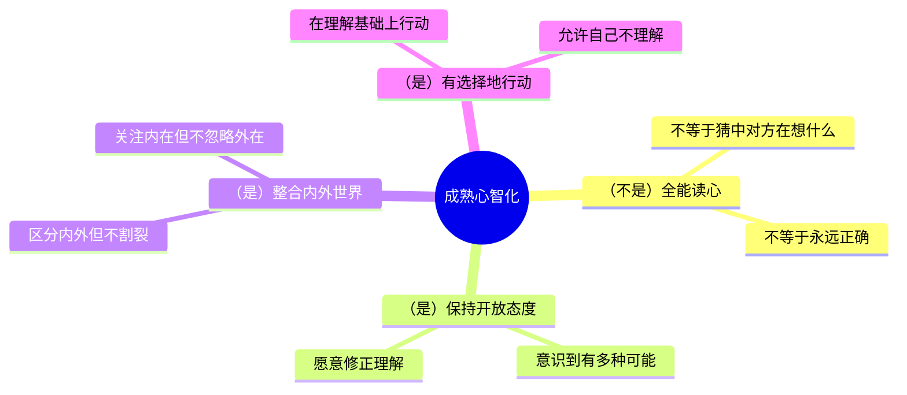
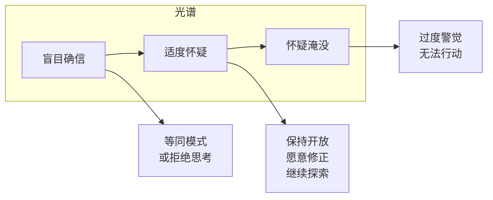
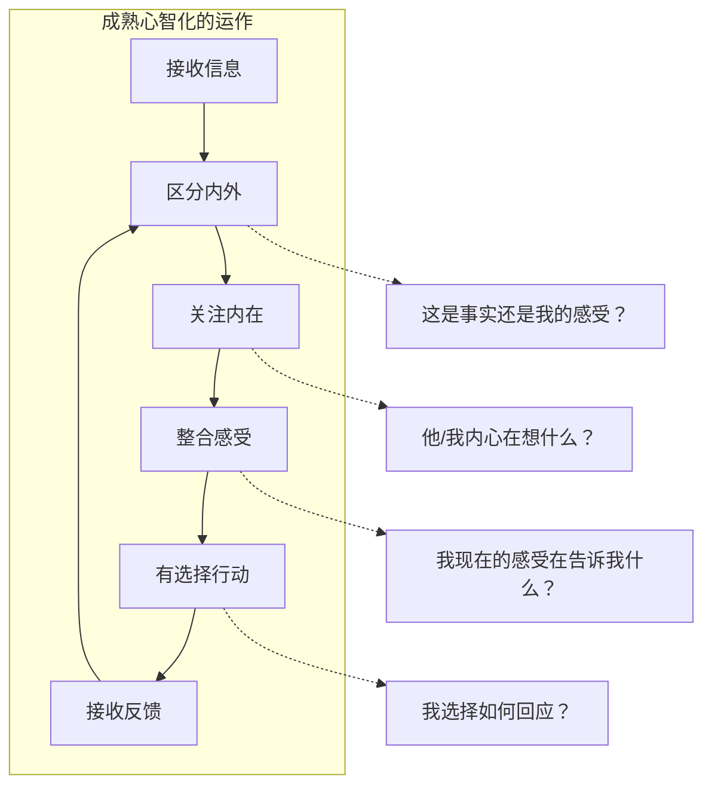

# 第04课：成熟版本的心智化能力

## Learning Objectives

- 描述成熟版本心智化的核心特征
- 理解"不理解才是常态"这一心智化基本原则
- 区分过度警觉与适度怀疑之间的界限
- 比较四种心智化版本的核心差异
- 识别自己当前主要使用的心智化版本

## Core Idea

### 成熟版本不等于全能读心术

经过前三课的学习，我们了解了三种不成熟的心智化版本。现在你可能会想：成熟版本是不是就是能完全读懂他人的心思？**完全不是。**

> [!WARNING] Common Misconception
> 成熟版本的心智化**并不意味着**拥有超强的"读心术"，能准确无误地猜中别人在想什么。恰恰相反——成熟版本的第一课是承认：**我永远无法完全知道对方在想什么。**

### 不理解才是常态

这是心智化中最重要也最容易被忽视的一点：

> **我们永远无法完全理解另一个人的心智世界。**

这不是因为我们的能力不够，而是一个**基本的心灵事实**：

| 维度 | 说明 |
|------|------|
| 心智不透明性 | 每个人的心智世界只有自己能直接体验，他人只能推测 |
| 动态变化性 | 心智世界时刻在变化，这一刻的理解下一刻可能就不适用 |
| 多维复杂性 | 想法、感受、需要、渴望等多个维度交织，难以一一厘清 |
| 无意识成分 | 很多心智活动发生在无意识层面，连当事人自己都不完全清楚 |

**承认"不理解才是常态"，不是放弃努力，而是以更谦逊、更开放的态度去接近理解。** 这种态度本身就比宣称"我已经完全理解你了"更接近真相。

### 保持怀疑，但不被怀疑淹没

成熟版本的关键在于一种微妙的平衡：

**盲目确信（左侧）：** "我知道他在想什么，我确定。"——这是等同模式或拒绝思考的特征。

**怀疑淹没（右侧）：** "我什么都不知道，每个人可能都在骗我，我无法做出任何判断。"——这是过度警觉，同样不利于互动。

**适度怀疑（中间）：** "我有一些推测，但我也知道可能有其他可能性。我需要更多的信息来验证。"——这是成熟版本的特征。

> [!TIP] Key Insight
> 适度怀疑是"是的，而且……"的心态：是的，我有我的理解，而且这可能不是全部；是的，我推测他生气了，而且他可能有其他我没有想到的原因。这种心态让你既能有所判断，又能随时准备修正。

### 不必过度警觉，心智化更多是后台自动运作

有人担心：如果按照心智化的要求，是不是每时每刻都要去思考"他为什么这样做""他内心在想什么"？

答案是否定的。

成熟版本的心智化，大部分时间是**后台自动运作**的，就像你不需要刻意思考就能知道迎面走来的人是在微笑还是皱眉。只有当互动出现问题时——比如对方反应异常、沟通出现障碍——我们才需要把心智化调到"前台"，主动思考。

过度警觉不是心智化，而是一种焦虑状态。真正的成熟版本是：

1. **日常状态下**：心智化在后台自动运行，不费力、不刻意
2. **有问题时**：有能力将心智化切换到前台，主动思考
3. **问题解决后**：能够退回后台，不必一直保持高度警觉

### 四种版本对比总结

经过四课的学习，我们了解了四种心智化版本。以下是完整的对比总结：

| 维度 | 等同模式 | 缺少桥梁模式 | 拒绝思考模式 | 成熟版本 |
|------|----------|-------------|-------------|---------|
| **内外关系** | 内外不分，内心即现实 | 内外割裂，需要外力连接 | 排斥内在，只关注外在 | 区分内外但不割裂，灵活连接 |
| **与他人关系** | 我的感受就是对方的感受 | 用理论标签替代真实接触 | 不关心对方的内心 | 通过自己推测但随时修正 |
| **核心问题** | 无法区分"我感受到的"和"事实" | 思考与现实脱节 | 回避内心世界 | 保持平衡 |
| **典型表现** | "你肯定生气了" | "根据XX理论，你是……型" | "别想太多，出去吃一顿" | "我猜你可能……但也有其他可能" |
| **升级路径** | 意识到"我在推测，而非确定" | 回归具体的人和情境 | 勇敢面对内心世界 | 持续保持开放和学习 |

### 成熟版本的核心特征

成熟版本的心智化，可以用四个特征来概括：

**1. 区分内外世界**
能够区分"我所感受到的"和"事实本身"，知道自己的感受是对事实的回应，而非事实本身。

**2. 关注内在世界**
不止关注外在行为，也愿意探索行动背后的动机、感受、需要、信念——无论是他人的还是自己的。

**3. 整合自身感受**
不回避自己的感受（不同于拒绝思考），也不被感受淹没（不同于等同模式），而是能够觉察、容纳、反思自己的情绪。

**4. 有选择地行动**
在理解内外世界、整合自身感受的基础上，做出有意识的、负责任的选择，而不是被无意识的力量驱使。

## Worked Example

**场景：** 老板在会议上对你的方案提出了尖锐的批评。

**等同模式反应：** "老板一定是不认可我，我在这个公司没有前途了。"（内心感受直接等同现实）

**缺少桥梁反应：** "根据公司政治理论，老板这是在立威。他针对的不是我，而是整个部门。"（用理论替代真实理解）

**拒绝思考反应：** "老板就是心情不好，跟我没关系。下班去吃顿好的就好了。"（回避感受和反思）

**成熟版本反应：**

1. **区分内外**："老板批评了我的方案。我因此感到挫败和不安。这是我的感受，不是全部事实。"
2. **关注内在**（他人）："老板的批评具体指向方案的哪些部分？他的关注点是什么？"
3. **关注内在**（自己）："我现在的挫败感背后是什么？是担心方案不够好，还是担心老板对我的评价？"
4. **整合感受**："我可以接受方案有不足，同时我也认可自己付出的努力。"
5. **有选择行动**："先感谢老板的反馈，然后针对具体问题请教他的建议。之后再评估是否需要对方案进行全面修改。"

## Practice

> [!QUESTION] Self-check
> **自测题一：** 以下哪个描述最能体现"成熟版本"的心智化？
>
> A. "我看人很准，第一次见面就能判断出这个人值不值得交。"
> B. "我觉得他可能生气了，但我不确定。我可以问问他是不是有什么事情让他不舒服。"
> C. "他不回我消息，肯定是故意的。这种人就不值得交往。"
> D. "根据心理学理论，不回消息的人通常是回避型依恋。"

查看答案

**正确答案：B**

选项A表面上看是"洞察力强"，但"很准""第一次就能判断"这种说法忽略了心智的复杂性和动态性，倾向于过度自信。选项C是典型的等同模式。选项D是缺少桥梁模式——用理论标签替代对具体人的理解。

选项B体现了成熟版本的关键特征：有自己的推测（他可能生气了），但保持开放（我不确定），并愿意主动去确认（我可以问问他）。这是一种"适度怀疑"的态度。

---

**自测题二：** 判断以下说法是否正确："成熟版本的心智化意味着我每时每刻都要分析和思考别人的内心世界。"

查看答案

**错误。**

成熟版本的心智化大多数时候是在后台自动运行的，不需要刻意努力。只有当我们发现互动出现异常、沟通遇到障碍时，才需要有意识地把心智化从后台切换到前台。

过度警觉（每时每刻都在分析他人）不是成熟心智化的表现，而是一种焦虑状态，反而会损害人际互动的自然流畅。

---

**自测题三（综合题）：** 阅读以下场景，你认为这个人的反应属于哪种心智化版本？如果是非成熟版本，请给出一个成熟版本的改写。

> 小陈看到朋友圈里几个同事聚餐的照片，但没有叫他。他心想："他们肯定是在故意排挤我。我在这个团队里就是不受欢迎的人。以后我也不用对他们那么好了。"

查看答案

**模式判断：等同模式。**

小陈把"没有被邀请聚餐"这个行为直接等同于"被排挤"和"不受欢迎"。他的感受（被排斥的伤痛）被当作了客观事实。他没有考虑其他可能性：也许只是临时起意、也许座位有限、也许大家以为他忙。

**成熟版本改写：**

"看到他们聚餐没叫我，我有点失落。可能有很多原因——也许是临时决定的，也许是忘了叫我，也可能确实有人在刻意组小圈子。我不确定是哪种情况。我可以找个机会私下问问关系好的同事最近有什么活动，也可以直接说'下次聚餐记得叫我啊'。同时，我也需要接纳自己的失落感——这很正常，不代表我确实被排挤了。"

## 关键术语回顾

| 术语 | 定义 |
|------|------|
| 成熟版本 | 区分内外、关注内在、整合感受、有选择行动的心智化状态 |
| 适度怀疑 | 有自己的理解但保持开放，愿意随时修正 |
| 心智不透明性 | 每个人的心智世界只有自己能直接体验，他人只能推测 |
| 后台运作 | 心智化大多数时候在无意识层面自动运行，不需要刻意努力 |
| 四种版本 | 等同模式、缺少桥梁模式、拒绝思考模式、成熟版本 |

## 模块一总结

恭喜你完成了模块一的学习！通过这四课，你已经：

1. 理解了心智化的基本概念——什么是心智化、心智世界的维度、人际互动链
2. 认识了四种心智化版本——从最原始的等同模式到成熟版本
3. 学会了识别自己和他人可能处于哪种模式
4. 掌握了升级的方向——保持开放、适度怀疑、整合内外

你已经打下了坚实的基础。在 [[../../index|返回课程主页]] 准备进入模块二的学习。

**复习任务：** 选择一个本周让你感到困惑或冲突的人际互动，用四种版本的角度分别分析，识别自己当时处于哪种版本，并思考如果使用成熟版本会有什么不同。