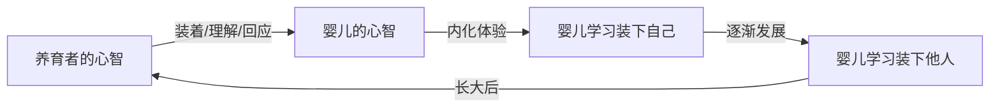

# 第05课：以心育心与代际传递

## 学习目标

完成本课后，你将能够：

- 解释"以心育心"的含义及其在心智化发展中的核心作用
- 描述"心灵渴望心灵"这一基本心理需求
- 分析代际传递如何影响父母能否把孩子"装进心里"
- 识别数字时代互动中"心不在焉"的风险
- 反思自身成长经历，找到突破不良传承模式的路径

---

## 以心育心：心智化的根源

### 心智化的核心能力

心智化最基本也最重要的能力是什么？回到最初的定义：

> 心智化就是**在自己的心智里装着另一个心智**。

但这里有一个关键的前提——

### 先被装进心里

**要想在心里装下别人，得先被别人装进心里。**

这个看似简单的道理，却是心智化发展的根本机制。一个人之所以能够理解他人的内心世界，是因为他在成长过程中**曾经**（并且持续）被另一个心智所容纳、理解和回应。这个过程，就是**以心育心**——用一颗心去培育另一颗心的能力。



### 心灵渴望心灵

儿童精神分析师伊尔玛·布伦曼·皮克（Irma Brenman Pick）曾提出一个深刻的比喻：

> **心灵渴望心灵，如同身体需要食物。**

正如身体没有食物会饥饿、枯萎，心灵如果没有被另一个心灵所"喂养"和容纳，也会感到饥饿和枯萎。这不是一种奢侈的"额外需求"，而是一种**基本的心理生存需要**。

---

## 日常生活中的以心育心：喂奶的例子

婴儿喂奶看起来是一个生理行为——摄入营养、填饱肚子。但从心智化的角度看，喂奶的过程同时也是一个**深刻的心理互动**。

| 层面 | 内容 |
|---|---|
| 生理层面 | 婴儿摄入奶水，获得营养 |
| 心理层面 | 婴儿通过养育者的抱持姿势、眼神交流、语调节奏，体验到被关注、被理解 |
| 心智化层面 | 养育者"猜测"婴儿的需要：是饿了？是渴了？是不舒服？是需要安抚？ |

当养育者一边喂奶一边专注地看着婴儿，轻声回应婴儿的咕哝声时，婴儿体验到的不仅是奶水的温度，更是一个**心智正在努力理解和容纳自己**的温暖体验。

> [!TIP] 关键洞察
> 喂奶的质量不在于奶水的多少或营养的高低，而在于**喂奶过程中养育者是否"在场"**——是否用整个心智去理解和回应婴儿。

---

## 数字时代的挑战

今天我们面临一个前所未有的挑战：手机和其他电子设备。

### 手机不是问题，心不在焉才是

要特别澄清一点：**使用手机本身不是问题**。问题在于养育者在与孩子互动时**心不在焉**——身体在场，但心智不在。

当一个孩子兴奋地跑过来想分享自己的发现，而养育者盯着手机屏幕含糊地回应"嗯嗯"时，孩子体验到的不是被容纳，而是**被忽视**。长期如此，孩子会逐渐内化一种信念：**我的内心世界不值得被关注**。

```mermaid
flowchart TD
    subgraph ”健康互动”
        A1[孩子表达需要] --> B1[养育者专注回应]
        B1 --> C1[孩子感到被理解]
        C1 --> D1[内化：我的感受值得被关注]
    end
    
    subgraph ”心不在焉的互动”
        A2[孩子表达需要] --> B2[养育者敷衍回应]
        B2 --> C2[孩子感到被忽视]
        C2 --> D2[内化：我的感受不重要]
    end
```

> [!WARNING] 数字时代的警告
> 不是你用了多少时间陪伴孩子，而是你在陪伴时**有多在场**。五分钟的全身心投入，胜过一小时的敷衍了事。

---

## 代际传递：上一代如何影响下一代

### 传递的链条

一个人能否把孩子"装进心里"，很大程度上取决于**他自己是否曾经（或正在）被装进另一个人的心里**。

```mermaid
flowchart TD
    subgraph ”代际传递链条”
        GP[祖辈] -->|装着/不装| P[父母]
        P -->|装着/不装| C[孩子]
        C -->|将来| GC[孙辈]
    end
    
    style GP fill:#f9f,stroke:#333
    style P fill:#bbf,stroke:#333
    style C fill:#bfb,stroke:#333
    style GC fill:#fbf,stroke:#333
```

- 如果父母在自己的成长过程中被他们的父母（孩子的祖辈）用心智容纳过，他们就更容易去容纳自己的孩子。
- 如果父母从未体验过被"装进心里"的感觉，他们就很难知道如何把别人装进心里——因为**他们根本不知道那是什么感觉**。

### 心智化不取决于受教育程度

这是一个非常重要的发现：**把别人装进心里的能力，不取决于一个人的受教育程度。**

原书中提到，一些不识字的母亲，反而能够给予孩子极好的心智化养育。她们也许不会讲复杂的心理学术语，但她们懂得：

- 用眼神和微笑回应孩子的喜悦
- 在孩子哭泣时抱起并轻声安抚
- 在日常生活中敏感地觉察孩子的需要

相反，一些高学历的父母，却可能在互动中**过于理性化**，忽略了孩子的情感需求。

> [!EXAMPLE] 生活案例
> 一位不识字的老奶奶照顾孙子时，她可能不知道"心智化"这个词，但当孙子摔倒了，她会立即放下手里的活，走过去把孙子抱在怀里，用温和的声音说："摔疼了吧？奶奶在呢，不怕。"——这就是以心育心的活生生的例子。

---

## 突破传承模式：做初代"愚公"

如果你的成长经历中缺乏被"装进心里"的体验，怎么办？

答案是：**你可以选择做初代"愚公"**。

像愚公移山一样，从自己这一代开始，改变代际传递的模式：

1. **觉察**：意识到自己可能正在重复上一代的模式
2. **学习**：通过课程、书籍、咨询等途径，学习如何装下他人的心智
3. **练习**：在日常生活中刻意练习专注和回应
4. **给予自己宽容**：你不可能做到完美，但你可以选择开始

```mermaid
flowchart LR
    subgraph ”旧模式”
        O1[祖辈未容纳] --> O2[父母未容纳] --> O3[你也可能重复]
    end
    
    subgraph ”突破模式”
        N1[觉察旧模式] --> N2[学习新方式] --> N3[刻意练习] --> N4[成为初代愚公]
    end
    
    O3 -.->|选择改变| N1
```

> [!TIP] 关键洞察
> 做初代"愚公"并不轻松，因为你需要**在没有模板的情况下**摸索如何装下别人的心智。但这是一个极具意义的开始——你改变的不仅是你自己，还有未来几代人的心智化能力。

---

## 自测题

> [!QUESTION] 自测：理解以心育心
> 请简述"以心育心"的含义，并说明为什么"先被装进心里"是"装下别人"的前提条件。

<details>
<summary>点击查看参考答案</summary>

**参考答案要点：**

"以心育心"是指用一颗心去培育另一颗心的能力——即一个人通过被另一个心智所容纳、理解和回应，从而学会理解和容纳自己及他人的心智。

"先被装进心里"是"装下别人"的前提，因为：
1. 一个人如果没有体验过被另一个心智所容纳的感觉，就无法知道"被理解"是什么样的体验。
2. 心智化能力是通过**内化**养育者对自己的心智化过程而发展的——孩子在被心智化的过程中，**学会了如何心智化**。
3. 这就像学语言：一个人如果从未听过语言，就无法学会说话；同样，一个人如果从未被装进心里，就很难学会把别人装进心里。
</details>

---

## 下一课

心智化能力的发展不仅依赖于"被装进心里"的体验，还与养育者与孩子之间的**依恋关系**密切相关。下一课我们将探讨四种依恋类型，以及养育者作为"镜子"是如何影响孩子的心智化发展的。

继续学习 [[0006-yi-lian-lei-xing-yu-qing-gan-yang-yu|第06课：依恋类型与情感养育]]

---

## 复习任务

在日常生活中，尝试做以下观察：

1. **观察互动**：注意一次你与孩子/伴侣/朋友的互动中，你是否真的"在场"——你的心智是否和你的身体在一起？
2. **反思自身**：回忆你成长过程中，是否有人曾把你"装进心里"？那是怎样的体验？
3. **小练习**：今天找一次机会，放下手机，用五分钟全神贯注地听一个人说话，只回应不评判。