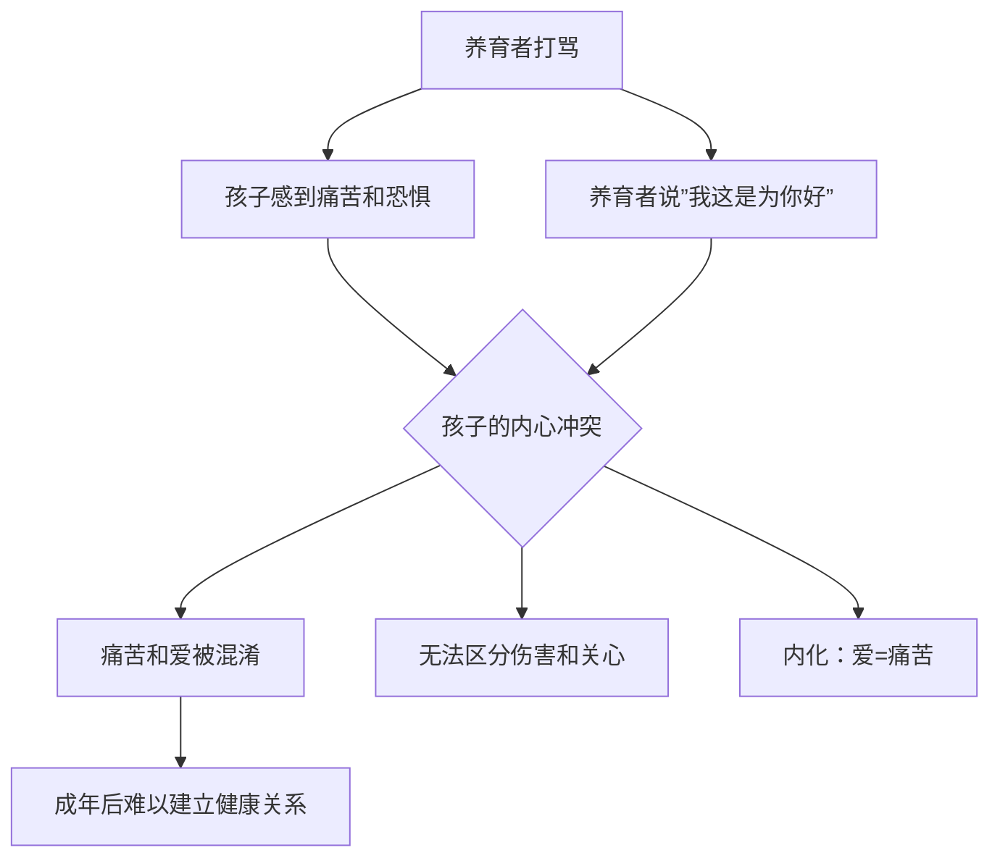

# 第06课：依恋类型与情感养育

## 学习目标

完成本课后，你将能够：

- 描述四种依恋类型及其对心智化发展的影响
- 解释养育者作为"镜子"的映射功能
- 分析不同依恋类型如何影响镜子的"折射率"
- 识别"情感养育"与"物质养育"的区别
- 理解为何负面感受未被"映射"比负面感受本身更具破坏性

---

## 四种依恋类型

依恋理论是理解心智化发展的重要框架。心理学家马丽·安斯沃思（Mary Ainsworth）通过"陌生情境实验"识别出以下三种依恋类型，后来研究者又补充了第四种：

```mermaid
quadrantChart
    title 四种依恋类型
    x-axis ”低回避” --> ”高回避”
    y-axis ”低焦虑” --> ”高焦虑”
    quadrant-1 ”安全型”
    quadrant-2 ”倾注型（矛盾型）”
    quadrant-3 ”疏离型（回避型）”
    quadrant-4 ”混乱型”
    “安全型”: [.25, .25]
    “倾注型”: [.25, .75]
    “疏离型”: [.75, .25]
    “混乱型”: [.75, .75]
```

| 依恋类型 | 特点 | 与心智化的关系 |
|---|---|---|
| **安全型** | 信任他人，能健康地依赖和被依赖 | 最有利于发展心智化能力 |
| **回避型（疏离型）** | 回避亲密关系，过度独立，压抑情感 | 倾向于关闭心智化通道 |
| **矛盾型（倾注型/迷恋型）** | 过度依赖，害怕被抛弃，情绪波动大 | 情绪淹没导致无法心智化 |
| **混乱型** | 行为矛盾，在接近与回避之间摇摆 | 心智化严重受损的风险最高 |

---

## 养育者作为镜子：映射功能

### 镜子的比喻

心理学家借用**镜子**的比喻来描述养育者的核心功能：

> 当婴儿哭泣时，养育者模仿婴儿的表情并发出关切的回应——就像一面镜子，**把婴儿的情绪状态映射回给婴儿看**。

这个过程的意义在于：

1. 婴儿通过养育者的反应**看到了自己的情绪**（"哦，原来我现在的状态叫'难过'"）
2. 婴儿体验到自己的情绪是**可以被理解和容纳**的
3. 婴儿逐渐学会**识别和命名**自己的情绪状态


### 什么是真正"打垮"一个人的

这里有非常重要的洞察：

> **打垮一个人的不是负面感受本身，而是负面感受从未被镜子映射，从未被心智化。**

- 一个孩子感到害怕是正常的。
- 但如果这个害怕**从未被任何人看见和理解**——如果养育者对孩子的恐惧视而不见、嘲笑、或否定（"这有什么好怕的！"）——那么这个恐惧就会变成一种**未被心智化的原始体验**。
- 这种未被映射的感受不会消失，而是会以各种形式在日后的人生中反复出现。

---

## 镜子的折射率：依恋类型如何影响映射

并不是所有的"镜子"都一样。不同依恋类型的养育者，镜子的"折射率"也不同。

### 米利根研究：母亲为宝宝唱歌

多伦多大学的米利根（Milligan）及其同事进行了一项富有启发性的研究。他们让不同依恋类型的母亲为宝宝唱歌，然后分析歌声中传递的情绪特征。

```mermaid
flowchart TD
    subgraph ”安全型母亲”
        A1[宝宝痛苦] --> B1[歌声映射痛苦]
        B1 --> C1[但掺杂其他情绪: 安抚、希望、温柔]
        C1 --> D1[宝宝既能被理解，又不会被淹没]
    end
    
    subgraph ”倾注型母亲”
        A2[宝宝痛苦] --> B2[歌声完全被痛苦淹没]
        B2 --> C2[焦虑和恐惧占主导]
        C2 --> D2[宝宝被双重痛苦包围]
    end
    
    subgraph ”疏离型母亲”
        A3[宝宝痛苦] --> B3[歌声距离太远]
        B3 --> C3[情绪平淡，缺乏回应]
        C3 --> D3[宝宝感到被忽视]
    end
```

#### 安全型母亲的歌声

安全型母亲的歌声中**映射了宝宝的痛苦**，但**掺杂了其他情绪**——安抚、希望、温柔。这就像一个恰到好处的镜子：

- 既让宝宝**被看见**（"妈妈知道我不舒服"）
- 又不会让宝宝被痛苦**淹没**（"但妈妈在安抚我，所以一切都会好起来"）

#### 倾注型母亲的歌声

倾注型（矛盾型/迷恋型）母亲被宝宝的痛苦**完全淹没**。她的歌声中充满了焦虑和恐慌。这意味着：

- 镜子里全是痛苦，没有缓冲
- 宝宝不仅体验着自己的痛苦，还**增加了母亲的焦虑**
- 失去了"恰到好处的距离"

#### 疏离型母亲的歌声

疏离型（回避型）母亲的歌声**距离太远**——情绪平淡，缺乏情感的回应。这意味着：

- 宝宝的感觉没有被映射回来
- 宝宝需要"靠近镜子"才能看到自己，但镜子已经退得太远

### 拉开距离才能照镜子

一个有趣的比喻：**你需要与镜子保持一段距离，才能看到镜子里的自己。**

- 如果贴得太近（倾注型），你看到的只是一片模糊
- 如果离得太远（疏离型），你也看不到自己
- 只有**恰到好处的距离**（安全型），才能清晰地看见自己

> [!TIP] 关键洞察
> 好的心智化养育不是在情绪上与孩子完全融合（"孩子哭我也哭"），也不是完全抽离（"哭就哭吧"），而是**既能够连接，又保持一定的空间**——在这个空间里，孩子的情绪可以被容纳、被理解，而不至于淹没双方。

---

## 情感养育被忽视的现象

### 知识喂养 vs 情感喂养

想象一个常见的场景：

> 妈妈和3岁的孩子一起读绘本。妈妈指着一只小狗问："这是什么颜色？"孩子答："黄色。"妈妈又问："小狗在干什么？"孩子答："在跑。"妈妈满意地说："真聪明！"

这是很好的认知教育，但是**情感养育在哪里？**

- 孩子对绘本中角色的感受是什么？
- 孩子自己此刻的感受是什么？
- 亲子之间的情感连接是什么？

> [!WARNING] 情感养育的缺失
> 我们太习惯于用"学到了什么知识"来衡量养育质量，却很少用"感受到了什么情感"来衡量同样重要。

### "打是疼骂是爱"造成的混乱

传统观念中的"打是疼骂是爱"在心智化视角下尤其值得警惕。当养育者一边打骂孩子一边说"我是为你好"时，孩子的内心会产生**极度的混乱**：



这种混淆会导致孩子在成年后难以区分"爱"和"伤害"，可能重复不健康的亲密关系模式。

---

## 情感养育与物质养育

| 维度 | 物质养育 | 情感养育 |
|---|---|---|
| 内容 | 提供食物、衣物、住所、教育 | 提供关注、理解、情绪回应 |
| 可测量性 | 容易量化（吃什么、穿什么） | 难以量化（是否"在场"） |
| 社会关注度 | 高（"不能让孩子输在起跑线上"） | 低（常常被忽视） |
| 对心智化的影响 | 间接（基本生存保障） | 直接（影响心智化能力发展） |

> [!EXAMPLE] 情感养育的例子
> 一个情感养育的例子：孩子放学回家闷闷不乐，妈妈注意到并轻声问："你今天好像不太高兴，愿意跟妈妈说说吗？"孩子摇摇头。妈妈说："没关系，等你想说的时候我都在。"——这不是知识教育，不是物质满足，而是对**内心世界的关注与尊重**。

---

## 自测题

> [!QUESTION] 自测：镜子的折射率
> 请用你自己的话解释：为什么说不同依恋类型会影响养育者这面"镜子"的折射率？安全型、倾注型、疏离型母亲各自产生的"折射"有何不同？

<details>
<summary>点击查看参考答案</summary>

**参考答案要点：**

"镜子的折射率"比喻的是养育者将孩子的情绪状态"映射"回去时，映射的准确性和距离感。

- **安全型母亲**：折射恰到好处——既能看到孩子的痛苦，又加入了安抚和希望的成分。孩子既能被理解，又不会被痛苦淹没。这是"恰到好处的距离"。
- **倾注型（矛盾型）母亲**：折射过度——被孩子的痛苦完全淹没，镜子里充满了母亲的焦虑。孩子被双重痛苦包围。这是"贴得太近"。
- **疏离型（回避型）母亲**：折射不足——距离太远，情绪平淡，孩子的感受没有得到充分的映射和回应。这是"离得太远"。

只有当镜子距离恰当时，孩子才能清晰地"看到"自己的情绪状态，并学会理解和调节情绪。
</details>

---

## 下一课

我们已经了解了养育者作为"镜子"的功能如何影响心智化发展。但除了养育方式外，还有一个更深层的问题：**互动本身的真实性**。真实的人类互动与虚拟互动有什么本质区别？过于追求"正确"的回应会带来什么后果？

继续学习 [[0007-hu-dong-de-zhen-shi-xing|第07课：互动的真实性]]

---

## 复习任务

1. **反思自身依恋模式**：回顾你的主要亲密关系，你更倾向于哪种依恋模式？这如何影响你与他人互动？
2. **观察情感养育**：在下次与孩子或他人的互动中，注意你是否关注了对方的**情感状态**，而不只是"事情做对了没有"。
3. **镜子练习**：当有人向你表达负面情绪时（难过、愤怒、恐惧），尝试先用一句话确认对方的感受（"听起来你真的很生气"），之后再提供建议或安慰。