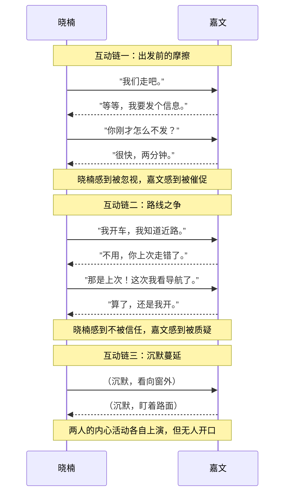

# 第08课：三大口诀总览——沟通断裂案例

## Learning Objectives

- 通过嘉文和晓楠的完整案例，理解亲密关系中沟通如何从顺畅走向断裂
- 掌握人际互动链的分析方法，识别沟通中每一环节的断裂点
- 概览三大口诀的核心思想，为后续深入学习做准备

## 案例：嘉文和晓楠的周末计划

嘉文和晓楠是一对年轻夫妻。一个周六的上午，两人计划一起出门办事。以下是他们之间的互动——

**场景一：出发前的分歧**

> 晓楠（边穿外套边说）：我们走吧。
>
> 嘉文（低头看手机）：等等，我要发个信息。
>
> 晓楠（语气略带不满）：你刚才怎么不发？我已经准备好了。
>
> 嘉文（头也不抬）：很快，两分钟。

**场景二：路线之争**

> 晓楠（走向车门）：我来开车吧，我知道一条近路。
>
> 嘉文：不用，我开。那条路你上次走错了。
>
> 晓楠：那是上次！这次我看了导航，真的可以走。
>
> 嘉文：算了算了，还是我开吧，你坐副驾就行。

**场景三：沉默蔓延**

两人上车后，车厢里是令人窒息的安静。晓楠看向窗外，嘉文面无表情地盯着前方的路。原本计划中的"一起出门"，现在变成了"两个人各自待在同一辆车里"。

这不是某个特别糟糕的日子——类似的情节在他们的生活中反复上演。

## 人际互动链分析

用Mermaid序列图来展示这三条连续的人际互动链，可以看到每一次互动如何为下一次埋下伏笔：



### 三次互动的断裂点

| 互动链 | 表面事件 | 嘉文的内心（推测） | 晓楠的内心（推测） | 断裂点 |
|--------|----------|-------------------|-------------------|--------|
| 1 | 出发时间 | "我在处理重要的事" | "他不重视我的安排" | 双方都只看到自己的需要 |
| 2 | 谁开车 | "上次她确实走错了，我来避免问题" | "他不相信我，不尊重我的能力" | 过去经验影响了当下判断 |
| 3 | 沉默 | "她在生气，我别惹她" | "他根本不在乎我的感受" | 不敢或不愿开启对话 |

## 从亲密到冲突：转变是如何发生的？

仔细看上面三条互动链，你会发现——

**第一步**只是一件小事：嘉文想发完信息再走，晓楠想按计划出发。如果此时的对话是心智化的，可能会是这样：

> 嘉文："这个信息很重要，给我两分钟发完，可以吗？"
> 晓楠："好，我等你。但我有点着急，担心会迟到。"

然而，实际情况是双方都陷入了**非心智化**状态——他们只关注"事情"本身，而没有关注"事情背后的人"在想什么、感受什么。

这便是三大口诀将要解决的问题。

## 三大口诀总览

三大口诀是在沟通陷入僵局时，帮你重新启动心智化的三句"魔法语言"：

### 口诀一：暂停、跳出，思考对方怎么了/我怎么了

当互动开始变得紧张时，**停下来**，从当前的角色中**跳出来**，像旁观者一样问自己："他为什么会这么说？""我为什么会这么反应？"

> 在嘉文和晓楠的例子中——晓楠若能暂停一下，问自己"嘉文坚持要发信息，是不是有什么重要的事？"嘉文若能暂停一下，问自己"晓楠催我出发，是不是她担心迟到？"——冲突的走向就会完全不同。

### 口诀二：别人不懂我，这才是正常的

我们的表达往往是**经过加密**的，而他人的心智是一座封闭的城堡。别人无法完全理解你，这不是关系的问题，而是**心灵的事实**。

> 嘉文的"算了算了"背后其实是"我不想争吵"，但晓楠听到的是"你不行"。晓楠的"你刚才怎么不发"背后是"我在乎我们的时间安排"，但嘉文听到的是"你总是拖延"。

### 口诀三：把"肯定"换成"可能"

我们之所以生气、受伤，往往是因为**太确定了**——"他肯定是对我不满意""她肯定是不在乎我"。把"肯定"换成"可能"，心智的空间就打开了。

> "他肯定是对我有意见" → "**可能**他今天心情不太好"
> "她总是无视我的感受" → "**可能**她还没有意识到我的感受"

> [!TIP] 三大口诀的内在逻辑
> 口诀一帮你在冲突**当下**停下来；口诀二让你在停下来之后，对自己和他人的沟通**难度**有合理预期；口诀三则为你提供一种**替换思维方式**，打破绝对化判断。三者是一个递进的过程。

## 三大口诀的适用场景速查

```mermaid
flowchart TD
    A[沟通出现紧张或冲突] --> B{能否停下来思考？}
    B -->|不能| C[使用口诀一：暂停、跳出]
    C --> D[思考对方怎么了/我怎么了]
    D --> E{是否觉得对方应该懂我？}
    E -->|是| F[使用口诀二：别人不懂我才是正常的]
    F --> G[重新解释对方的反应]
    G --> H{是否有绝对化的判断？]
    H -->|是| I[使用口诀三：把肯定换成可能]
    H -->|否| J[继续沟通，保持开放]
    I --> J
```

> [!QUESTION] 自测题
> 回顾嘉文和晓楠的案例，选择其中一条互动链，尝试用三大口诀重新编写对话。例如，如果晓楠在听到"等等，我要发个信息"之后使用了口诀一，她会说什么？她之后又如何使用口诀二和口诀三？

<details>
<summary>参考回答</summary>

**使用口诀一的改写**：
晓楠暂停了一下，想："嘉文说他要发信息——他平时不是拖延的人，可能真的有重要的事。""我等一下也可以，不需要急这几分钟。"

晓楠："好，是什么重要的事吗？"
嘉文："老板临时问我一个项目的进展，我回一句就好。"
晓楠："那行，你回吧，我等你。"

**使用口诀二的意识**：
晓楠意识到，嘉文说"等等"的时候，并没有意识到她已经穿好外套在等了——他不是故意忽视她，而是**沉浸在自己的事情中**。她不需要把他的行为解读为"不重视自己"。

**使用口诀三的思维转换**：
晓楠的自动思维是："他**肯定**不重视我们约好的时间。"转换后："他**可能**只是被临时的事情绊住了，并不代表他不重视。"

这样一来，冲突根本没有发生的机会。
</details>

## Next Step

你已经了解了三大口诀的全貌。接下来，我们将逐一深入学习每一条口诀。

- [[0009-kou-jue-yi-zan-ting|第09课：口诀一——暂停、跳出，思考对方怎么了/我怎么了]]
- [[0010-kou-jue-er-bie-ren-bu-dong-wo|第10课：口诀二——别人不懂我，这才是正常的]]
- [[0011-kou-jue-san-ba-ken-ding-huan-cheng-ke-neng|第11课：口诀三——把肯定换成可能]]

你也可以先查看 [[reference/san-da-kou-jue|三大口诀速查参考文档]]，快速回顾全部口诀的核心要点。

---

*用心智化打开关系之门，下一课见。*