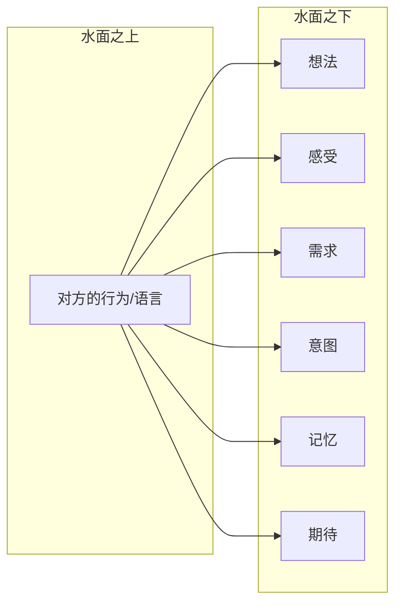
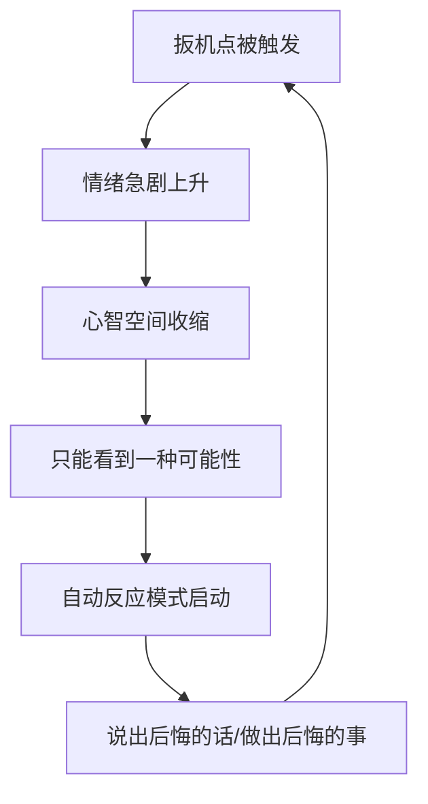
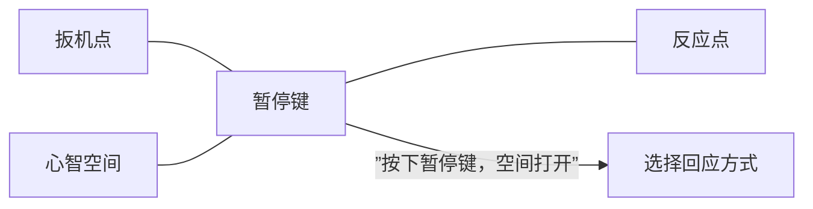
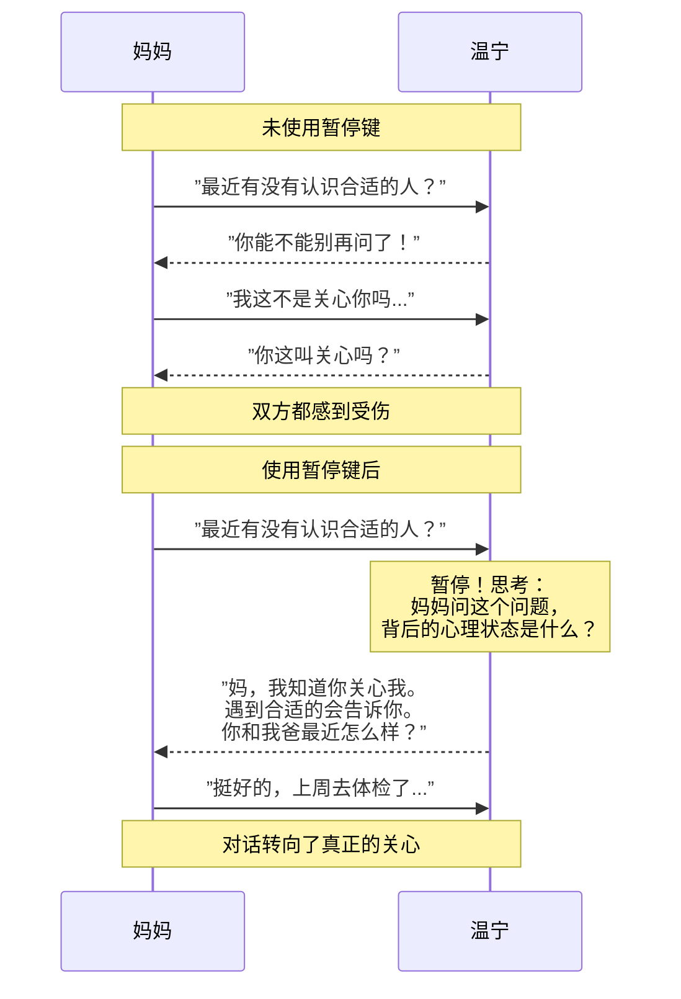

# 第09课：口诀一——暂停、跳出，思考对方怎么了

## Learning Objectives

- 理解"暂停键"在心智化中的关键作用
- 学会识别扳机点，在关键时刻按下暂停键
- 掌握"三个点"创造心智空间的方法
- 了解发起交流时同样需要暂停

## 核心概念：暂停键

口诀一的核心思想是：**行动背后必然有一个完整的心理状态**。

当一个人说了什么、做了什么，那只是冰山的一角。水面之下，有他的想法、感受、需求、意图、记忆和期待。然而，在日常沟通中，我们几乎从不关注水面下的部分——我们只对冰山的一角做出反应，然后奇怪为什么关系会撞上冰山。

## 快速反应下的"沟通"只是一场独角戏

作者分享了一个生动的例子：**杂货店恐怖电影**。

想象这样一个场景——深夜，你独自去杂货店买东西。货架之间的过道灯光昏暗，你拐过一个弯，突然有个人从另一边走过来，你吓了一大跳，心脏狂跳，下意识后退了一步。

在你来得及对那个人说"不好意思吓到我了"之前，你的身体已经完成了全部反应。这不是"沟通"，这是**本能反应**。

同样的道理适用于人际冲突：

> 嘉文说："你总是这样。"
>
> 在他说出这句话的那一瞬间——他没有停下来思考晓楠此刻的感受，也没有思考自己为什么会这么说。他只是被某种情绪"劫持"了，然后一句话就脱口而出。

这就是为什么我们需要在**刺激和反应之间**创造一段距离。这段距离，就是心智化的空间。

### 杂货店恐惧与日常冲突的类比

| 杂货店场景 | 关系冲突场景 | 共同机制 |
|-----------|-------------|---------|
| 黑暗中突然出现的人 | 伴侣说了一句戳中痛点的话 | 都是突发刺激 |
| 心跳加速、后退一步 | 愤怒涌上心头、反唇相讥 | 都是自动反应 |
| 不需要思考就完成反应 | 来不及想就脱口而出 | 都是未经心智化 |

## 在心里创建"暂停键"

如何在刺激和反应之间创造空间？答案是：**在心里创建一个"暂停键"**。

这个暂停键不是一个实际的按钮，而是一种心理习惯——当你察觉到自己即将进入"自动反应模式"时，对自己说：

> "等一下，我现在感觉到____，这是因为____。对方说/做____，这可能是因为____。"

### 扳机点与暂停键

**扳机点**（trigger point）是指那些会引发你强烈情绪反应的情境、话语或行为。每个人的扳机点不同——有人听到"你总是这样"就会炸，有人被忽视时会崩溃，有人在被批评时立刻防御。

当扳机点被触发，你的**心智空间**（mental space）会被急剧压缩：

这就是为什么许多冲突会陷入**恶性循环**——一个扳机点触发另一个扳机点，情绪像滚雪球一样越滚越大。

### 三个点才能创造空间

仅仅知道自己的扳机点是不够的。你需要建立**三个点**：

1. **扳机点**：知道什么会引发你的强烈反应
2. **反应点**：觉察自己正在进入自动反应模式
3. **暂停键**：在扳机点和反应点之间创造一段距离

如果没有暂停键，从扳机点到反应点的路径是**直接**的——中间没有任何空间。暂停键的作用就是在这条路径上插入一个"岔路口"，让你有机会选择不同的方向。

> [!TIP] 扳机点的识别线索
> 留意你身体的信号：呼吸变急促、心跳加快、肌肉紧张、声音变高变尖，或者你的脑海里出现绝对化的词语（"总是""从不""永远"）。这些都是扳机点正在被触发的信号——也是按下暂停键的最佳时机。

## 进阶应用：发起交流时也需要暂停

口语一不仅适用于**被动接收**信息时，也适用于**主动发起**交流时。

**温宁和妈妈的案例**：

温宁是一位三十岁的单身女性。每个周末她回父母家，妈妈都会问："最近有没有认识什么合适的人？"

以前温宁的反应是立刻防御："你能不能别再问了！这是我的事！"然后两人就会争吵。

但后来温宁学会了在**开口回应之前**先按暂停键——她问自己："妈妈问这个问题，她真正的心理状态是什么？"

当她暂停下来思考，她意识到：妈妈并不是在催婚，而是在表达关心——但妈妈不知道怎么直接表达关心，只能用"问对象"这个来来回回的唯一话题。

当温宁想明白这一点之后，她的回应变了：

> 温宁："妈，我知道你关心我。如果遇到合适的人，我会告诉你的。最近你和我爸身体怎么样？"

这个回应既接纳了妈妈的关心，又把话题转向了她真正关心的事情。

## 不必追求完美的理解

最后需要提醒的是：**"成功理解到了"已经是巨大的进步**。

你不需要完全猜对对方在想什么。心智化不是读心术，它只是一种**尝试**——你尝试去理解，对方感受到你的尝试，这就已经改变了互动的质量。

哪怕你暂停之后得出的推断是错的，也比根本没有暂停、直接进入自动反应要好得多。

> [!QUESTION] 自测题
> 回想你最近一次与人发生冲突的经历。在冲突中，你的"扳机点"是什么？当时你的身体有哪些信号（心跳、呼吸、肌肉紧张等）？如果当时你按下了"暂停键"，你可以对自己说什么？

参考回答

自测题是开放性的，没有标准答案。但你可以在回答中注意以下几点：

1. **扳机点的识别**：例如"对方提高音量"、"对方说'你总是这样'"、"对方翻白眼"、"被无视"等。

2. **身体信号**：这是关键线索——常见的有：胸口发紧、喉咙发堵、手心出汗、呼吸变浅、声音发抖、想哭、想逃、想打人。

3. **暂停后的自我对话**：例如——
   - "我现在的感受是愤怒/受伤/委屈，这是因为我说的话被他打断了。"
   - "他说'你总是这样'——他可能只是急于表达自己的观点，而不是真的要否定我整个人。"
   - "先深呼吸三次，再开口。"

请把这次的觉察记录下来——这就是你创建"暂停键"的第一步。

## 延伸阅读

- [[0008-san-da-kou-jue-zong-lan|第08课：三大口诀总览]] — 了解三大口诀的完整框架
- [[0010-kou-jue-er-bie-ren-bu-dong-wo|第10课：口诀二——别人不懂我，这才是正常的]] — 当你暂停之后，如何更合理地理解对方的"不懂"

---

*下一次冲突来临时，记得先按暂停键。*