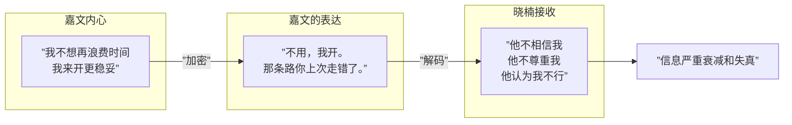
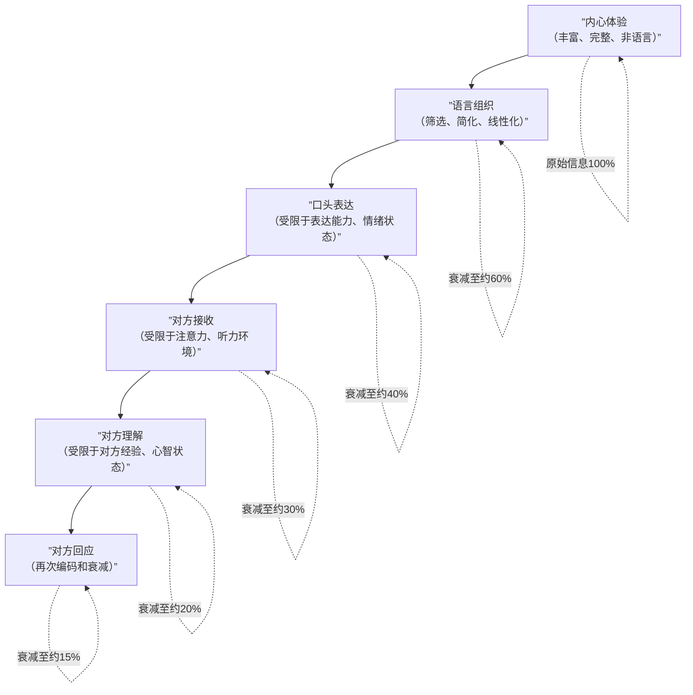

# 第10课：口诀二——别人不懂我，这才是正常的

## Learning Objectives

- 理解"心智不透明"原理，接受"不能完全被理解"是心灵的事实
- 认识自己的表达方式往往是"加密"的，而非直接传递
- 觉察自己对"被别人理解"的期待是否合理
- 学习在沟通中主动"解码"和"补充说明"的方法

## 核心概念：心智不透明

口诀二的核心思想是：**别人不懂我，这才是正常的**。

这句话看似简单，但真正接受它并不容易。因为我们内心深处都渴望被理解——甚至渴望**不需要说出口就被理解**。

但现实是：**心智并不透明**。

> **人心隔肚皮**——这句俗语道出了心智化的核心洞见：你无法直接看到别人的内心，别人也无法直接看到你的内心。

## 嘉文的表达是经过加密的

回到嘉文和晓楠的案例：

> 晓楠："我来开车吧，我知道一条近路。"
>
> 嘉文："不用，我开。那条路你上次走错了。"

嘉文的原话是——"不用，我开。那条路你上次走错了。"

但晓楠**听到**的是——"我不相信你""你不行""你做不好这种事"。

嘉文的实际意思（推测）是——"上次我们确实绕路了，这次我不想再浪费时间。我来开车更稳妥。"

这里存在一个巨大的**信息差**：



嘉文表达出来的内容，相对于他的内心状态，已经经过了**压缩和加密**。而晓楠接收到的内容，相对于嘉文表达出来的内容，又经过了**二次解读和扭曲**。

这就是为什么作者说：我们的表达像一段被多次解压缩的视频——最终的信息质量远远低于原始内容。

## 信息传达不像想象中那么清晰

想象一下这个场景：

> 你做了一个非常奇怪的梦，第二天早上想讲给朋友听。梦中那种黏腻的恐惧感、那种说不清道不明的紧张氛围、那些不符合物理规律的场景转换——你试图用语言描述，但总觉得词不达意。
>
> 朋友听完了，说："哦，听起来是挺奇怪的。"

你感到失望——她觉得你的梦"只是挺奇怪的"，但她根本不明白那种恐惧有多真实。

但问题是：你**真的**把那种恐惧传递给她了吗？

这个梦境例子说明了一个深刻的问题：**人类的内心体验是私密的、非语言的、多层次的，但我们必须用线性的、公共的语言来表达它**。这个翻译过程本身就是有损耗的。

### 信息传递的损耗链



这并非悲观——这是**现实**。认识到这个现实，反而会让你对沟通中出现的误解更加宽容。

## "不能完全理解"是心灵的一项事实

作者强调：**"不能完全理解"不是关系的失败，而是心灵的事实**。

就像我们不能完全隔着墙看到对面——这不是墙的问题，这是物理规律。同样，我们不能完全理解另一个人的内心——这不是沟通技巧的问题，这是心智的规律。

接受这一事实之后，你反而会获得一种解放：

- 你不必要求自己**完全**理解对方——能理解一部分就已经很好了
- 你不必期待对方**完全**理解你——他不理解，不是他不重视你
- 你可以在沟通中说："我说清楚了吗？"——而不是"你听懂了吗？"
- 你可以在对方没理解时，耐心地再说一遍——而不是生气地重复

> [!TIP] 从"你听懂了吗"到"我说清楚了吗"
> 一个小小的语言转换，反映出巨大的心智化差异：
> - "你听懂了吗？"——把责任放在对方身上，隐含的责备是"你怎么还不懂"
> - "我说清楚了吗？"——把责任放在自己身上，表达的是"我还可以再做一次努力"

## "别人一定懂我"的信奉者

有一些人特别容易陷入"别人应该懂我"的陷阱。以下是两个典型案例：

### 启辰的实习生案例

启辰是一位广告公司的创意总监。公司新来了一位实习生，启辰布置了一项任务：

> 启辰："把这份资料整理一下，做个PPT。"

实习生做完了，交上来的时候，启辰非常失望——PPT的风格、结构、内容深度都完全不符合他的预期。

启辰的第一反应是："她怎么这么不靠谱？我明明说了要做个PPT。"

但当启辰冷静下来，他问了自己一个问题："我真的说清楚了吗？"

他意识到——他说的是"做个PPT"，但脑中的期望是"做一份符合我们团队风格、以数据分析为支撑、页数控制在15页左右的提案框架PPT"。而他完全没有把这些**隐含的期望**说出口。

实习生没有读心术，她怎么可能知道？

### 李飞的"你当然知道"案例

李飞和妻子因为一件事争吵。妻子想去一个朋友聚会，李飞不想去，他认为妻子**应该知道**他不喜欢那种场合。

> 妻子："你为什么不早点说？"
>
> 李飞："你当然知道我不喜欢那种聚会啊！还用说吗？"

这就是"别人一定懂我"思维的典型表现——李飞认为他的好恶是**不言自明的**，他无法理解妻子为什么不"知道"。

但妻子是真的不知道吗？也许她以为李飞上次去聚会"看起来挺高兴的"（李飞只是在社交场合习惯性微笑），也许她以为这次的聚会不一样（的确不一样——这次是她的好朋友）。

**"你当然知道"——这句话往往意味着"我从未明确说过，但我假设你已经知道了"**。

```mermaid
flowchart TD
    subgraph ”别人一定懂我”的信念
        A[我内心有某种感受或想法] --> B[我觉得这是不言自明的]
        B --> C[我不需要明确说出来]
        C --> D[对方没有按我的期望行动]
        D --> E[我生气：你怎么连这都不知道！]
    end

    subgraph ”别人不懂我才是正常的”的信念
        F[我内心有某种感受或想法] --> G[我需要把它表达出来]
        G --> H[对方接收并回应]
        H --> I{对方理解了吗？}
        I -->|理解了| J[太好了！]
        I -->|没完全理解| K[再尝试一次]
    end
```

## 实践建议：如何面对"被理解"的落差

1. **降低期待值**：默认对方不会完全理解你，而不是默认对方应该完全理解你。

2. **把"解释"看作礼物**：当你向对方解释自己时，你是在**送给对方理解你的机会**，而不是在**为"他应该懂"做补救**。

3. **多问一句"我说清楚了吗"**：把沟通的责任放在自己这一侧。

4. **接受"部分理解"**：对方理解了你80%的感受，这已经非常了不起了。

5. **不要用沉默测试友谊**：不主动表达，然后生气对方没有猜到你的需要——这是对关系的伤害，而不是考验。

> [!QUESTION] 自测题
> 你是否有过"他应该懂我"的期待破灭的时刻？回想那个情境：
> 1. 当时你希望对方理解的是什么？
> 2. 你是否有明确表达？还是你假设他不说也"应该知道"？
> 3. 如果用"别人不懂我才是正常的"这个前提重新审视，你会有什么不同的做法？

<details>
<summary>参考回答</summary>

这是一个开放性的自我觉察练习。这里给出一个模拟案例供参考：

**情境**：小林生日那天，伴侣只发了一条微信"生日快乐"，没有准备礼物或庆祝活动。小林非常失望，觉得伴侣"应该知道"她期待一个特别的生日。

**分析**：
1. 小林希望伴侣理解的是——生日对她很重要，她想要被特别对待。
2. 小林没有明确表达过这个期待——她默认"在一起这么久了他当然知道"。
3. 如果用口诀二重新审视：
   - 伴侣的"不懂"不是不爱她，而是他的生日习惯和小林不同（他可能觉得生日就是普通的一天）。
   - 小林可以主动表达——"生日对我来说很重要，下次我们可以一起计划怎么庆祝吗？"
   - 这次的不愉快不是关系的失败，而是一次"双方对彼此更了解"的机会。

**关键转变**：从"你怎么连这都不知道"转向"我需要让你更多地了解我"。
</details>

## 延伸阅读

- [[0008-san-da-kou-jue-zong-lan|第08课：三大口诀总览]] — 了解三大口诀的完整框架
- [[0011-kou-jue-san-ba-ken-ding-huan-cheng-ke-neng|第11课：口诀三——把肯定换成可能]] — 学习如何进一步打开心智空间
- [[reference/san-da-kou-jue|三大口诀速查参考文档]]

---

*别人不懂你，这不是关系的失败，而是心灵的事实。接受它，你才能真正被理解。*