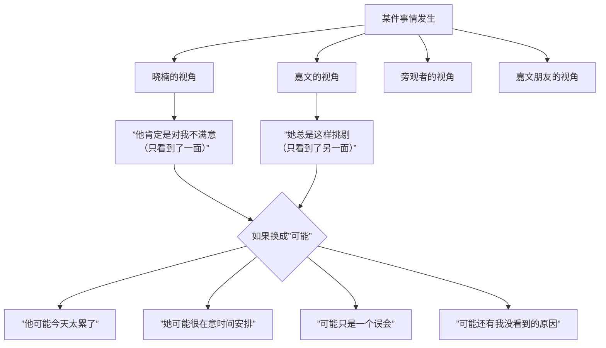

# 第11课：口诀三——把肯定换成可能

## Learning Objectives

- 识别沟通中绝对化语言（"肯定""总是""从不"）的危害
- 理解"心理地图"的概念及其来源
- 掌握从"肯定"到"可能"的思维转换技巧
- 学会使用多个具体方法拓展心智视角

## 核心概念：突破绝对化的思维壁垒

口诀三的核心思想是：**把"肯定"换成"可能"**。

回顾嘉文和晓楠的案例：

> 晓楠的内心独白："他**肯定**是对我不满意。"
> 嘉文的内心独白："你**总是**这样，**从不**考虑我的感受。"

注意这些绝对化的词语——**肯定、总是、从不、永远、没有人**。这些词一旦出现在你的内心独白或对话中，就是一个危险信号：你的心智空间正在急剧收缩。

当晓楠认为嘉文"肯定是对我不满意"时，她已经**关闭了其他所有可能性**。也许嘉文只是在想工作上的事？也许他今天身体不舒服？也许他根本没有注意到自己的语气？

但当"肯定"两个字出现时，这些可能性就被一键清除了。

## 事物有多种可能性

作者用**盲人摸象**的经典故事来比喻这一现象：

> 几个盲人第一次触摸大象。摸到象腿的说："大象像一根柱子。"摸到象身的说："大象像一堵墙。"摸到象鼻的说："大象像一条蛇。"
>
> 他们都**肯定**自己是对的——因为他们触摸到的部分确实像柱子、像墙、像蛇。

这个故事的寓意不是"不要相信自己的判断"，而是**你的判断只基于你接触到的那一部分现实**。你没有接触到全部，所以你的"肯定"可能仅仅是"你觉得"。



## 绝对化判断来自"心理地图"

作者指出：这些绝对化判断并非凭空而来，它们来自你的**心理地图**（mental map）。

### 什么是心理地图？

心理地图（在心理学中也称为**图式**或**内部工作模式**）是你从小到大积累的对世界、对他人、对自己的**认知模板**。

这些东西在塑造你的心理地图：

- 童年经历：父母如何对待你、你与兄弟姐妹的关系
- 重要关系：过去的亲密关系、友谊、师生关系
- 文化背景：家庭文化、社会文化、价值观
- 重大事件：创伤、失去、重大成功或失败

### 成也萧何，败也萧何

心理地图是**有用的**——它帮你快速理解世界，不需要每件事都从头学起。比如你小时候被烫过一次，你就建立了"火是危险的"心理地图，这保护了你。

但在人际关系中，心理地图也会**带来限制**——特别是当你的心理地图基于过去的经验，而忽略了当下的实际情况。

| 心理地图类型 | 它的来源（可能） | 它的局限 |
|-------------|----------------|---------|
| "别人都会伤害我" | 曾经被重要的人伤害过 | 可能让你对善意的人过度防御 |
| "我不够好" | 成长中频繁被批评 | 可能让你忽视自己的进步和优点 |
| "我必须完美" | 只有表现好才获得关注 | 可能让你无法承受任何失误 |
| "亲密关系不可靠" | 经历过背叛或遗弃 | 可能让你无法进入健康的亲密关系 |

### 心理地图的核心：对自我存在的判断

心理地图中最核心的部分，关乎你对**自我存在**的基本判断。作者指出，这些判断往往呈现为一种"底色"：

> "我是值得被爱的。"
> "我是不受欢迎的。"
> "没有人会真正在乎我。"
> "只要我足够努力，就会得到认可。"

这些核心信念不像衣服可以随时换——它们是你心灵的**地基**。即使你理智上知道"我应该觉得自己是值得被爱的"，但如果你的心理地图中写的是"我是不受欢迎的"，那么你的人际关系判断就会被这个底层代码影响。

```mermaid
flowchart TD
    subgraph ”心理地图的层级”
        L1[”表层：日常判断<br/>'他肯定对我不满意'”]
        L2[”中层：关系信念<br/>'亲密关系中我总是不被重视的'”]
        L3[”核心层：自我存在<br/>'我是不值得被爱的'”]
    end

    L3 --> L2 --> L1
    L1 -->|”触发”| L2
    L2 -->|”激活”| L3

    Note[”口诀三的作用：<br/>先从表层入手，<br/>把'肯定'换成'可能'，<br/>这就在撬动整个心理地图。”]
```

## 开放和多元视角的具体方法

以下是作者提供的五个具体方法。每一个都是将"肯定"替换为"可能"的实用工具。

### 方法一：关注绝对化语言

把以下词语列为"红色警报"词汇：

| 绝对化词语 | 替换为 |
|-----------|-------|
| "他**肯定**……" | "他**可能**……" |
| "你**总是**……" | "你**这次**……" |
| "**从来**没有人……" | "**有时候**没有人……" |
| "**永远**都会这样" | "**目前**看起来是这样" |
| "**所有人**都……" | "**一些**人……" |

当你在内心独白或对话中听到这些词，问自己一句："这是真的吗？有没有其他可能性？"

### 方法二：加上"我觉得"

把**主观判断**与**客观事实**区分开来。

> 不要说："他不重视我。"
> 可以说："**我觉得**他不重视我。"

加上"我觉得"这三个字，看似简单，却有着巨大的心理作用——它提醒你：这不是事实，这只是我的判断。

同理：

> **事实**：他今天没有回我消息。→ **我的判断**：他不在乎我。
> **事实**：她在会议上打断了我的话。→ **我的判断**：她不尊重我。

### 方法三：追问"这个结论是怎么得出来的"

这句话是你对自己说的——不是对对方说的。它是帮助你自己审视判断逻辑的工具。

> "他认为我做得不够好。"
>
> 追问：**这个结论是怎么得出来的？**
> 回答：他没有说"很棒"，直接就下一个问题了。
>
> 再追问：**"没有说'很棒'"和"认为我做得不够好"之间有什么必然联系吗？**
> 回答：不一定……他可能只是赶时间。

### 方法四：主动切换其他角度

这是一种刻意练习。当你有了一种判断之后，主动寻找至少**两种其他可能的解释**。

> 晓楠的原始判断："他肯定是对我不满意。"
>
> 其他可能性：
> 1. **可能**他今天在公司被老板批评了，心情不好。
> 2. **可能**他最近睡眠不好，疲惫让他没精神。
> 3. **可能**他只是在专注地想事情，没有注意到自己的表情。
> 4. **可能**他以为我也在生气，不敢先开口。

**这不是在为对方开脱**——而是在帮助你的心智从"只有一种解释"的僵化中解放出来。即使嘉文真的对晓楠不满意，晓楠如果能带着"可能"而不是"肯定"去沟通，对话的氛围也会完全不同。

### 方法五：保持开放，接受他人观点

最后，即使你经过全面思考得出了一个合理的判断，也要为"对方可能有不同视角"留出空间。

> "我以为你不高兴是因为我迟到了。但你说不是？那你可以告诉我是什么原因吗？"

这就是心智化的成熟表现——你给出了你的理解，但你愿意接受修正。

> [!TIP] 口诀三不是让你放弃判断
> 把"肯定"换成"可能"，不是让你变成一个没有立场、不敢下结论的人。而是让你的判断**留有修改的余地**。就像科学家提出假说——"根据我的观察，我推测……"——然后保持开放，接受新的证据。
>
> 你依然可以有坚定的观点，但这个观点是**可修正的**。

## 总结：三大口诀如何联动


> [!QUESTION] 自测题
> 观察自己过去一周的内心独白或对话中，有没有用到"肯定""总是""从不""永远"这些绝对化词语？选一个例子，用今天学到的五个方法逐一改写。

<details>
<summary>参考回答</summary>

以下是示例改写，请根据你自己的实际情况进行练习：

**原始内心独白**："我老板**肯定**觉得我不够好。他**总是**把重要的项目交给别人做，**从来**不考虑我的感受。"

**改写过程**：

1. **关注绝对化语言**：
   - "他肯定觉得我不够好" → "他可能觉得我还需要再锻炼"
   - "他总把项目交给别人" → "这次他把项目交给了别人"
   - "从不想我的感受" → "他可能没意识到这件事对我的影响"

2. **加上"我觉得"**：
   - "我觉得他不认可我。"（这不是事实，只是我的感受）

3. **追问来源**：
   - 这个结论怎么得出来的？→ 因为我主动申请了一个项目但没被批准。
   - "没被批准"等于"他觉得我不够好"吗？→ 不一定，可能项目需要更资深的人，可能我最近太忙了。

4. **切换角度**：
   - 可能他正在培养我在另一个方向上的能力。
   - 可能他觉得这个项目压力太大，不想让我过度承担。

5. **保持开放**：
   - 下次有机会可以主动问老板："我如果想承担更有挑战性的项目，需要提升哪些方面？"

**最终对话**：
从"他肯定觉得我不够好"变成了"我想知道他对我未来发展的看法"——思维方式发生了根本转变。
</details>

## 延伸阅读

- [[0008-san-da-kou-jue-zong-lan|第08课：三大口诀总览]] — 了解三大口诀的完整框架
- [[0009-kou-jue-yi-zan-ting|第09课：口诀一——暂停、跳出]] — 先学会暂停，才有机会替换
- [[0010-kou-jue-er-bie-ren-bu-dong-wo|第10课：口诀二——别人不懂我才是正常的]] — 当你不强求别人懂你时，也更容易放下肯定
- [[reference/san-da-kou-jue|三大口诀速查参考文档]]

---

*把"肯定"换成"可能"，世界会在一瞬间变得开阔。*