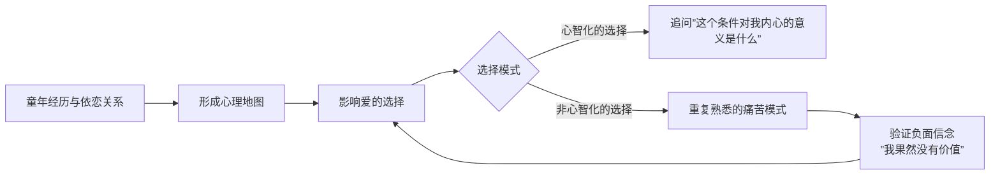
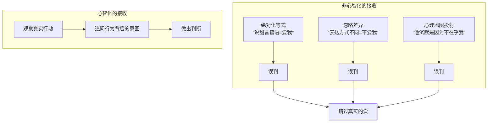

# 第12课：亲密关系——选择与接收爱

## Learning Objectives

- 识别自己的"心理地图"如何影响对爱人的选择，并审视其背后的信念根源
- 区分非心智化的三种接收类型，学会用真实行动而非夸张言词判断爱

## 心理地图：你选择的不是一个人，而是一张地图

每个人心中都有一幅关于"爱"的心理地图——它由童年经历、早期依恋关系和过往伤痛绘制而成。这幅地图告诉你：什么样的爱是熟悉的、什么样的关系是安全的、什么样的人值得靠近。

问题是，熟悉的不一定健康，安全的未必是温暖的。

> [!WARNING] 心智化警示
> **"我没有价值"的信念就像一个隐形的磁铁**，它会让你不断选择那些会验证这一信念的人——忽视你的、贬低你的、让你觉得自己不够好的。你不是运气不好，而是心理地图在无声地导航。

## 选择的自由与自由的代价

留在熟悉的心理地图里是有代价的——你得到了"确定"，但失去了"可能"。那个总让你猜心思的伴侣，那个若即若离的对象，他们之所以被选中，是因为他们激活了你童年的熟悉感。

但心智化给你一个选择：**你可以走出这间囚牢**。

留在囚牢的代价是安全但窒息，破栏而出的代价是未知但自由。真正的自由不是没有恐惧，而是带着恐惧依然选择迈出那一步。

## 心智化自己对爱人的选择

心智化的练习不是让你立刻换一个人，而是让你学会追问自己：

> 我迷恋"霸道总裁"这个条件，它对我内心的意义是什么？——也许是因为我想被一个强大的人接管，那样我就不必为自己负责了。

> 我非要找一个"老实人"，它对我内心的意义是什么？——也许是因为我害怕被伤害，觉得老实人就意味着安全。

把外在的条件翻译成内心的语言，你就从被动接受心理地图的导航，变成了主动绘制新地图的绘图师。

## 接收爱：李尔王的故事

莎士比亚的《李尔王》中，老国王想知道三个女儿有多爱他，于是让她们用言辞表白。大女儿和二女儿用夸张的辞藻说尽了甜蜜的话，而小女儿只是老实地说：我爱你如我的本分，不多不少。

李尔王大怒，驱逐了小女儿。最后他发现自己被骗了——那些说最爱他的人，恰恰是伤害他最深的人。

## 非心智化的接收：三种类型

### 类型一：绝对化——A等于B的等式

> "他不说晚安就是不爱我了"
> "他不给我买礼物就是不在乎我了"

把一个人的行为直接等同于一个结论，忽略了行为的多种可能性。他也许加班到深夜，也许以为晚安太幼稚，也许正在学习如何去爱。

心智化不是告诉你"他一定爱你"，而是让你看到：**还有其他的可能性**。

### 类型二：忽略了差异——猫和狗的不同表达

猫和狗表达爱的方式完全不同——狗摇尾巴是兴奋，猫摇尾巴是警告。如果一个人用猫的方式爱你，而你用狗的解读方式，你永远感受不到爱。

有的人的爱是每天给你做饭，有的人的爱是默默记住你随口提到的一本书。没有标准答案，只有你是否愿意学习对方的语言。

### 类型三：源于自身的心理地图

最隐蔽的是这一种——你对对方行为的解读，反映的不是他，而是你。

- 他开会没回消息 → "他不重视我"（但这更多说明你很需要被重视）
- 她没有主动联系你 → "她不喜欢我"（但这更多说明你很害怕被拒绝）
- 他批评你的工作 → "他觉得我没用"（但这更多说明你对自己能力不够自信）

## Worked Example

**情境**：小敏的男朋友阿强很少说"我爱你"，但他每个周末都会早起为小敏做早餐。小敏觉得阿强不够爱她，因为她认知中的等式是"说爱=爱"。

心智化的过程：

1. **暂停**：先别急着下结论
2. **反思自己的等式**：为什么我认为说爱才是爱？这个信念从哪里来？
3. **观察对方的表达方式**：阿强用行动在传达什么？
4. **开启对话**："我发现你很少说那三个字，但你做早餐让我感觉很温暖——你表达爱的方式和我不太一样，能跟我说说你是怎么想的吗？"

> [!NOTE] 关键区分
> 心智化接收 ≠ 自我欺骗说"他这样就够了"。心智化是**先理解再判断**，而不是无视自己的需求。如果理解了对方的方式后依然觉得不满足，那也是一个诚实的结论。

## Practice

> [!QUESTION] 自测题
> 小丽每次和男友吵架后，男友都会选择沉默几个小时。小丽觉得"他沉默=冷暴力=不在乎我"。但实际上，男友来自一个需要冷静处理情绪的家庭，沉默是他的方式避免说出伤人的话。
>
> 请问小丽的接收属于哪一种非心智化类型？心智化的做法应该是什么？

点击查看答案

小丽的接收属于**源于自身的心理地图**——她把"沉默"直接等同于"冷暴力"，这反映的是她过去被冷暴力的经历，而非男友的实际意图。

心智化的做法：
1. **暂停绝对化等式**：问自己"沉默一定等于冷暴力吗？还有没有其他可能？"
2. **观察更多线索**：男友沉默后的行为是怎样的？他最终会来处理问题吗？
3. **心平气和地确认**："你每次吵架后不说话，我容易理解为你在冷落我。你的沉默是什么意思？"
4. **根据确认的结果判断**：是调整自己对他的理解，还是承认双方不匹配。

**参考**：[[0011-kou-jue-san-ba-ken-ding-huan-cheng-ke-neng|口诀三：把肯定换成可能]]

## 相关课程

- [[0013-qin-mi-guan-xi-biao-da-ai|第13课：亲密关系——表达爱]]
- [[0014-zhi-chang-gou-tong|第14课：职场沟通]]
- [[0009-kou-jue-yi-zan-ting|口诀一：暂停]]
- [[0011-kou-jue-san-ba-ken-ding-huan-cheng-ke-neng|口诀三：把肯定换成可能]]

## Next Step

尝试在本周留意：当你觉得对方"不够爱"或"不够在乎"的那一刻，问自己三个问题——我的判断是一个等式吗？我用的是自己的语言还是对方的语言？这个判断更多反映的是我还是他？

Continue with the next lesson or complete the review task above before moving on.