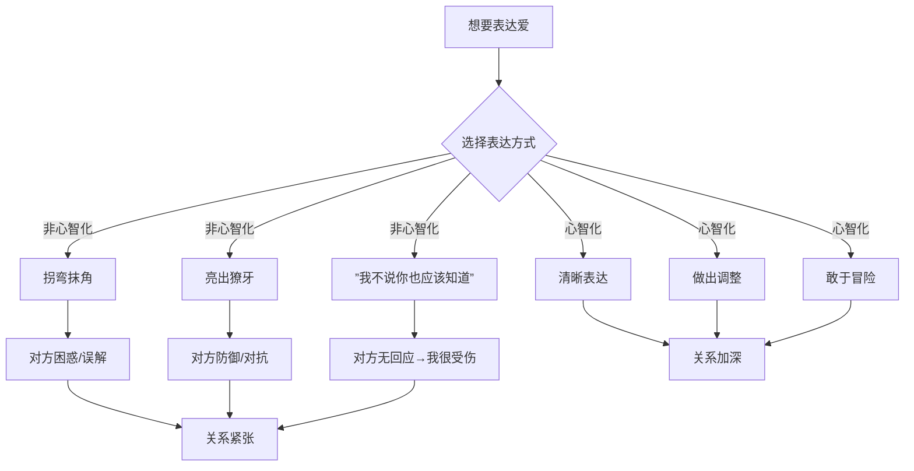
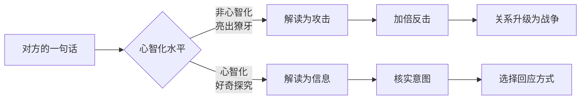

# 第13课：亲密关系——表达爱

## Learning Objectives

- 识别非心智化表达的四种类型，对照自身在亲密关系中的表达模式
- 掌握心智化表达的三要素——清晰表达、做出调整、敢于冒险——并在真实关系中练习

## 李尔王的故事之二：小女儿的心智化表达

上一课提到李尔王让小女儿表白，小女儿说："我爱你如我的本分，不多不少。"

这不是冷漠——这是心智化的表达。小女儿知道：
- 父亲的测试是**不安全的**——用夸张言词来判断爱，本身就是游戏
- 她不参与这个游戏，因为她对父亲的爱是真实的，不是表演出来的
- 她选择了**清晰但不夸张**的表达方式

虽然结果悲壮——她被驱逐了——但她的表达方式是心智化的：清晰、真实、不迎合。

## 非心智化的表达一：拐弯抹角

### 霸道总裁式

"我没生气。"（面无表情、一言不发）

把真实的情感藏在反话或沉默背后，期待对方能"穿过我的冷漠看到我受伤的心"。但这其实是把对方推入了猜谜游戏的陷阱——猜对了是运气，猜错了是常态。

### 口不对心的反话

明明想要被陪伴，却说"你忙你的"；明明吃醋了，却说"我才不在乎"。你以为你在保护自己——如果我表现出不在乎，被拒绝时就不会太痛。但代价是对方永远不知道你需要什么。

### 小佩的身体症状

小佩每次和丈夫有矛盾，不是说出来，而是开始偏头痛、胃疼。她用身体症状表达了愤怒和不满，但她自己都不知道自己在表达什么。身体帮她说了她嘴说不出来的话。

## 非心智化的表达二：亮出獠牙

晓楠的炸毛反应是经典案例。男友只是随口说了一句"你今天这衣服有点奇怪"，晓楠立刻进入防御状态——"你什么意思？你是不是嫌弃我了？你从来就没看得起过我！"

这不是在表达感受，这是在**打保卫战**。把对方的每一句话都当成攻击，把自己武装到牙齿，结果是把一个小摩擦升级为大战争。

## 非心智化的表达三："我不说你也应该知道"

这是很多亲密关系中最具破坏性的假设——"如果你真的爱我，我不说你也会知道我要什么。"

> [!TIP] 面包瓤与面包边的笑话
> 一位太太五十年来总是把最硬的面包边切下来给丈夫，自己吃松软的面包瓤。直到有一天，丈夫说："你知道吗，我这辈子最爱吃的就是面包边。"太太愣住了："我一直以为你爱吃瓤，所以我才给你边……"
>
> **你不说，对方不知道。对方不说，你也不知道。** 这不是爱不爱的问题，这是心电感应不存在的客观事实。

"我不说你也应该知道"的另一种伪装是**自我牺牲**——"我为你做了这么多，你怎么看不见？"但对方没有让你牺牲，你的牺牲是他根本不知道的账本。

## 心智化的表达：清晰 + 调整 + 冒险

### 1. 清晰表达

说出你的需要时，要考虑对方是否能接收到。不是说得越大声越好，也不是说得越委婉越好，而是**确保信息的接收者能解码**。

> "我今天工作很累，如果你能抱我五分钟，我会好很多。"

这不是命令，这是把内心状态翻译成对方能理解的语句。

### 2. 做出调整

晓冬和晓夏是一对夫妻，晓冬表达爱的方式是"解决问题"——妻子说累，他立刻给建议。晓夏觉得他不关心她的感受。心智化的调整不是让晓冬变成另一个人，而是在保持自己特色的前提下做出调整：

- 晓冬可以先问："你需要我帮你解决问题，还是只是听你说说？"
- 晓夏可以理解："他给建议是他的关心方式，然后我可以补充说我需要的是倾听。"

### 3. 敢于冒险

表达爱本身就是冒险——你可能会被拒绝，你的真心可能被误解，你的脆弱可能被利用。

> [!CAUTION] 冒险的意义
> 如果对方不渣，你的冒险会有收获——关系会加深，你会感到被接纳。如果对方渣，你的冒险会让你早日发现真相，及时止损。**不冒险的代价不是安全，而是永远不知道真相。**

## Worked Example

**情境**：小杰觉得女友最近在疏远自己，他很不安，但不知道怎么说。

**非心智化的表达**：
- 拐弯抹角："你最近是不是很忙啊？"（期待她主动来解释）
- 亮出獠牙："你是不是烦我了？你最近一直冷着脸！"
- "我不说你也应该知道"：沉默地生闷气，希望她来问自己

**心智化的表达**：
1. **暂停**自己的不安，不要被情绪裹挟
2. **清晰表达**："我注意到你最近下班后话少了，我有点不安，怕你是不想跟我说话了。我想知道你是怎么想的。"
3. **调整节奏**：如果她暂时不想谈，可以说"好，那等你准备好了我们再聊，我只是想告诉你我的感受，不是要逼你回应。"
4. **接受冒险**：可能她的答案就是不太舒服——但那也是答案，比猜测强。

## Practice

> [!QUESTION] 自测题
> 以下哪些是心智化的表达？（多选）
> 
> A. "你每次都迟到，你根本不尊重我！"
> B. "你迟到的时候我会觉得被忽视了，下次能提前告诉我吗？"
> C. "没什么，你忙你的吧。"（然后不说话）
> D. "我知道你不是故意迟到的，可能是路上有事。但你到之前发个消息的话我会安心很多。"
> E. "你心里根本就没有我！"

点击查看答案

正确答案是 **B 和 D**。

- **A** 是亮出獠牙——"你每次都""根本不"是绝对化指责，容易引发防御和反击。
- **B** 是心智化的表达——表达了感受（"被忽视"），同时给出了建设性的请求。
- **C** 是拐弯抹角——口不对心，把真正的感受藏了起来。
- **D** 是心智化的表达——先为对方找了一种可能的解释（心智化的尝试），再表达自己的需要。
- **E** 是亮出獠牙式的绝对化攻击。

**参考**：[[0011-kou-jue-san-ba-ken-ding-huan-cheng-ke-neng|口诀三：把肯定换成可能]]

## 相关课程

- [[0012-qin-mi-guan-xi-xuan-ze-yu-jie-shou|第12课：亲密关系——选择与接收爱]]
- [[0017-biao-da-xu-yao-yu-chu-li-mao-dun|第17课：表达需要与处理矛盾]]
- [[0009-kou-jue-yi-zan-ting|口诀一：暂停]]
- [[0010-kou-jue-er-bie-ren-bu-dong-wo|口诀二：别人不懂我，这才是正常的]]

## Next Step

本周做一个"表达实验"：选一件小事（比如"我想吃什么""我今天需要什么"），用最直接的方式说出来。观察——你没说什么，你失去了什么？你说了，又得到了什么？

Continue with the next lesson or complete the review task above before moving on.