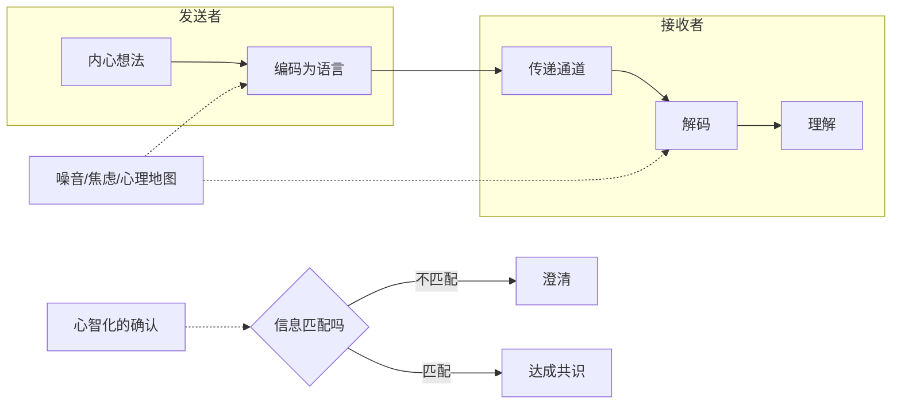
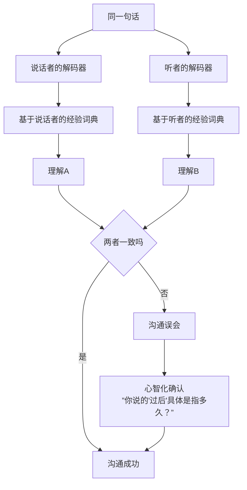
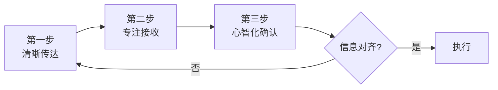

# 第14课：职场沟通

## Learning Objectives

- 识别职场沟通中非心智化传递和接收的典型问题
- 掌握心智化确认信息的"脑补+确认"方法，减少沟通失误

## 非心智化的传递：无法清晰输出

职场中最常见的沟通困境之一是——你以为你说清楚了，但对方听的是另一个意思。

### 汇报时的监控心理

站在领导面前汇报时，大脑像被装了监控：他会怎么看我？我是不是说得不够好？他皱眉头了是什么意思？这些内心活动占据了认知资源，结果是——你说出来的只是你准备好的10%。

> [!TIP] Key Insight
> 当你太在意"对方怎么看我"时，你就没有多余的注意力来"关注我正在传达什么"。**内在监控越强，外在输出越弱。**

### 提需求困难

"我想要一个数据报表"——听起来很简单，但你有没有补充："什么时候要？什么格式？包括哪些维度？"大多数提需求困难的人不是不想说清楚，而是他们自己都没想清楚自己要什么。

心智化的传递要求你：先对自己清晰，才能对别人清晰。

## 非心智化的接收：忽视信号

林经理开会时说了一个数据："这个季度的增长大约在15%左右。"下属小王听到了，"大约""左右"——那就是15%没问题。结果月底汇报时，实际数据是13.8%。林经理说："我说的'大约'，是基于乐观估计的。"

问题出在哪里？小王接收的时候，下意识地把模糊信号变成了确定信号——大脑自动完成了"大约15%"→"15%"的简化。

### 30秒专注力练习

一个简单的练习可以改善接收质量：**每次接收重要信息后，给自己30秒的安静时间，不急于回应，不急于理解，只是让信息完整地进入**。

在这30秒里，问自己三个问题：
1. 他刚才说的核心内容是什么？
2. 有什么是我没听明白的？
3. 我的理解和他要传达的是一回事吗？

## 解码器不兼容

我们以为语言的意思是固定的，但实际上每个人的词典不同。

### "过后"的主观时间概念

- 领导说："你过后把方案发给我。"
- 你的理解：今天下班前。
- 领导的理解：这周五前。

"过后"不是客观的时间词——它是一段**主观长度**的时间。你觉得你按时发了，他觉得你太慢了，双方都委屈。

解决方案：把模糊词变成具体词。
- "尽快" → "今天下班前"
- "过几天" → "这周四之前"
- "大概" → "正负误差在什么范围"

## 焦虑导致接收范围狭窄

这是最容易被忽视的沟通障碍。当你处于焦虑状态时，你的接收通道会变窄——你只能听到你想听的那些信息。

### 618海报案例

市场部的小张负责618大促海报设计。总监审稿时说："整体不错，但主色调可以再考虑一下，消费者调研显示蓝色系转化率更高——不过红色的冲击力确实强，你评估一下。"

小张只听到了"但主色调可以再考虑"这几个字，瞬间陷入焦虑：完了，我选的颜色不对，要重做，又要加班了……

她没有听到后面的"不过红色的冲击力确实强，你评估一下"——这才是总监的真正意思：他给了两个信息，让她做专业判断。

焦虑像聚光灯：**只照亮了你最怕的那个角落，其他信息都湮没在黑暗中。**

## 心智化地确认信息：脑补+确认

人的大脑天生会脑补——我们听到一半的话自动补全，看到模糊的描述自动填充细节。这是高效的生存机制，但在工作中也是误导的根源。

心智化的做法不是"不脑补"——大脑停不下来——而是**脑补之后加一道确认**。

### 买奶牛的秘书案例

老板对秘书说："你去帮我买一头奶牛。"

秘书脑补了：老板要喝鲜奶？要开农场？送人？——但她没有直接行动，而是确认：

"老板，您让我买奶牛，我不太确定您的具体用途——是想要一头产奶的，还是肉用的？预算大约多少？什么时候需要？"

老板："哦，我太太最近在研究手工奶酪，我随口说说，先了解一下市场行情就行。"

——如果不是这个确认，秘书可能已经联系牧场谈价格了。

> [!NOTE] 脑补+确认公式
> **确认 = 先说你的脑补 + 然后问是不是这样**
> 
> "我听到的是……，我的理解是……，请问我理解得对吗？"

## 处方：清晰传达 + 正确接收 + 心智化确认

职场沟通的心智化模型可以总结为三个步骤：

- **清晰传达**：把模糊词具体化，先对自己清晰才能对别人清晰
- **正确接收**：30秒专注力练习，看见自己的焦虑如何扭曲接收
- **心智化确认**：脑补+确认，补全信息但不替对方做决定

## Worked Example

**情境**：领导在微信上说："小李，上周的那个报告你调整一下，尽快给我。"

**非心智化的接收**：小李立刻理解为"领导不满意，催我，完了我在加班"——然后带着怨气通宵改完，结果改的方向不对。

**心智化的接收**：
1. **接收**：读完消息，30秒内不回复
2. **发现焦虑**："我有点慌——先停一下"
3. **确认**："领导，我刚收到。关于报告调整，您能具体说一下是哪部分需要改吗？我调整好预计需要两个小时，今天下班前发给您，可以吗？"
4. **执行**：按照对齐的方向修改

## Practice

> [!QUESTION] 自测题
> 你的同事说："这个项目进度有点慢，我们得抓紧了。"你的第一反应是什么？以下哪个是心智化的回应？
>
> A. （心里想）"他是在批评我效率低？"
> B. 立刻回复："好的，我今晚加班。"
> C. "你说得对，是有点慢。"（心里不服）
> D. "你说的'进度慢'是指哪个环节？你说的'抓紧'是指什么时间节点前做什么？我想跟你对齐一下具体预期。"

点击查看答案

正确答案是 **D**。

- A 是**源于心理地图的接收**——把一句中性反馈解读为针对个人的批评
- B 是**非心智化的接收**——没有确认就承诺，很可能加班做的不是对方想要的
- C 是**假装同意但内心封闭**——表面认同，实际上没有真正沟通
- D 是**心智化的确认**——把模糊词具体化，对齐期望，避免误会

**参考**：[[0011-kou-jue-san-ba-ken-ding-huan-cheng-ke-neng|口诀三：把肯定换成可能]]

## 相关课程

- [[0015-duo-jiao-du-jie-jue-wen-ti|第15课：多角度解决问题]]
- [[0016-gei-yu-yu-an-wei|第16课：给予与安慰]]
- [[0010-kou-jue-er-bie-ren-bu-dong-wo|口诀二：别人不懂我，这才是正常的]]
- [[0009-kou-jue-yi-zan-ting|口诀一：暂停]]

## Next Step

本周选一次工作沟通，做一个"确认实验"：在接收重要信息后，用"我听到的是……请问我理解得对吗？"句式确认一次。观察——确认前和确认后的差异有多大。

Continue with the next lesson or complete the review task above before moving on.