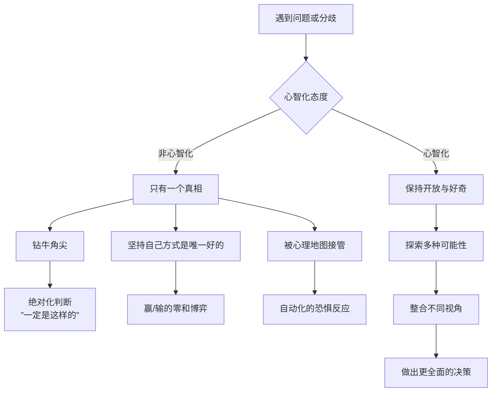
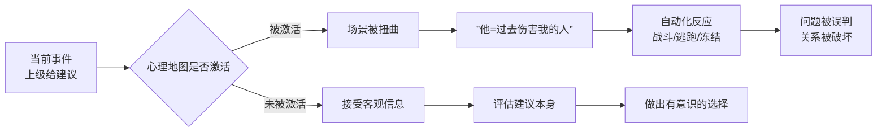
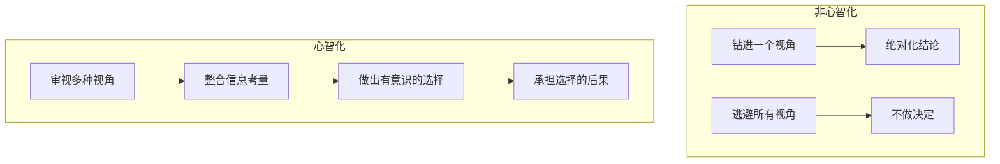

# 第15课：多角度解决问题

## Learning Objectives

- 区分非心智化视角的三种类型，识别自己在问题解决中的思维定势
- 运用"心智化态度"面对分歧，从零和博弈转向正和博弈

## 真相不止一个

一个经典的故事可以说明这一点：

教室里有两个学生坐在不同的位置看教室墙上的钟。左边的学生说："钟在右边。"右边的学生说："钟在左边。"两个人争得面红耳赤，都觉得对方在撒谎。

他们说的都是事实——从他们的视角来看，钟确实在他们的右边或左边。但他们忘记了：**真相不止一个，取决于你看问题的角度。**

> [!TIP] Key Insight
> 心智化的态度是：**保持开放，一切皆有可能。** 不是放弃自己的立场，而是愿意承认你的立场只是众多可能中的一种。

## 非心智化的视角一：钻牛角尖

钻牛角尖不是认真——认真是探索多种可能，而钻牛角尖是**认定只有一种可能**。

比如和同事讨论方案时，坚持"只能用我的方案，因为其他方案都有问题"。问题在于，你花在捍卫自己方案上的精力，远多于你花在真正研究各种方案优劣上的精力。

心智化的做法是：**从"这个方案是最好的"变成"这个方案在什么条件下是最好的"**。

- 我的方案好在哪？它解决了什么问题？
- 对方的方案好在哪？它照顾了什么我没看到的？
- 两者可以结合吗？有没有第三条路？

## 非心智化的视角二：坚持自己的方式是唯一好的

这背后的思维模式是零和博弈——你赢我就输，你的方案被采纳=我的方案被否定=我输了。

但心智化告诉我们：**不是所有博弈都是零和的**。正和博弈是存在的——两个看似冲突的方案，可能整合后比任何一个都更好。

> [!NOTE] 零和博弈 vs 正和博弈
> - 零和博弈思维："你赢=我输，我必须赢。"
> - 正和博弈思维："我们可以一起找到比各自方案都更好的方案。"
>
> 零和博弈让关系变成战场，正和博弈让关系变成联盟。

如何从零和转向正和？
1. **看见自己的恐惧**——"如果按他的方案，我在团队里就没有存在感了"（这是恐惧，不是事实）
2. **把立场变成假设**——"我的方案是一种可能，不是唯一的真理"
3. **共同寻找第三选择**——"我们各自方案的优势能否合并？"

## 非心智化的视角三：被心理地图接管

这是最危险的一种——你的心理地图被激活，你把当前的人和事当成了过去的人和事来应对。

### "总有刁民要害朕"的例子

小陈的上级给她提了一个修改建议，小陈立刻感到被针对、被贬低。她的反应不是思考建议本身是否合理，而是进入全面防御状态：他是不是在给我穿小鞋？是不是想逼我走？

在这个反应中，小陈不是在和眼前的上级互动——她是在和**过去那些不公平对待她的人**互动。她的心理地图把上级投射成了"迫害者"，然后她做出的是自我保护的战斗反应。

## 归去来兮：心智化的选择

心智化的英文"mentalization"的词根暗含了一个意象：**你走出去（迷失在各种视角中），然后你回到自己（整合这些视角后做出选择）。**

你在任何问题前都有三条路：

1. **钻进去**（非心智化）——困在自己的视角里，认为只有一个答案
2. **逃出去**（非心智化）——放弃自己的立场，全盘接受对方的
3. **站上去**（心智化）——看到所有的视角，然后选择一个负责任的行动

站上去看，不是让你不做决定——恰恰相反，是为了让你做出**更清醒的决定**。

## Worked Example

**情境**：一个三口之家商量周末去哪——爸爸想去爬山，妈妈想逛博物馆，孩子想去游乐场。三个人都觉得自己的方案是最好的。

**非心智化的处理**：
- 爸爸："爬山锻炼身体，你们的不健康。"
- 妈妈："博物馆涨知识，你们的是纯消费。"
- 孩子："游乐场最好玩，你们的不考虑我的感受。"
- → 结果：要么一个人赢其他人输，要么谁都生气不去。

**心智化的处理**：
1. **暂停**，看见分歧不是攻击
2. **追问每个方案背后的意义**：
   - 爸爸想要的是"家庭的活力感"
   - 妈妈想要的是"家庭的成长感"
   - 孩子想要的是"家庭的快乐感"
3. **寻找正和方案**：
   - 方案A：去郊野公园（爬山）+ 附近有小型博物馆（逛）+ 有儿童乐园（玩）
   - 方案B：这周去游乐场，下周去爬山，下下周去博物馆
   - 方案C：周六上午各做各的（爸爸爬山→妈妈陪孩子去游乐场），周日一起逛博物馆
4. **选择并承担**：选了方案A，如果体验不好，下次再调整

## Practice

> [!QUESTION] 自测题
> 以下哪些做法属于心智化的多角度解决问题？（多选）
>
> A. 认定自己的想法是对的，据理力争直到对方接受
> B. 承认自己的方案有局限，同时也承认对方方案有价值
> C. 觉得对方有不同意见就是在挑战自己
> D. "在这个条件下我的方案更好，在另一种条件下对方的方案更好，我们选最优组合"
> E. 为了避免冲突，直接放弃自己的方案

点击查看答案

正确答案是 **B 和 D**。

- **A** 是钻牛角尖——认定"只有我的对"，这不是解决问题，是争夺控制权。
- **B** 是心智化的——同时容纳"我的方案有局限"和"他的方案有价值"两个事实。
- **C** 是被心理地图接管——把不同的意见等同于攻击。
- **D** 是心智化的——承认多种条件下的多种答案，寻求最优组合。
- **E** 是逃避不是解决——放弃自己的立场不等于心智化，心智化是整合后选择，不是简单地退出。

**参考**：[[0011-kou-jue-san-ba-ken-ding-huan-cheng-ke-neng|口诀三：把肯定换成可能]]

## 相关课程

- [[0014-zhi-chang-gou-tong|第14课：职场沟通]]
- [[0016-gei-yu-yu-an-wei|第16课：给予与安慰]]
- [[0011-kou-jue-san-ba-ken-ding-huan-cheng-ke-neng|口诀三：把肯定换成可能]]
- [[0017-biao-da-xu-yao-yu-chu-li-mao-dun|第17课：表达需要与处理矛盾]]

## Next Step

本周注意一个你正在纠结的问题——尝试从三个不同人的立场描述这个问题。注意当你能完整地复述对方的立场时，你内心的僵硬是否开始松动。

Continue with the next lesson or complete the review task above before moving on.