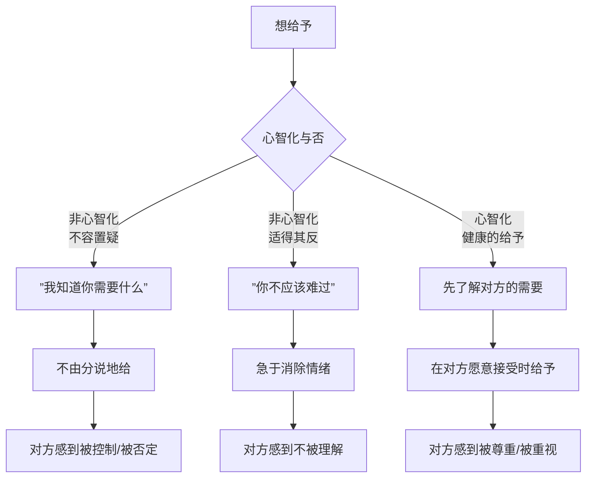
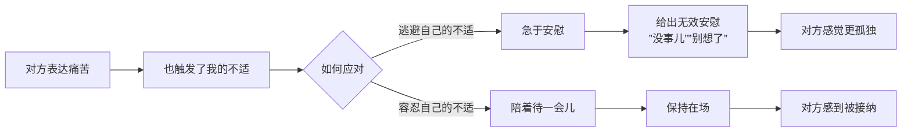

# 第16课：给予与安慰

## Learning Objectives

- 识别非心智化给予的两种类型——不容置疑的给予和适得其反的安慰
- 掌握健康的给予方式：让对方觉得自己很好、值得被给予

## 心智化的人际交流让大脑更健康

日本脑科学研究者泷靖之教授的研究发现：**心智化的人际交流对大脑健康有直接的积极影响**。当一个人被真正地"看见"和理解时，大脑中与安全感和幸福感相关的区域会被激活。

 

这不是心灵鸡汤——这是神经科学。心智化的交流不仅让你感觉好，而且实实在在地改变你的大脑化学环境。

换句话说，你如何给予和接受安慰，不仅关系到人际关系，还关系到你的**大脑健康**。

## 非心智化的给予一：不容置疑

"为你好"可能是最不心智化的一句话。它的潜台词是："我知道什么对你好，你不需要参与这个判断。"

### 不由分说地给予好事物

朋友心情不好，你买了她爱吃的蛋糕，放在她桌上。你的心意是好的——但你有没有问过她："你想吃东西吗？你想要什么？"

不由分说的给予，其实是在满足"我要做个好人"的需要，而不是在回应对方的需要。

### 酒店洗内裤的例子

一个妈妈去外地看女儿，到酒店第一件事就是把女儿的内裤洗了。女儿说："妈，我自己会洗。"妈妈说："你洗得不干净。"

这不是爱——这是**用爱包装的控制**。妈妈通过"照顾"女儿来获得"我是有用的"的感觉，代价是女儿的自主感被剥夺了。

## 非心智化的给予二：适得其反的安慰

### "没事儿"的无效安慰

- A："我最近真的很累。"
- B："没事儿，休息一下就好了。"
- A更累了。

为什么？因为"没事儿"的潜台词是"你不该有这种感觉"——它在否定对方的感受。而**感觉被否定的人，永远得不到安慰**。

### 理智分析的陷阱

- A："我和我妈又吵架了，我好难受。"
- B："其实你应该这么想，你妈是因为……从心理学角度看……"
- A更难受了。

当一个人在情绪中时，她需要的不是解题思路，而是被陪伴。你跳过了她的感受直接到了解决方案，她会有种"你不了解我"的孤独感。

> [!WARNING] 小心"修理模式"
> 对方在倾诉时，你的第一反应如果是"我可以做点什么来解决这个问题"，你就在修理模式下。但大多数时候，对方需要的不是被修好，而是被接住。
>
> **修理模式关心的是问题，心智化关心的是那个人。**

## 急于摆脱痛苦 vs 陪着待一会儿

为什么我们会急于安慰？因为在听到别人痛苦时，我们自己也难受了。于是我们急于把对方的情绪"修好"——这样我们就不难受了。

**急于安慰，其实是安慰者自己在逃避痛苦。**

"陪着待一会儿"不需要你做什么——不需要你说正确的话，不需要你解决问题，不需要你给出人生建议。你只需要在那里，用你的在场告诉对方：**我看到了你的痛苦，我不会逃走。**

## 健康的给予：让对方觉得自己很好

给予的真正标准不是"我给了多少"，而是"对方收到后感觉怎样"。

> [!NOTE] 给予的检验标准
> 健康的给予会让对方觉得：
> 1. **自己很好**——我值得被这样对待
> 2. **被给予是安全的**——我不需要为此感到亏欠
> 3. **我有拒绝的权利**——我可以不接受，而你不会因此撤回你的善意

有些人的给予是带着钩子的——"我对你这么好，所以你欠我的"。这不是给予，这是**交易**。健康的给予没有附带条件，也不要求回报。

### 不对味的饺子

一对父母每次去看望孩子，都带一冰箱饺子。孩子说不用，他们说"你不懂，饺子最方便"。但实际上孩子家里冰箱塞不下，又不好意思扔，只好偷偷处理掉。

这对父母的给予不是为了孩子——**是为了让自己感觉"我是一个好父母"**。然后"我给你了，你必须收下"就成了对孩子的控制。

## 不给以打压方式给予

最隐蔽的伤害是"打压式给予"——一边给一边贬低。

> "这个给你——反正你也买不起。"
> "这些旧衣服你穿吧——你那些衣服太土了。"
> "我帮你介绍个工作——你看看你自己能找到什么。"

这种给予，比不给更伤人。因为它传递的信息是：**你给我好是因为你比我好，你给我是因为可怜我。**

这不是给予，这是施舍。

## Worked Example

**情境**：朋友小兰考研失败，非常沮丧地来找你哭诉。

**非心智化的给予**：
- "没事儿，下次再考就是了。"（否定感受）
- "我觉得你学习方法有问题，你应该先做真题……"（理智分析/修理模式）
- "我认识一个辅导老师，我帮你联系。"（跳过情绪，急于解决问题）

**心智化的给予**：
1. **先不急着说什么**——坐在她旁边，递一张纸巾
2. **确认她的感受**——"你肯定很难过，准备了这么久。"
3. **保持在场，不急于让痛苦消失**——"你要是想说就说，不想说我就陪你坐会儿。"
4. **在她情绪稍微平复后，再问**——"你需要我做点什么吗？"
5. **尊重她的回答**——如果她说"不用，我待一会儿就好"，那就真的只是陪她待一会儿

## Practice

> [!QUESTION] 自测题
> 以下哪些是心智化的给予？（多选）
>
> A. 朋友失恋了，你直接帮她报名了一个相亲活动
> B. 朋友说很累，你问"你想要我安静地陪你，还是帮你分析一下原因？"
> C. 家人心情不好，你说"别难过了，想开点"
> D. 你注意到同事压力很大，在桌上放了一杯咖啡，留了张字条："辛苦了，这杯咖啡是给你的，不喝也没关系。"
> E. 朋友说很焦虑，你立刻说"我教你一个冥想方法"

点击查看答案

正确答案是 **B 和 D**。

- **A** 是不容置疑的给予——没有询问对方需要什么就替她做了决定。
- **B** 是心智化的给予——先了解对方的需要再行动，而且给了选择权。
- **C** 是适得其反的安慰——"别难过""想开点"本质是在否定对方的感受。
- **D** 是心智化的给予——你给了，但同时也"不喝也没关系"——尊重对方的拒绝权。
- **E** 是理智分析的陷阱——跳过情绪直接给解决方案。你还没确认对方是不是想"被教"。

**参考**：[[0015-duo-jiao-du-jie-jue-wen-ti|第15课：多角度解决问题]]

## 相关课程

- [[0017-biao-da-xu-yao-yu-chu-li-mao-dun|第17课：表达需要与处理矛盾]]
- [[0015-duo-jiao-du-jie-jue-wen-ti|第15课：多角度解决问题]]
- [[0009-kou-jue-yi-zan-ting|口诀一：暂停]]
- [[0010-kou-jue-er-bie-ren-bu-dong-wo|口诀二：别人不懂我，这才是正常的]]

## Next Step

本周找一个机会，试着用"陪着待一会儿"的方式去回应一个人——不急于解决问题，不急于给出建议。观察对方的表情和反应，然后问自己：当我什么都不"做"的时候，是否反而"给"了更多？

Continue with the next lesson or complete the review task above before moving on.