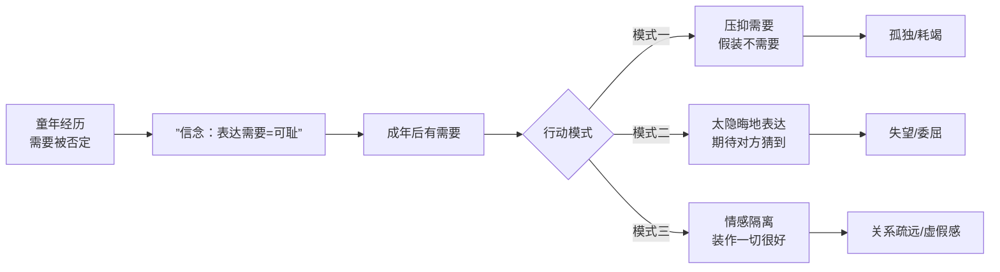
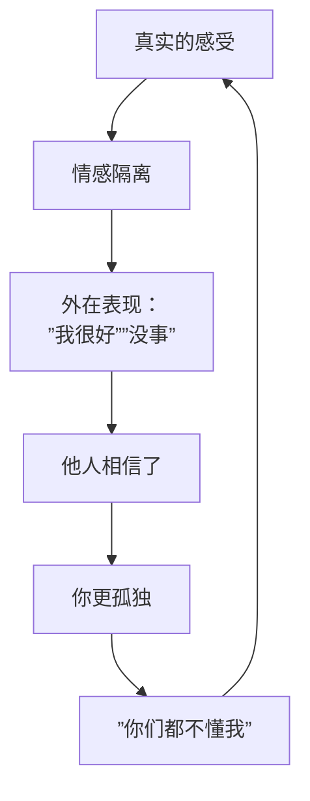
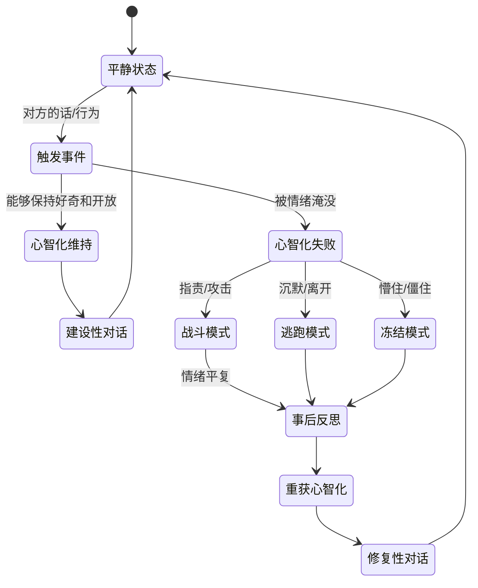

# 第17课：表达需要与处理矛盾

## Learning Objectives

- 识别非心智化表达需要的三种模式，克服心理地图对获得支持的阻碍
- 掌握矛盾白热化时重获心智化的方法，运用口诀一和口诀二

## 有需要才能成长

很多人把"有需要"等同于"脆弱"——有需要是可耻的，说明我不够独立、不够强大。

但心智化告诉我们一个完全相反的视角：**有需要是人类的基本属性，承认需要才是成长的开始。**

一个婴儿有需要会哭——他毫不掩饰地告诉世界他需要什么。这是最原始、最健康的状态。但成长过程中，很多人学会了隐藏需要、否定需要、用各种扭曲的方式表达需要。

> [!TIP] Key Insight
> **有需要不是软弱，否认需要才是问题。** 心智化不是让你"没有需要"，而是让你清楚地知道自己需要什么，然后用健康的方式去表达。

## 非心智化的模式一：心理地图阻碍获得支持

有些人的心理地图刻着一行字：**"表达需要=可耻"**。

这个信念可能来自童年：
- 小时候你哭的时候，父母说："哭什么哭，有什么好哭的！"
- 你想要什么东西时，父母说："你怎么这么不懂事！"
- 你表达不舒服时，父母说："别装了，你就是想偷懒。"

于是你学会了一件事：**需要是不被允许的。**

成年后，当你有需要时，你不是直接表达——而是先自我攻击："我怎么又需要别人了，我真没用。"然后你不敢开口，或者用愤怒包裹需要，或者用生病来表达需要。

## 非心智化的模式二：表达太隐晦

### 云雾图

你有没有做过这种事——
- 在朋友圈发一首悲伤的歌，希望那个人看到后来关心你
- 对伴侣说"我没事"，但希望对方能看穿你的"没事"
- 暗示生日快到了，期待对方主动安排

你把需要放进一团云雾里，希望对方能穿透云雾看见你的心。问题是：**对方不是雷达，他看不到你的云雾图。**

### 旧校服的比喻

你的需要就像穿着十年前的旧校服——你知道校服上写着"我需要被关注"，但你拼命用外套把它遮住，然后期待别人能猜到你在穿什么衣服。

> [!WARNING] 认清这一点
> 没有人能透过你的沉默看见你的需要。**对方不是不爱你，他是真的不知道。** 这不残忍——这恰恰解放了你：如果你承认了对方真的不知道，你就可以选择去说清楚。

## 非心智化的模式三：强颜欢笑/情感隔离

咨询室里常见的现象：来访者笑着说自己最痛苦的经历。

这不是"坚强"——这是**情感隔离**。用笑容隔开了真实的感受，以至于连自己都不知道自己在难过。

强颜欢笑的代价是：别人真的以为你没事了。然后你更孤独了——"你们都没有看到我有多难受"——可是你也没有让别人看到。

## 矛盾白热化时的心智化失败

当矛盾升级到白热化阶段时，心智化系统会"宕机"——你进入非心智化的战斗/逃跑模式。

整个过程是这样的：

1. **触发事件**：对方说了一句让你不舒服的话
2. **心理地图激活**：这句话激活了你过去的某个痛处
3. **大脑失联**：前额叶（理性中心）下线，杏仁核（警报中心）上线
4. **非心智化接管**：进入战斗（反击/指责）/逃跑（沉默/离开）/冻结（懵了）
5. **事后恢复**：情绪平复后，重新开始思考

这个过山车是正常的——没有人能在矛盾中保持100%的心智化。关键不是"永远不翻车"，而是 **"翻车后能不能更快地重新上车"**。

心理状态和人际关系会直接影响心智化能力：当你疲惫、焦虑、被触发时，前额叶功能下降，心智化能力也随之减弱；而安全、放松的人际氛围则有助于维持心智化。理解这一点，就能更好地接纳自己在矛盾中的"翻车"，而不是二次指责自己。

## 重获心智化的表达

当你发现自己已经在矛盾中"翻车"了，怎么办？

### 口诀一：暂停

> **口诀一：暂停。**

停下来的意思是：不继续说，不继续吵，不回那条信息。不是逃避，而是给自己空间让大脑前额叶重新上线。

你可以说："我现在有点情绪上头，没办法好好说。我需要十分钟冷静一下，然后我们继续聊，可以吗？"

十分钟后，如果还不行，就再加十分钟。不要带着翻车的大脑做决定。

### 口诀二：别人不懂我，这才是正常的

> **口诀二：别人不懂我，这才是正常的。**

在矛盾中最致命的想法是"他应该懂我"——我应该不需要说得这么清楚他就知道我在难过。但如前所述，心灵的事实是不能完美传达的。

把他不懂你，从"他不爱我"翻译成"他是真的不知道"——你就会从绝望模式切换到解释模式。

## 觉得全完了的反应

矛盾白热化时，很多人会进入"全完了"的思维模式：

- "我们吵架了，说明我们不合适。"
- "他这样说，就是看不起我。"
- "这段关系完了。"

这种"一遇到矛盾就觉得全完了"的反应，与心智化相差甚远。它一次性地否定了关系的所有价值。

> [!NOTE] 势利之交，难以经远
> 诸葛亮在《论交》中说："势利之交，难以经远。"如果把关系建立在"对方必须永远让我满意"的基础上，那么任何矛盾都会摧毁关系。真正的关系是建立在"即使有矛盾，我们也愿意一起面对"的基础上的。

## 安全空间练习

为了让矛盾后的修复成为可能，双方需要建立一个"安全空间"——一个让心智化得以重新启动的环境。

安全空间的基本要素：
1. **暂停的权利**——任何一方都可以说"我需要暂停一下"
2. **不翻旧账**——就事论事，不把三个月前的事拖出来
3. **不作人身攻击**——说感受，不说"你就是这样的人"
4. **修复的机会**——吵完后，有一个明确的修复步骤

## Worked Example

**情境**：丈夫下班回家，妻子说："你最近天天晚归。"丈夫立刻说："我不是天天晚归，上周二我就按时回来了。你怎么总挑我毛病！"

**非心智化的升级**：
- 丈夫进入战斗模式，反驳事实（"我不是天天"）
- 然后升级为对关系的指控（"你总挑我毛病"）
- 妻子被激怒："我挑你毛病？我关心你有错吗？"
- → 吵的内容早已偏离了"晚归"这件事

**心智化的重获过程**：
1. **暂停**（丈夫意识到自己进入防御状态）："等一下——我刚刚反应有点激烈，让我缓一缓。"
2. **重获心智化**（问自己）：她为什么说这个？她是想挑毛病，还是有别的需要？
3. **确认**："你是觉得我最近陪你的时间少了吗？"
4. **妻子**——（也心智化）"是的，我有点想你。但我一开口就变成了抱怨……对不起。"
5. **修复**："那这周末我们早点安排，好好待在家。"
6. **不是"全完了"** ——他们吵了，但吵完之后关系更近了。

## Practice

> [!QUESTION] 自测题
> 假设你正在和伴侣/同事争论某件事，你发现自己越来越激动，心跳加快，想要大声反驳或者直接走人。这时，心智化的正确做法是什么？
>
> A. 把话说完，赢了再说
> B. 走人——我受不了了
> C. "我现在太激动了，没办法好好说话。我需要十分钟冷静一下，然后我们再接着聊。"
> D. 转移话题，假装没事

点击查看答案

正确答案是 **C**。

- **A** 是战斗模式——"赢了再说"的代价往往是关系受损，而且"赢了争论输了关系"。
- **B** 是逃跑模式——直接走人会让对方感到被抛弃/被拒绝，矛盾不但没解决还增加了新的伤。
- **C** 是心智化的——意识到自己"翻车"了，用暂停给自己时间重新"上车"。同时明确告诉对方你会回来，这不是抛弃。
- **D** 是逃避模式——转移话题解决不了问题，矛盾会积累并以更大的方式爆发。

**参考**：[[0009-kou-jue-yi-zan-ting|口诀一：暂停]] | [[0010-kou-jue-er-bie-ren-bu-dong-wo|口诀二：别人不懂我，这才是正常的]]

## 相关课程

- [[0012-qin-mi-guan-xi-xuan-ze-yu-jie-shou|第12课：亲密关系——选择与接收爱]]
- [[0013-qin-mi-guan-xi-biao-da-ai|第13课：亲密关系——表达爱]]
- [[0016-gei-yu-yu-an-wei|第16课：给予与安慰]]
- [[0009-kou-jue-yi-zan-ting|口诀一：暂停]]
- [[0010-kou-jue-er-bie-ren-bu-dong-wo|口诀二：别人不懂我，这才是正常的]]

## Next Step

本周留意一个"我觉得全完了"的瞬间——不管是关系中的矛盾还是工作中的挫折。尝试在这一刻告诉自己："全完了"是一个念头，不是事实。然后看看，还有没有别的可能。

Continue with the next lesson or complete the review task above before moving on.