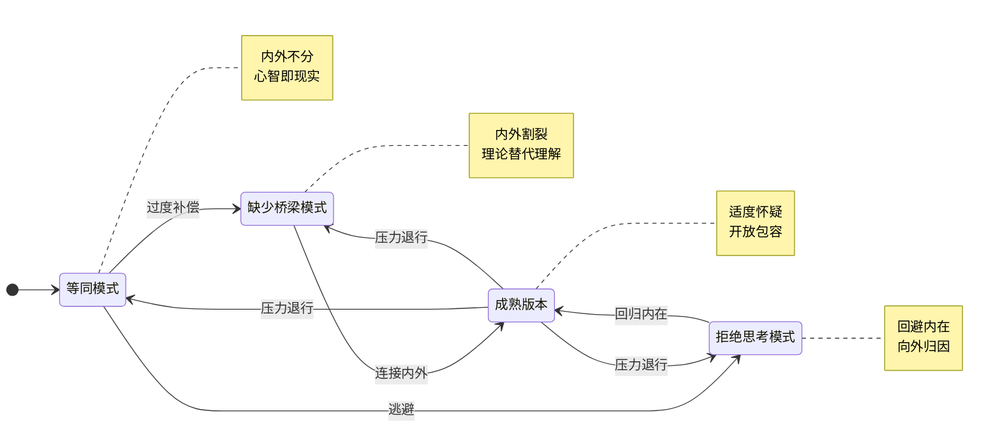
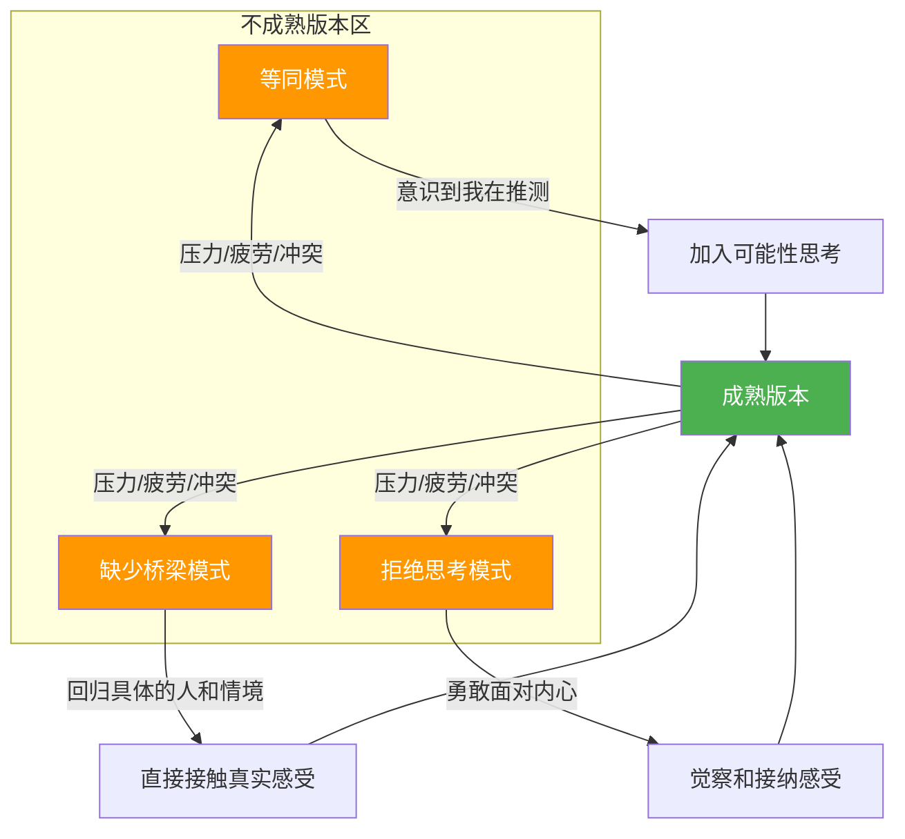

# 四种心智化版本对比

本文档是《打开心智之门》模块一的参考资料，汇总四种心智化版本的关键特征、对比维度和升级路径。

## 版本总览

心智化能力的发展不是线性的，而是像软件版本一样迭代更新。**新版本不覆盖旧版本**，在压力、疲劳或情感冲突中，我们可能暂时退回到更原始的版本。

## 详细对比表

| 维度 | 等同模式 | 缺少桥梁模式 | 拒绝思考模式 | 成熟版本 |
|------|----------|-------------|-------------|---------|
| **核心特征** | 内心世界与外部现实没有边界 | 内外世界截然分开，需要外力连接 | 刻意回避内在世界，只关注外在 | 区分内外但不割裂，灵活连接 |
| **自我与他人的关系** | 我的感受=对方的感受（以己度人） | 用理论/标签替代真实接触（以标签代理解） | 不关心对方内心（以行动代情感） | 通过自己推测，但保持开放（以推测代确定） |
| **对感受的态度** | 被感受淹没，感受即事实 | 与感受脱节，过度理性化 | 否定感受，认为"想太多是问题" | 觉察、容纳、反思感受 |
| **归因方式** | 过度向内归因（都是我的错） | 过度抽象化（都是理论/系统的问题） | 过度向外归因（都是别人的/环境的错） | 内外兼顾，因情境而异 |
| **典型语言** | "你肯定……""一定是因为……" | "根据XX理论……""这种人都是……" | "别想太多""想这些有什么用" | "我猜可能……但也有其他可能" |
| **对不确定性的态度** | 不接受不确定性（必须确定） | 用"确定的理论"掩盖不确定性 | 假装不确定性不存在（无视复杂性） | 接纳不确定性，与之共存 |
| **升级难度** | 需要意识到"我在推测" | 需要回到具体的人与情境 | 需要勇气面对内心 | 持续练习，永无止境 |

## 各版本详解

### 等同模式

**定义：** 内心世界与外部现实之间没有清晰边界。自己所想、所感受的，就是事实本身。

**升级路径：**
1. 意识到"我是在用我的感受去推测对方的感受"
2. 在"我感受到"和"事实"之间加入一个"可能"
3. 练习问自己："有没有其他可能性？"

**相关课程：** [[../lessons/0002-deng-tong-mo-shi|第02课：等同模式——心智即现实]]

### 缺少桥梁模式

**定义：** 内外世界被截然分开，内心世界和外部现实之间缺乏有效的连接桥梁。需要用理论或外部信号来"架桥"。

**升级路径：**
1. 放下理论标签，回到具体的人与情境
2. 直接询问对方的感受和想法（而非用理论推导）
3. 练习问自己："在这个具体的时刻，这个具体的人，内心可能发生了什么？"

**相关课程：** [[../lessons/0003-que-shao-qiao-liang-yu-ju-jue-si-kao|第03课：缺少桥梁与拒绝思考]]

### 拒绝思考模式

**定义：** 刻意回避内在世界（包括自己的和他人的），将所有注意力转向外在的、可见的因素。

**升级路径：**
1. 承认回避的合理性——有些感受确实令人不安
2. 从小处开始，试着觉察一种简单的感受（比如"我现在饿了"）
3. 练习问自己："我现在的感受是什么？我回避的是什么？"

**相关课程：** [[../lessons/0003-que-shao-qiao-liang-yu-ju-jue-si-kao|第03课：缺少桥梁与拒绝思考]]

### 成熟版本

**定义：** 能在内外世界之间灵活切换，区分但不割裂，关注内在但不忽略外在，保持适度怀疑但不受怀疑淹没。

**保持方法：**
1. 日常中让心智化在后台自动运作，不必过度警觉
2. 遇到困难时切换到前台主动思考
3. 记住"不理解才是常态"，保持谦逊和好奇

**相关课程：** [[../lessons/0004-cheng-shu-ban-ben|第04课：成熟版本的心智化能力]]

## 版本升级的动态路径

## 自测工具：你当前处于哪个版本？

对于以下每个场景，选择最符合你的反应：

**场景1：** 伴侣很晚才回家，没提前说。
- A. "你肯定是不在乎这个家了。"（等同模式）
- B. "根据行为心理学，这种行为说明你缺乏责任感。"（缺少桥梁模式）
- C. "回来了就好，饿了吗？我给你热饭。"（拒绝思考模式——回避内心的不安）
- D. "我有点担心，也有些生气。发生什么事了吗？我想听你说说。"（成熟版本）

**场景2：** 同事在会议上否定了你的方案。
- A. "他就是在针对我、排挤我。"（等同模式）
- B. "从组织行为学角度看，这是典型的资源竞争行为。"（缺少桥梁模式）
- C. "方案不行就改呗，多大点事。"（拒绝思考模式）
- D. "他的否定让我有些措手不及。我想先理解他否定的具体是什么，然后再决定如何调整。"（成熟版本）

---

> [!TIP] 重要提醒
> 看到自己经常处于不成熟版本，不必自责。心智化能力的成长是一个持续的过程，而且我们每个人都会在不同情境下"退行"到更原始的版本。**觉察本身就是改变的开始。** 只要你能识别自己正在使用哪种版本，你就已经在心智化的道路上前进了。

## 参考资料

- [[../lessons/0001-shi-mo-shi-xin-zhi-hua|第01课：什么是心智化？]]
- [[../lessons/0002-deng-tong-mo-shi|第02课：等同模式——心智即现实]]
- [[../lessons/0003-que-shao-qiao-liang-yu-ju-jue-si-kao|第03课：缺少桥梁与拒绝思考]]
- [[../lessons/0004-cheng-shu-ban-ben|第04课：成熟版本的心智化能力]]
- [[../index|返回课程主页]]