# 课程地图

> 本课程分为五大模块，建议按顺序学习。心理练习课建议在相关理论学习后立即实践。

```mermaid
flowchart TD
    M0[发刊词：心理能量] --> M1[模块一：情绪管理]
    
    subgraph M1[模块一：情绪管理]
        L01[01 做老好人]
        L02[02 不开心的价值]
        L03[03 照顾自己情绪]
        L04[04 减少内疚感]
        L05[05 面对失去]
        L06[06 走出自我嫌弃]
        L07[07 缓解焦虑]
        L08[08 原生家庭]
        L09[09 想太多放不下]
        L10[10 心理练习]
    end
    
    M1 --> M2[模块二：学会说不]
    
    subgraph M2[模块二：学会说不]
        L11[11 习惯性听话]
        L12[12 别为善良掏空]
        L13[13 优雅拒绝]
        L14[14 拒绝讨好]
        L15[15 不怕冲突]
        L16[16 边界感]
        L17[17 敢麻烦别人]
        L18[18 内向者自信]
        L19[19 心理练习]
    end
    
    M2 --> M3[模块三：调整自我期待]
    
    subgraph M3[模块三：调整自我期待]
        L20[20 承认脆弱]
        L21[21 不跟别人比]
        L22[22 拥抱不自信]
        L23[23 拖延症]
        L24[24 减压]
        L25[25 低价值感]
        L26[26 过度努力]
        L27[27 权威关系]
        L28[28 年龄焦虑]
        L29[29 心理练习]
    end
    
    M3 --> M4[模块四：关系觉察]
    
    subgraph M4[模块四：关系觉察]
        L30[30 三观合]
        L31[31 情绪价值]
        L32[32 爱无能]
        L33[33 不安全感]
        L34[34 完美偏执]
        L35[35 强迫性重复]
        L36[36 付出与爱]
        L37[37 谈心的奢侈]
        L38[38 接住坏脾气]
        L39[39 允许舒服]
        L40[40 自卑与超越]
        L41[41 离婚勇气]
        L42[42 心理练习]
    end
    
    M4 --> M5[模块五：爱自己]
    
    subgraph M5[模块五：爱自己]
        L43[43 自我表扬]
        L44[44 不够好的自己]
        L45[45 受害者标签]
        L46[46 负性情感]
        L47[47 内心冲突]
        L48[48 倾听自己]
        L49[49 活在当下]
        L50[50 评判体系]
    end

    M4 --> DEPR[抑郁特辑]
    M4 --> FAM[原生家庭特辑]
```

## 模块一：情绪管理（第01-10课）

| 课次 | 主题 | 核心概念 |
|------|------|----------|
| 发刊词 | 心理能量与自我认知 | 心理能量、内耗、自我觉察 |
| 01 | 习惯了做老好人？ | 愤怒的毒性、攻击性、压抑 |
| 02 | 不开心的价值 | 快乐强迫症、情绪接纳 |
| 03 | 照顾自己的情绪 | 情绪拯救者、心理边界 |
| 04 | 减少内疚感 | 内疚的根源、责任边界 |
| 05 | 面对"失去" | 丧失与哀悼、情绪处理 |
| 06 | 走出自我嫌弃 | 自我期望、完美主义 |
| 07 | 缓解焦虑 | 焦虑根源、耐受不确定 |
| 08 | 原生家庭治愈 | 原生家庭模式、内在小孩 |
| 09 | 想太多、放不下 | 反刍思维、认知融合 |
| 10 | 心理练习：走出负面情绪 | 觉察-接纳-转化 |

## 模块二：学会说"不"（第11-19课）

| 课次 | 主题 | 核心概念 |
|------|------|----------|
| 11 | 习惯性听话 | 顺从模式、自我压抑 |
| 12 | 别为善良掏空自己 | 善良的边界、耗竭 |
| 13 | 让人如沐春风的拒绝 | 温和而坚定、非暴力沟通 |
| 14 | 拒绝讨好 | 讨好的根源、任性作为美德 |
| 15 | 不怕冲突 | 健康的冲突、攻击性 |
| 16 | 边界感 | 心理边界、课题分离 |
| 17 | 敢麻烦别人 | 互惠关系、适度依赖 |
| 18 | 内向者的自信 | 内向的优势、自我接纳 |
| 19 | 心理练习：接住否定 | 否定不定义你、内在锚点 |

## 模块三：调整自我期待（第20-29课）

| 课次 | 主题 | 核心概念 |
|------|------|----------|
| 20 | 承认脆弱 | 脆弱的力量、真实即力量 |
| 21 | 不跟别人比 | 社会比较、独特价值 |
| 22 | 拥抱不自信 | 不自信的根源、重新定义 |
| 23 | 拖延症真相 | 内在小孩、未满足的需求 |
| 24 | 减压 | 高光时刻执念、活在当下 |
| 25 | 低价值感 | 价值感来源、自我重建 |
| 26 | 过度努力 | KPI化生活、存在价值 |
| 27 | 权威关系 | 权威恐惧、内在父母 |
| 28 | 年龄焦虑 | 衰老恐惧、生命阶段 |
| 29 | 心理练习：接纳自我 | 放松身心、自我慈悲 |

## 模块四：关系中的觉察（第30-42课）

| 课次 | 主题 | 核心概念 |
|------|------|----------|
| 30 | 三观合就能幸福吗 | 关系幻想、真实碰撞 |
| 31 | 情绪价值 | 情感供给、情绪交换 |
| 32 | 爱无能 | 情感封闭、自我保护 |
| 33 | 摆脱不安全感 | 依恋模式、内在安全 |
| 34 | 追求完美是偏执 | 完美期待、关系破坏 |
| 35 | 强迫性重复 | 创伤重复与修复 |
| 36 | 付出越多离爱越远 | 过度付出、爱的条件 |
| 37 | 谈心的奢侈 | 情感交流、深度联结 |
| 38 | 接住彼此的坏脾气 | 情绪容纳、抱持 |
| 39 | 允许自己舒服 | 传统压抑、内在需求 |
| 40 | 自卑与超越 | 价值条件、无条件自尊 |
| 41 | 离婚的勇气 | 关系抉择、自我负责 |
| 42 | 心理练习：共情与觉察 | 觉察、共情、理解 |

## 模块五：学会爱自己（第43-50课）

| 课次 | 主题 | 核心概念 |
|------|------|----------|
| 43 | 自我表扬 | 自我肯定、自我奖赏 |
| 44 | 不够好的自己 | 自我接纳、内在空间 |
| 45 | 撕下受害者标签 | 受害者认同、自我负责 |
| 46 | 正确对待负性情感 | 情感调节、情绪共存 |
| 47 | 内心冲突与和解 | 内在分裂、整合 |
| 48 | 倾听自己 | 自我倾听、情绪巨浪 |
| 49 | 活在当下 | 目标导向vs过程体验 |
| 50 | 建立自己的评判体系 | 内在标准、独立人格 |

## 补充专题

| 主题 | 关联模块 |
|------|----------|
| [[lessons/s01-yi-yu-shang|抑郁特辑（上）：放过自己]] | 模块四 |
| [[lessons/s02-yi-yu-xia|抑郁特辑（下）：我真的不行]] | 模块四 |
| [[lessons/s03-yuan-sheng-jia-ting|原生家庭特辑：疗愈创伤]] | 模块一/四 |