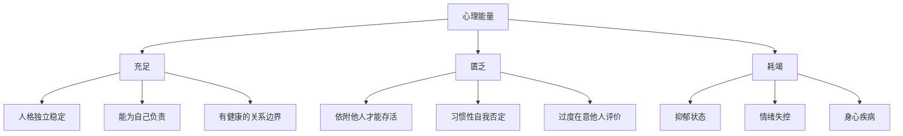

# 发刊词：心理能量——活出自己的力量

> 心理能量高，才能轻松活出自己。 ——周小宽

## 你是否有这些困扰？

课程开始时，周小宽老师列出了几类非常常见的心理困扰：

- 习惯性地否定自己，觉得自己这不行那不好
- 拿自己去和别人比较，把自己搞得很焦虑
- 无法拒绝别人，常常讨好
- 看到别人不开心，马上感到内疚和沮丧
- 总想成为"更好的自己"，却越努力越累

如果你符合其中任何一条，这门课就是为你准备的。

## 什么是心理能量？

**心理能量**（Psychological Energy）是荣格提出的概念。荣格认为，人格结构要正常活动需要一个动力系统，这个系统就是心理能量——一种普遍的生命力。

**心理能量匮乏的人**：常常活在对自己的否定中，无法让自己的人格稳定独立地运转，只能依附于别人，在关系里才能存活。

**心理能量耗竭的人**：负面情绪完全盖过正面能量，整个人被黑暗笼罩，看不见希望和阳光，可能陷入长期的抑郁状态。

## 一个典型的案例

> [!EXAMPLE] 来访者的故事
> 一位来访者总是小心翼翼地希望得到所有人的肯定。她说，只有让大家都满意时，内心才能体验到平静和踏实。如果有人对她不满，或她拒绝了别人，她就感觉自己好像要被全世界抛弃了。
>
> 她在公司做员工，在家里做妻子、儿媳和妈妈，尽最大努力却仍然被挑剔。她常常陷入自责，隐忍越来越多，对伴侣和婆婆积累的怨恨越来越强烈。最后，她发现自己无法控制地对孩子吼叫，和丈夫的关系也越来越冷淡。
>
> 她对老师说："我想做个好妻子好妈妈，可是我做不到。这种生活太累了，我耗竭了我自己。"

这个案例揭示了一个核心问题：**不断压抑自己、讨好他人，最终的结果不是关系的和谐，而是自己的耗竭和关系的毁灭。**

## 课程结构

这50节课分为五大模块：

| 模块 | 主题 | 核心目标 |
|------|------|----------|
| 一 | [[../00-course-map#模块一情绪管理|情绪管理]] | 识别负面情绪，减少内耗 |
| 二 | [[../00-course-map#模块二学会说不|学会说"不"]] | 建立边界，勇敢表达 |
| 三 | [[../00-course-map#模块三调整自我期待|调整自我期待]] | 放下完美，拥抱真实 |
| 四 | [[../00-course-map#模块四关系觉察|关系中的觉察]] | 避免强迫性重复，建立健康关系 |
| 五 | [[../00-course-map#模块五爱自己|学会爱自己]] | 自我接纳，活出自己 |

> [!TIP] 学习建议
> 这门课不仅仅是知识的传递，更是一种疗愈力量的传递。建议你：
> 
> 1. 可以重复听某些章节，因为潜意识的内化需要时间
> 2. 写学习笔记和觉察日记
> 3. 在安全的环境中实践课中的练习

## 核心认知：先拥有自己，才能拥有好的关系

> [!QUOTE] 老师的话
> "唯有先拥有自己，我们才能拥有好的关系。唯有让自己内在平衡和舒服了，才能和别人建立长期的、健康的、有生命力的流动的关系。"

## 下一步

继续学习 [[0001-lao-hao-ren|第01课：习惯了做老好人？——说不出的愤怒有毒]]