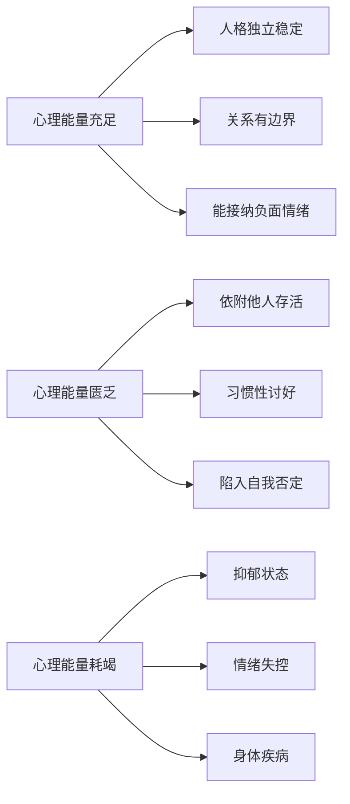
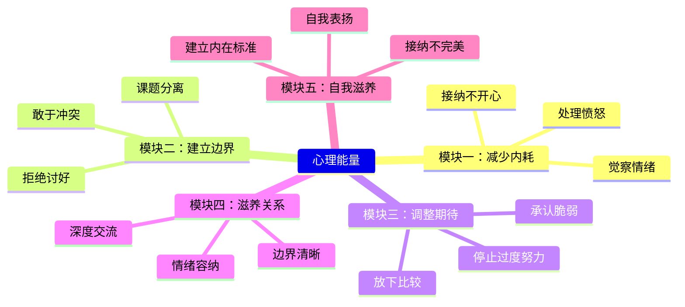

# 心理能量详解

> "心理能量是人格的动力系统，是一种普遍的生命力。" ——荣格

## 什么是心理能量

**心理能量**（Psychological Energy）是荣格分析心理学中的核心概念。荣格认为，人格结构要正常活动，需要一个动力系统，这个系统就是心理能量。

心理能量与生理能量不同：
- 生理能量关乎身体健康和体力
- 心理能量关乎心理健康和情绪活力
- 两者相互影响，但不能互相替代

## 心理能量的三个状态



### 1. 充足状态
- 人格独立、稳定运转
- 能为自己负责，不依附他人
- 有清晰的自我边界
- 能容纳负面情绪而不被淹没

### 2. 匮乏状态
- 需要依附他人才能在关系中存活
- 常常自我否定、失去自信
- 过度在意他人评价
- 不敢表达真实需求

### 3. 耗竭状态
- 负面情绪完全盖过正面能量
- 陷入长期抑郁
- 看不见希望和阳光
- 可能出现身心疾病（失眠、胃病、皮肤病等）

## 损耗心理能量的行为

### �� 高损耗行为

| 行为 | 机制 | 后果 |
|------|------|------|
| 习惯性讨好 | 压抑真实自我，满足他人期待 | 边界模糊、累积愤怒 |
| 不断自我否定 | 内在批判者持续攻击自己 | 自信丧失、抑郁风险 |
| 反复反刍思维 | 在脑中反复播放负面事件 | 焦虑加重、无法行动 |
| 过度追求完美 | 设立不可能达到的标准 | 持续挫败感、拖延 |
| 压抑愤怒不表达 | 愤怒能量转向攻击自己 | 抑郁、身心疾病 |
| 做情绪拯救者 | 背负他人的情绪责任 | 精疲力尽、耗竭 |
| 与他人比较 | 用他人标准衡量自己 | 焦虑、自卑、嫉妒 |
| 用KPI逼自己 | 把生活变成绩效指标 | 失去快乐、持续焦虑 |

### 心理能量守恒公式

```
心理能量余额 = 天生能量基础 + 滋养性活动 - 损耗性行为
```

## 提升心理能量的方法

### 减法策略（减少损耗）

1. **建立边界**：学会说"不"，不承接他人的情绪责任
2. **停止自我攻击**：觉察内在批判者的声音，用自我慈悲替代
3. **允许负面情绪存在**：不强迫自己快乐，给情绪空间
4. **放下比较**：建立自己的评价标准
5. **减少讨好**：优先照顾自己的感受

### 加法策略（增加补给）

1. **表达真实感受**：哪怕是愤怒，也可以用建设性方式表达
2. **建立滋养性关系**：找到能接纳你真实一面的关系
3. **自我肯定与奖赏**：理直气壮地表扬自己
4. **与内心和解**：拥抱不够好的自己
5. **活在当下**：从目标导向转向过程体验

## 心理能量自检清单

> [!QUESTION] 自我评估
> 以下情况你符合几条？（每符合一条标记1分）
> 
> - [ ] 经常觉得自己不好，拿自己和别人比较
> - [ ] 无法拒绝别人，常常讨好
> - [ ] 看到别人不开心，马上感到内疚
> - [ ] 不敢表达愤怒，总是压抑
> - [ ] 做决定前反复想别人会怎么看
> - [ ] 需要别人的肯定才能感到安心
> - [ ] 总觉得活得累，没有休息的资格
> - [ ] 对自己的期待很高，达不到时严厉自责
> 
> **0-2分**：心理能量状态良好
> **3-5分**：需要关注，建议练习边界和接纳
> **6-8分**：能量耗竭风险高，建议寻求专业帮助

## 课程中的心理能量地图



> [!TIP] 核心原则
> 心理能量提升不是靠"更努力"，而是靠"停止内耗"。先做减法，再做加法。只有停止对自己能量的持续损耗，真正的滋养才能进入。参考 [[glossary|核心概念术语表]]