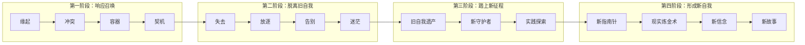

# 课程地图：4大阶段与15个节点

## 第一阶段：响应召唤（要不要变）

> 自我意志开始觉醒，与现实发生矛盾。生活的平衡被打破。

### 节点1：缘起——发现"我想要"
- 核心问题：我到底想要什么？
- 关键：发现"我想要"是自我主导转变的关键力量
- 对应课程：第01-06课

### 节点2：冲突——探索自我的核心
- 核心问题：不同自我需要之间的冲突
- 关键：探索自我核心，以此为依据做选择
- 对应课程：第07-09课

### 节点3：容器——培育新自我
- 核心问题：如何在不必放弃旧自我的前提下培育新自我
- 关键：创造安全的时间和关系环境
- 对应课程：第10-11课

### 节点4：契机——决定时刻
- 核心问题：新旧自我无法共存时如何推动选择
- 关键：理解、接纳甚至推动偶然事件的发生
- 对应课程：第12-15课

## 第二阶段：脱离旧自我（如何告别）

> 开始与过去告别。这是转变中最痛苦的阶段，充满了失去、后悔、迷茫和恐慌。

### 节点5：失去——面对目标的消失
- 核心问题：如何面对失去重要目标/身份的痛苦
- 关键：突破思维窄化，超越失去去看更大的世界
- 对应课程：第16-17课

### 节点6：放逐——关系的脱离
- 核心问题：从重要关系或群体中脱离
- 关键：学会面对孤独，学会重新依靠自己
- 对应课程：第18-20课

### 节点7：告别——与过去和解
- 核心问题：如何真正放下过去
- 关键：整理过去，接受已经从旧自我中脱离的事实
- 对应课程：第21-24课

### 节点8：迷茫——面对不确定
- 核心问题：如何面对迷茫和焦虑
- 关键：在不确定中保持探索的勇气
- 对应课程：第25-30课

## 第三阶段：踏上新征程（如何探索）

> 从旧自我中寻找资源，通过实践探索新的可能性。

### 节点9：旧自我遗产——整理可用资源
- 核心问题：旧自我留下什么资源可以用于重建
- 关键：发现真实的品质、深刻体验作为新自我的种子
- 对应课程：第31-33课

### 节点10：新守护者——寻找榜样与导师
- 核心问题：谁可以引领你进入新部落
- 关键：寻找领路人提供信息、途径和指导
- 对应课程：第34-35课

###节点11：实践探索——通过行动发现新自我
- 核心问题：如何通过尝试找到新自我
- 关键：遵循实践原则，通过尝试→反馈→调整循环
- 对应课程：第36-38课

## 第四阶段：形成新自我（如何巩固）

> 转变凝聚为人生智慧，形成新的评价坐标、信念和人生故事。

### 节点12：新指南针——评价坐标切换
- 核心问题：如何从外界评价切换到自我评价
- 关键：根据自己的感受、想法和意志做判断
- 对应课程：第39-43课

### 节点13：现实炼金术——与现实的创造性互动
- 核心问题：如何从顺从和反抗中解脱出来
- 关键：成为现实的创造者
- 对应课程：第44-46课

### 节点14：新信念——从困境中生长出智慧
- 核心问题：如何从转变经历中长出新的信念
- 关键：信念是经验的结晶
- 对应课程：第47-48课

### 节点15：新故事——重新叙述你的人生
- 核心问题：如何将转变的经历整合成新的人生故事
- 关键：所有阶段和环节都成为新故事的素材
- 对应课程：第49-51课

## 使用建议

1. **地图不是道路**：你实际走的路径不会完全与地图相同
2. **不一定经历所有节点**：例如"容器"更适用于职业探索，"告别"更适用于关系脱离
3. **转变不止一种形式**：可以是离职/离婚式的激烈转变，也可以是调整心态的内在转变
4. **所有弯路都是有用的**：转变的心理历程没有弯路——你只是用不同的方式学到了它

## 延伸阅读

- [[reference/glossary|核心术语表]]
- [[reference/transformation-map|转变地图概览]]