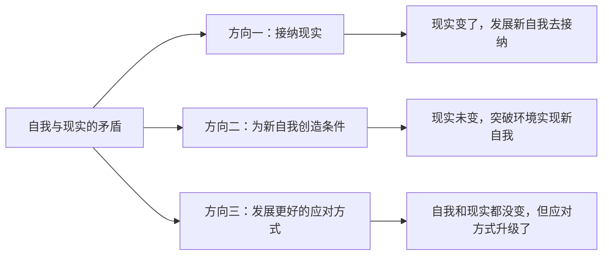
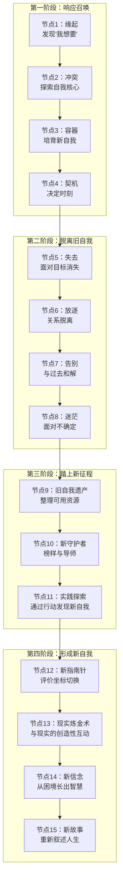

# 第00课：导论——转变的地图

## 什么是自我转变？

**转变是新旧自我的更替。**

它不是日常生活中的表面改变（换发型、培养新习惯），而是**核心自我概念的变化**。如果用五个词来标识你自己——工作、家庭、重要关系、目标、性格特征——当你一件件失去这些东西时，你是谁？

转变正是这些核心部分发生变化的过程。

> [!INFO] 转变 vs. 改变
> 理个新发型不是转变，因为核心自我没有变。但辞去一份定义了你是谁的工作、离开一段塑造了你生活方式的关系、放弃一个你追求了半生的梦想——这些触及核心的变化，才是转变。

### 转变的隐喻：龙虾脱壳

龙虾有厚厚的壳来保护自己。当身体长到一定程度，旧壳会限制发展，它必须脱去旧壳。这时龙虾非常脆弱，带着柔软敏感的身体趴在角落，等着新壳慢慢长起来。

人也要经历这样的"脱壳"，才能把旧的、不符合现实的自我去掉，迎来新的自我。

## 转变的动力

转变的动力来自**变化的自我与变化的现实之间永恒的矛盾**：

- 一方面，环境在塑造你——为了适应环境，你把自己变成环境需要的样子
- 另一方面，自我有一种倾向——去实现自身的发展，成为想要成为的自己

当现实和自我发生剧烈矛盾时，转变就开始了。

## 转变的三个方向

### 方向一：面对和接纳现实

现实已经改变，需要发展新自我去接纳这个改变。例如南希·里根在公众面前摔倒后才真正意识到自己老了——身体迈不过台阶的现实，以再也不能拒绝的方式摆到她面前。

### 方向二：为新自我创造条件

现实没有变，但自我已经发生改变，需要突破环境限制让新自我实现。例如那位投行精英，表面拥有一切，内心却知道自己想要的不止于此，最终创立了一所面向特殊孩子的学校。

### 方向三：发展更好的应对方式

看起来自我和环境都没变，但你发展出了更好的应对方式。例如辞职兜兜转转后又回到原公司的人——工作没变，但从不接纳变成了接纳，从被动忍受变成了主动选择。

> [!TIP] 关键洞察
> "所有的弯路都是有用的，所有的弯路也都算数。转变的心理历程并没有弯路——你只是用不同的方式学到了它。"——陈海贤

## 转变的四个阶段与十五个节点

### 第一阶段：响应召唤（要不要变）

自我意志开始觉醒，与现实产生矛盾。你会经历四个节点：

1. **缘起**：发现"我到底想要什么"
2. **冲突**：不同的自我需要开始打架
3. **容器**：在不必放弃旧自我的前提下培育新自我
4. **契机**：一些偶然事件变成推动选择的分水岭

### 第二阶段：脱离旧自我（如何告别）

开始与过去告别。这是转变中最痛苦的阶段：

5. **失去**：失去重要目标、身份或关系
6. **放逐**：从重要群体或关系中脱离
7. **告别**：接受已经从旧自我中脱离的事实
8. **迷茫**：面对不确定带来的焦虑

### 第三阶段：踏上新征程（如何探索）

从旧自我中寻找资源，通过实践探索新可能：

9. **旧自我遗产**：旧自我留下的资源成为重建的基础
10. **新守护者**：寻找领路人、榜样和导师
11. **实践探索**：通过尝试→反馈→调整来摸索新自我

### 第四阶段：形成新自我（如何巩固）

磨难凝聚为人生的智慧：

12. **新指南针**：从外界评价切换到自我评价
13. **现实炼金术**：从顺从和反抗中解脱，成为现实的创造者
14. **新信念**：从困境中长出新的信念
15. **新故事**：所有前面的经历变成新故事的素材

## 关于地图的重要提醒

> [!WARNING] 地图不是道路
> 1. 你实际走的路不会完全与地图相同
> 2. 不一定每个节点你都要亲自经历
> 3. 转变不止一种形式——可以是激烈的方式，也可以是内在的转变
> 4. 所有弯路都是有用的

## 自我检查

> [!QUESTION] 理解检验
> 以下哪些属于"自我转变"（触及核心自我的变化），哪些只是日常改变？
> 
> 1. 小张决定每天早起跑步
> 2. 李梅辞去了做了十年的律师工作，去学习花艺
> 3. 王强和结婚十五年的妻子离婚了
> 4. 小刘换了一个新发型
> 5. 赵老师退休后，从"教书育人"到不知道自己是谁

参考答案

1. ❌ 日常改变——培养新习惯，但核心自我未变
2. ✅ 自我转变——职业身份的转换触及核心自我
3. ✅ 自我转变——重要关系的失去改变了自我定义
4. ❌ 日常改变——外表变化，核心自我未变
5. ✅ 自我转变——核心身份（职业）的失去触发了转变

区分的关键在于：这个变化是否触及了你用来自我标识的核心要素——工作、关系、目标、身份。

## 继续学习

- 下一课：[[0001-yuan-qi-wo-xiang-yao|第01课：缘起——"我想要"如何生长出来]]
- 查看完整地图：[[00-course-map|课程地图：4大阶段与15个节点]]
- 参考：[[reference/transformation-map|转变地图概览]]