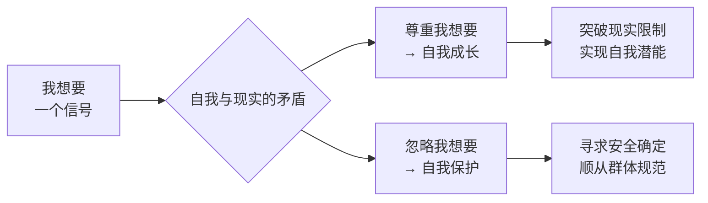

# 第01课：缘起——"我想要"如何生长出来

所有自我转变的起点，就是你内心有一个"我想要"需要被表达和实现。这个"我想要"是自我转变的基本动力，也是所有转变的源起。但为什么"我想要"如此重要？它在转变过程中发挥着怎样的作用？

## "我想要"的两种层次

"我想要"其实有很多层次。有些比较细碎——我想吃什么、想穿什么样的衣服；有些则郑重得多——我想跟谁在一起、我想做什么样的工作。这节课主要讨论后一种，那种关乎人生方向的我想要。因为这些"我想要"的核心，是**我想成为一个什么样的人**。

为什么说"我想要"对转变如此重要？因为你的自我和外界的现实之间，存在着一种永恒的矛盾和张力。当你想要突破现实的限制、实现自我时，"我想要"就变成了一个重要的信号。

让我们来看看Costco超市里那个著名的故事：一个妈妈带着孩子在买可乐，孩子指着最下面那箱说"我要那一箱"。妈妈没有说"可乐都一样"，而是真的把上面的一箱箱搬开，取出孩子要的那一箱，再一箱箱搬回去。她通过满足孩子的"我想要"，告诉孩子：**你想要这件事很重要**。



## 对待"我想要"的两种本能

你对待"我想要"的不同态度，背后是两种相互矛盾的本能：

**第一种本能**：希望自我能够成长、有力量，实现自我的潜能。从这个角度，"我想要"是你对现实提出的要求，是一种影响力的召唤。如果我们希望自己更强大，就需要诚实地面对和回应，甚至要有意识地放大这个"我想要"。

**第二种本能**：保护自己的本能。我们倾向于寻找安全和确定，倾向于合群和顺从现实。所以当"我想要"可能带来冲突和威胁时，人们会倾向于把这个声音藏起来，有意识地忽略它。当忽略变成习惯，等你条件成熟再去找"我想要"时，却发现再也找不到了。

> [!WARNING]
> 当忽略"我想要"变成一种习惯，你可能会发现自己再也找不到内心的声音。这不是因为你不想要，而是因为你太久没有倾听它了。

## "我想要"发展的三个阶段

对于自我转变，到底是我重要还是现实重要？这个问题的答案不是一成不变的，它的变化本身就是自我转变的过程，常常分为三个阶段。

```mermaid
graph TD
    subgraph 第一阶段
        A1[自我是关系的背景] --> A2[听不到我想要的声
        
        A2 --> A3[自我尚未诞生<br/>只是关系的附属物]
    end
    subgraph 第二阶段
        B1[自我与关系<br/>相互矛盾冲突] --> B2[我想要的声音<br/>隐隐约约出现
        B2 --> B3[委屈和失落<br/>不断提醒你]
    end
    subgraph 第三阶段
        C1[自我成为主体<br/>关系成为背景] --> C2[我想要的声音<br/>强烈到无法忽略]
        C2 --> C3[认真审视我想要<br/>并为之负责]
    end
    A3 -.->|内心声音慢慢冒出来| B1
    B3 -.->|声音大到无法忽略| C1
```

### 第一阶段：自我是关系的背景

在这个阶段，自我还很弱小，你常常听不到那个"我想要"的声音。为了生存，我们要努力在社会和关系中找到一个位置，满足他人的期待，理解和尊重社会的规则。这时候，真正的自我还没有诞生，自我只是关系的附属物。

法国存在主义哲学家加缪曾说："很多人的自我，其实是他人。"如果你听从他人的话胜过听从自己，重视他人的感觉胜过重视自己，当你和他人产生矛盾时总是把自己的"我想要"藏起来，那么你的自我就没有诞生——你只是他人的声音、他人的期待、他人的影响的总和。

### 第二阶段：自我与关系相互矛盾

就算外界压力再大，内心那个被隐藏的"我想要"还是会慢慢冒出来。在这个阶段，你会感觉到"我想要"的声音——尤其是那个与现实相悖的"我想要"——开始隐隐约约地出现了。你仍可能努力去满足他人的期待，但你会感觉到一种委屈和失落，而这种委屈和失落正在不断提醒你：你内心有一部分的自我等待被满足。

这个阶段惯用的方式不是直接完成转变，而是一种妥协和迂回。我们总想：现在条件还不成熟，也许挣更多的钱、也许等待更长的时间、也许做更多的忍让和改变，这个平衡就能协调好。然而自我和现实的矛盾在不断地积聚着转变的力量。

### 第三阶段：自我成为主体

当"我想要"的声音大到无法忽略时，自我意识开始逐渐清晰，声音强烈到盖过了他人的要求和期待。你开始认真审视"我想要"，同时意识到需要为"我想要"负责。

一位学员对此有过形象的形容：她五十多岁遭遇婚姻变故后说，"我看这些年的照片，年轻的时候我是清晰的，在照片很显眼的位置。可是慢慢的，我发现自己成了照片的背景。直到婚姻出现变故，我才发现原来这么多年我一直忽略了自己。现在无论愿不愿意，我重新成为了自己生活的主角。"

当自我重新变成主角时，"我想要"的声音就开始变得重要而明确。你必须去正视它、审视它、理解它、帮助它。当"我想要"的声音变得明确时，新的自我就诞生了——你不再从属于特定的关系，你开始从属于你自己。

> [!TIP] Key Insight
> 自我转变的原因，就是你内心里有一个"我想要"要去实现。发现和实现"我想要"的过程，就是自我诞生的过程。

---

> [!QUESTION] 自我检查
> 1. 你内心里的"我想要"是什么？它是清晰的还是模糊的？
> 2. 回顾你目前所处的阶段，你更多处于"自我是关系背景"的状态，还是已经进入了"自我与关系矛盾"的阶段？
> 3. 当你听到内心"我想要"的声音时，你的第一反应是去确认它，还是忽略它？

<details>
<summary>参考答案</summary>

1. "我想要"可能表现为对某种工作的渴望、对某种关系的期待、或是对某种生活方式的向往。它不一定宏大，但一定让你有深刻的情感联结。如果不清晰，不必着急——这正是整个课程要帮助你去探索的。
2. 这三个阶段并不是线性推进的，你可能会在不同领域处于不同阶段。关键在于觉察：你是否在某些关系中压抑了自己的"我想要"？
3. 两种反应都情有可原。确认它需要勇气，忽略它是自我保护的本能。但真正的转变，需要你慢慢学会去倾听那个微弱的声音，并给它表达的空间。
</details>

---

继续学习：[[0002-fa-xian-zi-ji|第02课：发现自己——为什么不知道想要什么]] | [[reference/glossary|核心术语表]]