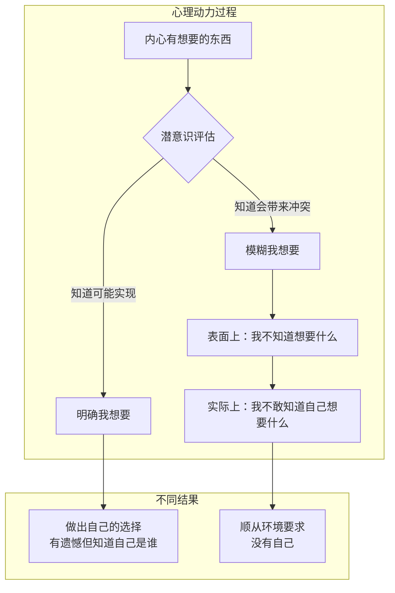

# 第02课：发现自己——为什么不知道想要什么

在转变期，人们常说一句话："我不知道自己想要什么。"这很常见。但问题是，为什么我们会不知道自己想要什么？除了自我尚未成形，背后还有什么样的心理动力？

## "不知道"的伪装

让我们用一个案例来说明。我曾经访谈过一位女士，她是国内大厂早期的员工，很早就实现了财务自由。但她最触动我的，不是她的成功经验，而是她在某一刻说："我不知道自己想要什么。"

她的成长环境并不好。原生家庭给了她两个标签：一个是"穷"，另一个是"女性"。每到她想要什么的时候，父母总是呵斥她——这些愿望不应该，因为家里穷。于是"穷"从物资的贫乏变成了一种身份的暗示：你是卑微的、低下的，你的"我想要"天然就是一种不应该和不懂事。

她很有商业头脑，开了一个计算机培训机构挣到了第一笔钱，但钱并没有证明她有梦想的权利。重男轻女的家庭里，父母觉得女性最重要的是结婚生子。他们对她说："你不要折腾了，以后开个小店养家就好，赶紧找个人嫁了。你是个女孩子，太能干就没有男孩子会喜欢你。"

转折点出现在2003年。朋友拉她去参加一家互联网公司的年会。那些聚在一起做梦的人感染了她，她一边看一边哭："我忽然觉得人生中有一束光把我照亮了。"在那束光之下，她的"我想要"逐渐清晰。她以"这家公司男生多好找对象"为理由说服了父母，加入了销售团队，还顺便结了婚。

我问他："那时候你那么拼，苦不苦？"他说："不苦。人没有希望才苦，那时候我有希望。"

```mermaid
flowchart LR
    A[环境暗示<br/>"你不配拥有梦想"] --> B{我想要被模糊}
    B --> C[知道我想要<br/>→ 面对冲突和求不得的痛苦]
    B --> D[不知道我想要<br/>→ 避免冲突但失去自我]
    C --> E[做出自己的选择<br/>无论追求还是放弃]
    D --> F[顺从环境要求<br/>变成"我应该"]
```

## 梦想的再次模糊

当这位女士的人生逐渐展开时，女性的束缚又来了。她有了孩子，忙于事业忽略了家庭，导致严重夫妻矛盾。先生需要辅佐，孩子需要妈妈，父母需要女儿家庭稳定。他们承认她有能力，但觉得家更需要她。

最终她辞职回家带孩子。当我问她那时候自己的想法是什么，她说："我不知道我的想法是什么。想到这个问题，我的头脑一片空白。"

你发现了吗？在她做出最重要选择的那一刻，她说的不是"我被迫做了我不想要的选择"，而是"我不知道自己想要什么"。当她说"我不知道"的时候，她模糊的不仅是选择的答案，模糊的也是她自己。

> [!WARNING]
> 当一个人放弃梦想时，"我想要"也会随之模糊。这不是简单的遗忘，而是一种心理上的自我保护机制——为了避免求不得的痛苦，宁可连"想要"本身都压抑掉。

## 不知道，也是一种适应方式

我们总以为环境对人的压迫，是逼迫我们做不想要的选择。但实际上环境的影响更深——深到在你想法成形之前。它不是让你不敢坚持自己的想法，而是让你根本**不知道**自己的想法是什么。

因为潜意识里你知道：一旦"我想要"清晰起来，你就会和这个世界产生不可避免的矛盾。你也许会再次面对有梦想却得不到的痛苦。为了避免这种痛苦，你宁可模糊了自己的"我想要"。



从这个角度，当我们说"我不知道自己想要什么"时，更准确的表述也许是："我不敢知道自己想要什么。"

## 知道的意义

知道了之后，它就能帮助你坚持自己的选择吗？不一定。有时候我们会顺从我想要，有时候又会屈服于现实。就像那位女士，就算她意识到自己想要梦想，她也许还是会牺牲梦想。

但如果这样，她选择了其中的一种而放弃了另一种，那是她的选择——有遗憾，但知道自己想要什么。而现在，当她不知道自己想要什么时，她所做的并不是自己的选择，她只是顺从了环境的要求。

人只有知道自己想要什么，才能做出自己的选择——无论是追求它，还是放弃它。否则你只是顺从环境，随着环境的要求做选择，里面就没有你自己。

> [!TIP] Key Insight
> 转变的过程，就是要让"我想要"从模糊变得清晰，从而发现自己的过程。当"我想要"被清晰地在头脑中表达出来，你再也无法压制它。它会变成一种强大的动力，有时候以痛苦的形式存在，但它会让你努力在现实中为它寻找一个出路。

---

> [!QUESTION] 自我检查
> 1. 你是否曾经对自己说过"我不知道自己想要什么"？试着问问自己：到底是"不知道"，还是"不敢知道"？
> 2. 想象两个选项：A. 知道自己想要什么但需要面对烦恼和冲突；B. 不知道但暂时安逸。你会怎么选？
> 3. 在你的生活里，有没有哪个"我想要"曾经清晰，后来又变模糊了？发生了什么？

<details>
<summary>参考答案</summary>

1. 这是一个艰难的自问。大多数说"不知道"的人，背后其实有隐约的声音，只是这个声音曾经被否定过、打压过，所以学会了沉默。
2. 选择B是自我保护的本能反应，但选择A才是转变的开始。转变的勇气不在于立刻行动，而在于愿意去面对那个"知道"可能带来的不安。
3. "我想要"的模糊通常发生在重大的现实压力之后——关系冲突、职业挫折、家庭责任。这不是你的软弱，而是你为了生存所做的适应。但适应不等于放弃，你依然可以重新找回它。
</details>

---

继续学习：[[0003-san-ge-qu-fen|第03课：三个区分——如何知道自己想要什么]] | [[reference/glossary|核心术语表]]