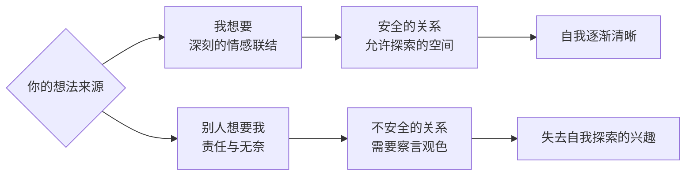

# 第03课：三个区分——如何知道自己想要什么

上节课我们从心理动力的角度解释了为什么你不知道自己想要什么——因为有时候人会在"知道而求不得"和"不知道"之间选择后者。那接下来你一定会问：我该如何找回"我想要"呢？

知道"我想要"的一个重要途径，是对自我和他人做区分。当我们陷入关系的迷雾，把注意力放到关系中时，就很难有空间去探索和思考"我想要"。这节课提供三条线索，帮你拨开关系的迷雾。

## 线索一：区分"我想要"和"别人想要我"

这件事到底是你想做，还是别人想要你做？

当你思考"我想要"时，跟自身经验常常有一种深刻的情感联结。而想到"别人想要我做"时——尤其是你自己也不那么情愿时——那更多是一种责任和无奈。

在转变期，人们常常会有这样的觉醒："对啊，为什么我只知道别人想要我怎么样，却从来没有想过我自己想要什么？"这个问题常常成为转变的契机。

为什么只考虑别人怎么想？关键不在于你多认同对方，而在于**这段关系对你安全还是不安全**。安全的关系会给我们一个空间，让我们知道那个重要的人允许我们去探索和容纳"我想要"。而不安全的关系会让你总是想着别人，因为别人的喜怒哀乐对你是头等大事。



## 线索二：区分"我想要"和"我应该"

"我应该"和"别人想要我"有点像，但并不完全一样。"别人想要我"一般来自具体的关系，而"我应该"则常常来自更抽象的社会规则。

想想我们社会最明显的常识：你应该找一个稳定的工作、你要坚强不能软弱、赚更多的钱代表更有能力……所有这些规则都有它特定的道理，但它们有一个共通的问题——**这里面没有你自己**。

前段时间跟一个朋友聊天，他一直都是"别人家的孩子"，几乎所有外界期许的事情他都能做得很好。名校的头衔、高薪的职位唾手可得。可是他总觉得缺了一点东西——缺少的也许就是跟"我想要"的那种深刻联结。因为大部分事情他都能做得好，所以大部分事情对他来说其实没什么区别。

> [!WARNING]
> 在"应该"的路上太顺利，这种顺利本身也会变成一种挫折——寻找自我的挫折。

## 线索三：区分"我想要"和"我想向别人传递信息"

这个最有迷惑性，因为看起来向别人传递信息也是我们主动的想法。当我们嵌入某种关系时，常常会下意识地根据关系来做反应：我想取悦他、我想反抗他、我想靠近他、我想挫败他。

我曾见过一个家庭：父亲是很成功的企业家，对孩子很严格。孩子最开始很听话，到了青春期就开始反叛——抽烟、喝酒、逃学。在咨询室里，孩子愤怒地对爸爸说："你以为你很成功？我就是要告诉你，你不成功！"

孩子是通过把自己的生活搞得一团糟来证明父亲不成功。这种自毁的背后有巨大的委屈——证明父亲不成功，远比我自己的前途更重要。当我们心灵受伤时，我们很多时候不惜把自己当作工具来报复对方。

可问题是：为什么要把他放到那么重要的位置，甚至比自己还重要？除了向他传递信息，那我自己想要的又是什么？

```mermaid
graph TD
    A[陷入关系迷雾] --> B{三个区分}
    B --> C[我想要 vs 别人想要我]
    B --> D[我想要 vs 我应该]
    B --> E[我想要 vs 向对方传递信息]
    C --> F[从不安全关系中抽离<br/>找回自我空间]
    D --> G[从社会期待中觉醒<br/>找回真实感受]
    E --> H[从关系反应中解脱<br/>回归自身福祉]
    F --> I["
    G --> I
    H --> I
```

> [!TIP] Key Insight
> 有一句话是这样说的："为了自己的福祉是人的最高美德。"很多人觉得这么说太自私，但他们没有理解这句话的真正含义——当我们陷入复杂的关系时，有能力从自己的角度去思考"什么对我最好"。如果放下一件事对你有好处，那你可以选择放下它，不是为了对方，而是为了你自己。

---

> [!QUESTION] 自我检查
> 1. 你生活中的哪些决定是出于"别人想要你"做的？哪些是出于"你应该"做的？哪些是你真正"想要"做的？
> 2. 你身边有没有一段"不安全的关系"——在这段关系里你总是察言观色，很少思考自己？
> 3. 有没有哪个你正在做的事情，其实是为了向某个人传递信息（证明自己、反抗对方、引起注意）？

<details>
<summary>参考答案</summary>

1. 三者往往交织在一起，不必追求纯粹的"我想要"。关键在于觉察——当你做选择时，能否意识到这三个声音分别是什么。觉察本身就是从关系迷雾中走出的第一步。
2. 不安全的关系不一定都是坏的或可以逃离的（比如某些家庭关系），但你可以在心理上划出一个自我空间：每天给自己一点时间，不去想"对方需要什么"，只问"我需要什么"。
3. 这个发现可能让人不舒服——发现自己原来把自己当成了工具。但觉察到这个模式就是转变的开始。试着问自己：如果不需要向这个人传递任何信息，我会怎么做？
</details>

---

继续学习：[[0004-qiu-bu-de|第04课："我想要"的另一面——如何面对求不得]] | [[reference/glossary|核心术语表]]