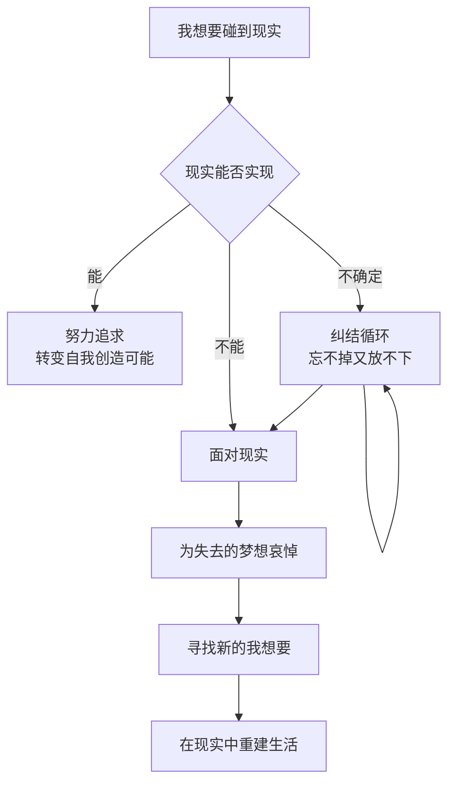
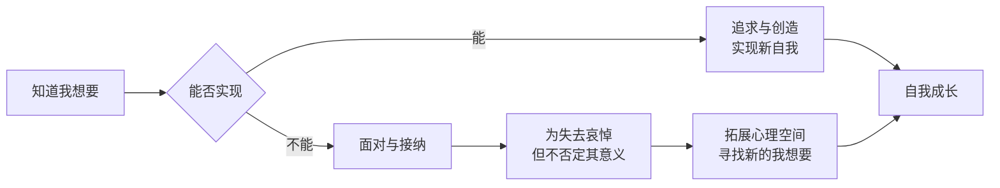

# 第04课："我想要"的另一面——如何面对求不得

前面几节课一直在说，转变是自我和现实之间永恒的矛盾，也一直在强调要寻找"我想要"。可是，只要你尝试过，就知道事实没有那么简单。有时候我们会无可避免地碰到坚硬的现实，它会打击你的"我想要"。这时，也许你需要开始另一种转变——**接纳现实**。

## 困在中间地带

生活总是残酷的：它给我们一个梦想，但不告诉我们到达梦想的道路。当我们鼓起勇气坚持梦想时，现实却要给我们暗示——梦想所暗示的那条路根本行不通。于是很多人被困在无法选择的境地——那个已经无法安住的现实、却又不能抵达梦想的中间地带，不停地纠结，停不下来。

> [!EXAMPLE] 落难的公主
> 一个落难的公主，王国被推翻，颠沛流离来到民间，靠做一份普通工作为生。她还依稀记得自己是公主，但这个身份除了带来失落和痛苦，并没有别的用处。周围的人不知道她的身份，她也避开人群离群索居。她不知道是该记住过去的痕迹，还是该忽略它们——记住会一直痛苦，忽略就会忘记自己是谁。
>
> 这就是人忘不掉又放不下的纠结。

## 面对现实，还是不面对

以关系为例。我帮很多夫妻挽回关系，也面对过很多关系的分离。我知道并不是所有的关系都可以挽回，一旦越过某条线，关系就很难逆转了。当接近的痛苦大于清静的快乐，当回避痛苦的冲动大于对关系的渴望时，自我保护机制就会启动。

我会对那些被留在关系里的人说："记住，你不是在继续和结束这段关系之间做选择——这不是你能选择的。你只能在**面对现实和不面对现实**之间做选择。"

不爱了就是一种现实。如果它已经变成了现实，你就要去面对它。同样的道理，有时候发现曾经的"我想要"走不通了，你也需要在面对现实和不面对现实之间做选择。只有在接受现实的前提下，你才有机会去发展新的"我想要"。

## 臣服于命运，不等于放弃自我

我有一个学员，从小喜欢诗歌文学，做的却是一份最琐碎的行政性工作。他的故事不是借着"我想要"冲破命运束缚的故事，而是臣服于自己命运的故事。

从青春期开始，他就一直过得很拧巴。一方面渴望自由、不想被束缚；另一方面，他所走的每一步都是追随主流道路，为了让妈妈放心。

"好像一直有一条绳子拽着我，我想去做什么，这个隐形的绳子不让我去。原来我觉得绳子的那头在父母手里，后来他们老了，我长大了，那个绳子就已经在我心里了。"

后来外公去世了，他利用写作才能为外公写了传记，也鼓励妈妈给自己写传记。在这个过程中，他逐渐理解了妈妈不安全感的来源——那是更远的不安全时代的印记。他说："我一直以为那条绑着我的绳子是拽在我妈妈手里的，可是我发现并不是。妈妈也是被这条绳子绑着的人。绳子的另一端不在她的手上，在更遥远的家族历史里。"

因为这个发现，他跟妈妈和解了，也跟那个总是得不到的"我想要"和解了。

> [!WARNING]
> 臣服不是放弃，而是一种更深层的接纳。它意味着你承认某些梦想无法实现，但并不因此否定这些梦想对你人生的意义。

## 知道"我想要"的真正意义

就算没有被实现，"我想要"也有它的意义。知道"我想要"虽然会让你面临矛盾和冲突，但这些矛盾在给我们痛苦的同时，也拓展了我们心理的空间。那些没有被实现的"我想要"，仍然是自我重要的组成部分，一直存在于我们精神的深处。

知道本身就是对"我想要"这件事的重视。习惯对"我想要"重视，其实也是习惯重视我们自己。

实现"我想要"没有一个简单的答案。如果有，那就是：先知道它；发现它不可能了，就勇敢地为它哭泣；然后再去生活中寻找新的"我想要"。

---

> [!QUESTION] 自我检查
> 1. 你生命中是否有一个"求不得"的梦想？它现在对你的意义是什么？
> 2. 你是否正困在"无法安住的现实"和"无法抵达的梦想"之间的中间地带？
> 3. 面对求不得，你更倾向于继续纠结，还是尝试接纳现实、寻找新的可能？

参考答案

1. 求不得的梦想就像是内心的一个坐标。即使没有实现，它也定义了你曾经想要成为的方向。它的意义不在于"有没有得到"，而在于它让你知道"我是谁"。
2. 中间地带是转变中最煎熬的阶段。脱离中间地带的关键不是立刻做选择，而是接受"这个梦想确实无法实现"这个事实。承认失去，才能重新开始。
3. 接纳现实不等于放弃自我。恰恰相反，只有接纳了那些无法改变的现实，你才能把精力释放出来，去寻找真正可以改变的方向。臣服于命运，有时候是为了更好地成为自己。

---

继续学习：[[0005-xuan-ze-biao-zhun|第05课：选择的标准——是环境还是自我]] | [[reference/glossary|核心术语表]]