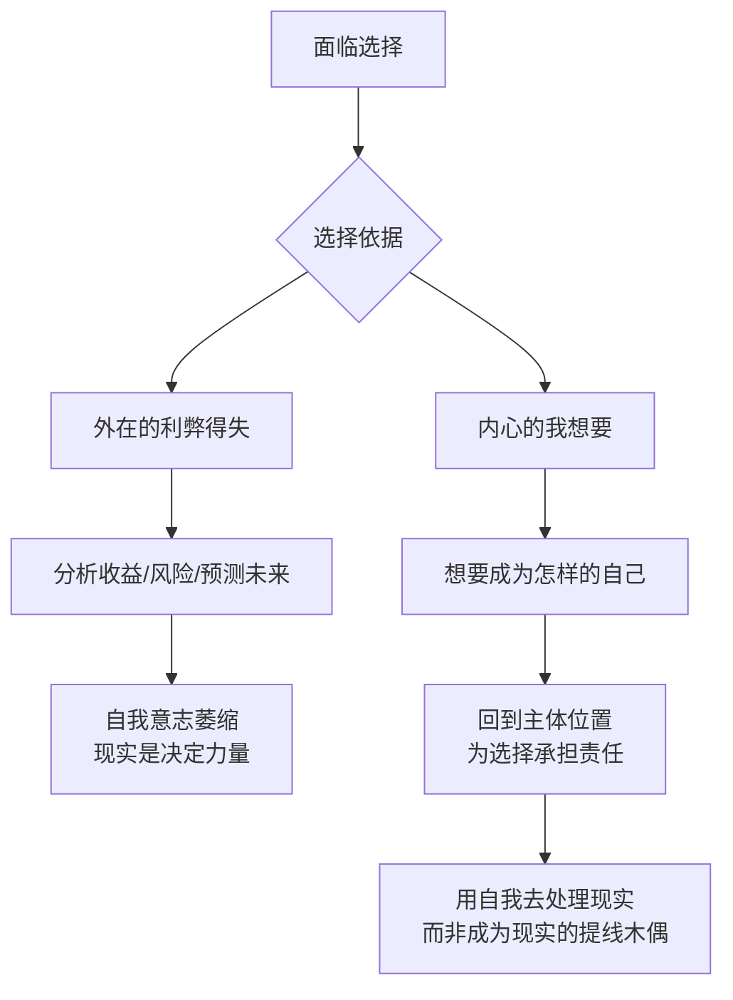
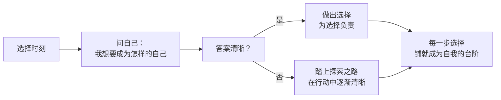

# 第05课：选择的标准——是环境还是自我

从这一讲开始，我们进入了自我转变的第二站：**选择**。选择什么呢？上一阶段我们讨论的是如何发现自己的"我想要"。当你开始正视"我想要"时，就算不很清晰，对这个问题本身的重视也会慢慢影响你的选择。

现实所提示的是一条稳定、清晰、可预期的道路，而你隐隐约约的"我想要"却暗示了另一条神秘、幽远、带着危险和诱惑的不确定的道路。在这两条路中间，你要选哪一条？

## 传统选择的困境

传统上面对选择，我们会做两件事：一是分析现实的利弊得失，二是努力预测未来。分析利弊得失和预测未来，能够帮助我们减轻选择所面临的不确定的焦虑，可是它**不能帮你理解自己**，也不能帮你做出你的选择。

设想一下：如果有一天，科技发展到能有一个AI把每个选择的利弊得失都计算清楚，告诉你哪个选择收益更大。你会只根据AI做选择吗？如果是这样，那这个选择究竟是你的选择，还是AI的选择？你只是通过执行AI的选项，逃避了选择的责任。

> [!WARNING]
> 如果你只是根据外界信息做选择，你就会忽略选择中最重要的因素——你想要成为怎样的自己。事实上，选择最核心的意义，就是**选择成为什么样的自己**，并为这个选择承担责任。

## 从"我要成为怎样的自己"出发

我曾经有一个来访者，是一个建筑设计师，在一家房地产公司工作了十几年，身心俱疲，行业也开始走下坡路。他参加了几次心理学培训，感觉很好，想转行成为心理咨询师。可是放弃原来的工作，这么多年的积累就白费了。

我问他，为什么对心理咨询这么执着？这时他才告诉我，成长环境里妈妈很强势，对他有很高的期待，他一直隐藏着跟妈妈期待不符的"我想要"。那个隐藏的自我，变成了一种脱离母亲、实现自我的幻想。

他说："我慢慢才明白，我的转行不仅是转行，而是自我意志的表达。我总是小心翼翼地把我想要的东西放到一个不起眼的地方，防止别人看到它，也不让我自己看到它。"

后来他跟先生交流了转行的想法。本以为先生会像妈妈一样反对他，但先生说："无论你选择原来的工作，还是去探索新领域，我都会支持你。在你谈论未来的探索时，你有种热情，我从未在原来工作中见过。我觉得这对你很重要。"

听完先生的话，他说："当我说先生支持我的时候，我忽然觉得当心理咨询师也没有那么紧迫了。我还有更多可能性可以去探索。"

> [!TIP] Key Insight
> 从外在的利弊得失切换到内心的"我想要"，会改变你跟现实的关系。它把选择从"外部事件"回收到"内心"，让你从被动的适应者变成主动的创造者。当你把自我放到更中心的位置，你知道你需要用它去处理和创造现实，而不是成为现实的提线木偶。

## 选择是一条探索之路

当我们问自己"我想要成为怎样的自己"并把它作为选择依据时，这并不意味着答案就清晰完整了。有时候我们不知道想要成为什么样的自己，有时候想要成为的自己也会变化。

可是当我们从"想要成为的自己"出发去思考选择时，我们就走上了一条与分析现实利弊得失完全不同的道路。它不是完整的答案，而是一条在探索中逐渐完成的道路。这条道路本身，有时候比答案更重要。

诗人弗罗斯特在《未选择的路》中写道：金黄的丛林里分出两条路，而我选择了少有人走的那一条，一切的不同都从这儿开始。

---

> [!QUESTION] 自我检查
> 1. 目前你面临的最重要的选择是什么？你是从"利弊得失"出发思考，还是从"想要成为怎样的自己"出发？
> 2. 如果你问自己"我想要成为怎样的自己"，答案会是什么？哪怕很模糊，试着写下来。
> 3. 如果你把选择的标准从环境切换到自我，你对同一个选择的看法会发生什么样的变化？

参考答案

1. 大多数人首先会从利弊得失出发，这是正常的。但做完利弊分析后，不妨再追问一句：抛开这些现实考量，哪个选项更接近"我想要成为的自己"？
2. 答案模糊是正常的。"想要成为的自己"不是预设好的蓝图，而是在探索中逐渐显现的方向。关键在于你开始问这个问题了——这本身就已经走上了转变之路。
3. 当选择标准切换后，你会发现：原来有些"不理性"的选择变得合理了，因为它在保护某个重要的自我；原来有些"理性"的选择变得可疑了，因为它在牺牲自我。这不是让你不顾现实，而是让你重新排列"现实"和"自我"的主次关系。

---

继续学习：[[0006-bao-hu-jia-zhi-guan|第06课：保护性价值观——什么是自我的核心]] | [[reference/glossary|核心术语表]]