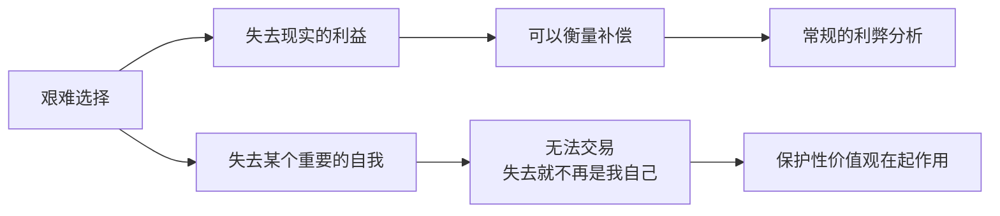

# 第06课：保护性价值观——什么是自我的核心

就算从环境视角切换到自我视角，你仍然可能不知道如何做选择——因为你内心不止一个"想要的自我"，不同的自我在相互打架。既想要稳定，又想要更多可能；既想要受人尊重，又想要更多体验。这么多不同的自我之间，该如何做选择？

答案或许藏在你的**保护性价值观**里。

## 不可交易的东西

电影《师父》里有这样一个情节：几个天津的武林高手把想要挑战他们的年轻人带到天津边界，刺伤了他，告诉他前面不远处有医院，不要回天津了。可年轻人只往医院走了几步，就二话不说往天津的方向跑，直到失去生命。

这个年轻人的选择告诉我们：作为一个概念的自我，有时候比现实存在的自我更重要。如果选择了去医院，保留了现实的自我，就会失去那个引以为傲的概念上的自我。有时候我们宁愿失去生命，也不愿意失去那个重要的自我。

虽然大部分人所面临的选择没有这么极端，但类似的选择情境也经常出现在生活里——要么失去一些现实的重要东西，要么失去某个重要的自我。



## 什么是保护性价值观

美国心理学家巴伦和斯普兰卡提出了"保护性价值观"（Protected Values）的概念。它指的是：人内心存在着一种绝对的价值体系，神圣又无价，不能被交易。一旦被冒犯，无论冒多大的风险，人们都会为之战斗，努力捍卫它，甚至献出生命。

从自我的角度，保护性价值观是自我建立的基石——我们是在这个基石上建构了自我存在的意义。这也是为什么我们宁可失去很多重要的东西也要去捍卫它。

想想你自己是否也做过这样的选择：并不遵循趋利避害的理性原则，有一种倔强——虽然别人觉得没必要，但你咬紧牙关坚持这么做，哪怕会让你蒙受重大损失。

> [!TIP] Key Insight
> 这种倔强并不是不理性，而是你有一个很重要的自我要维护。

## 一个用放弃标价的故事

我有一个学员，曾有一段外人看来很不错的婚姻。先生和她都是高学历，公婆经济条件非常好。可结婚后，公婆坚持要一起住，他们是家里绝对的权威，总是有意无意地轻视她。

后来因为一件小事，她跟公婆有了矛盾。这一次不知道怎么来的劲头，她就是不肯道歉。事情开始失控，她从家里搬了出来，向先生提出离婚。他说："好，那我什么都不要，都给你好了。"

就这样，她孤身一人离开了那段婚姻，离开了原来的工作，离开了所在的城市。在另一个城市重新找了一份工作，从基层做起，慢慢建立了自己的事业。

回想起这个选择，她说："我没有办法。原来我以为有些事忍忍就可以，可是后来我发现我没法忍。那会让我觉得自己不被尊重、没有价值、没有希望、也没有自我。"

我感慨：为了保护尊严，人是会付出这么大的代价的。我问她："你后悔吗？"她说："我不后悔。我后悔的是没有早点做这个选择。"

```mermaid
graph TD
    A[长期压抑] --> B{核心价值被侵犯}
    B --> C[以前的做法：忍让妥协]
    C --> D[自我逐渐消失<br/>不被尊重/没有价值]
    D --> E[保护性价值观被触发<br/>"我不能再这样"]
    E --> F[做出决绝选择<br/>放弃财产/婚姻/城市]
    F --> G[失落但坚定<br/>"我不后悔"]
    G --> H[重新建立自我<br/>在新的土壤上]
```

## 保护性价值观的双面性

保护性价值观的意义在哪里？对于一个身处转变的人来说，保护性价值观既帮我们做出选择，也蕴含着重要的能量。它是自我重建的基础。如果没有这样的倔强，也许你就不会知道自己是谁、在哪里，也不知道怎么重新开始。

但保护性价值观就一定是对的吗？在危机时刻，它给我们力量，有时也会让我们失去灵活性。而且，保护性价值观也会改变——以前拼命要坚持的东西，慢慢可能会觉得它是不对的。

正因为这种两面性，对不同阶段的人要说不同的话：

- 对**已经做出选择**的人：肯定他们的做法，因为他们要借着这个保护性价值观去完成转变。
- 对**正在选择**的人：审慎地问——是不是只能这样？他们要保护的东西毫无疑问，但如果我们能以不同方式来保护它，是不是会有不一样的灵活性？

> [!WARNING]
> 人有时候很难知道一件事对自己有多重要，直到他用放弃的东西为它标上价格。你放弃的东西告诉你，你所捍卫的自由是无价的。

---

> [!QUESTION] 自我检查
> 1. 你内心有没有一种"无论如何都不能妥协"的东西？它是什么？
> 2. 你有没有做过一个"不理性"的选择——别人觉得没必要，你却咬牙坚持？那个选择想保护什么样的自我？
> 3. 如果你正处于选择中，你确定你正在保护的东西只能用一种方式来保护吗？

<details>
<summary>参考答案</summary>

1. 想想那些让你感到"如果我让步了，我就不再是我自己"的事情。那背后就是你的保护性价值观。它可能是尊严、自由、独立、正直、忠诚、创造力……
2. "不理性"的选择往往是最理性的——它在保护你自我最核心的部分。回想那些选择，你会发现它们定义了你是谁。
3. 这是一个好问题。保护性价值观保护的东西往往不能变，但保护的方式可以灵活。比如"我要被尊重"这个价值可能不变，但"一定要离婚才能被尊重"这个方式可以重新思考。关键在于区分核心价值和实现方式。
</details>

---

继续学习：[[0007-zi-wo-shi-jiao|第07课：自我视角——如何做出你的选择]] | [[reference/glossary|核心术语表]]