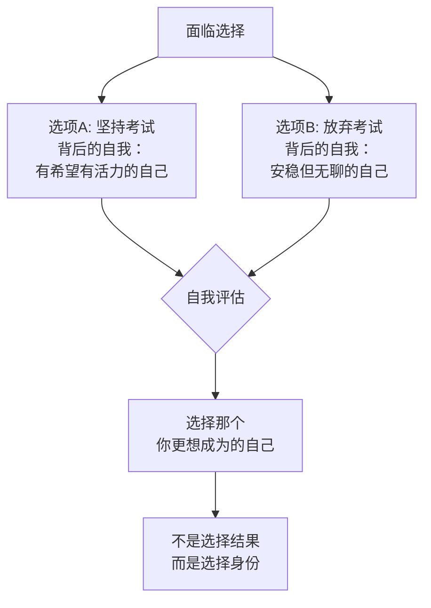
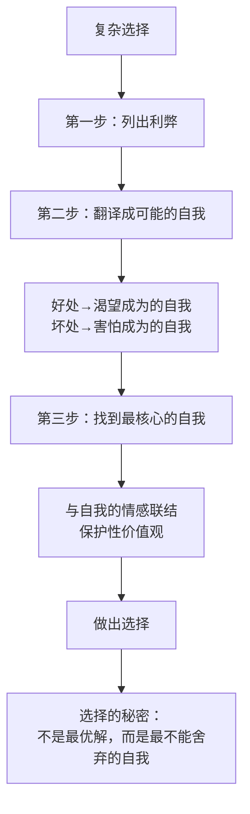

# 第07课：自我视角——如何做出你的选择

前面讲了两种选择的标准，也讲了决定选择的核心要素——保护性价值观。也许你会问：怎么才能把这些融入我所面临的选择？有没有切实可行的方法来整理选择的思路？今天这节课就来回答这个问题。

## 选项背后的"可能的自我"

先举一个例子。我有一个来访者，在追求梦想的道路上经历过很多次失败。考研究生考了几次才考过，司法考试第一次没考过，第二次还是没考过。周围的人都劝他放弃。他很焦虑，问我该坚持还是放弃。

我没有直接给他答案，而是问他："假如放弃了以后，你准备怎么过呢？"

他说："放弃了以后就不用看书了，每天早早回家跟妈妈看电视剧。"

我问："你喜欢那个自己吗？"

他说："不喜欢。我试过了，过了一星期就觉得无聊了。相比之下，我更喜欢准备考试的自己——虽然焦虑，但至少有希望和活力。"

我说："那就去追求那个你喜欢的自己。"

坚持还是放弃，背后有两个不一样的自己。这是一种选择的思路：我们能不能根据选项背后不同的自己来做选择？

几乎每一个选项背后都有一个可能的自我，它们在不停地对你喊："选我，选我。"如果你选择了其中一个，就有机会把这个自我带到现实中来。如果你不选择它，它就会跟很多其他可能的自我一样，消失不见。

## 三步法：将选项统一到自我视角

更复杂的选择怎么办？比如一个博士毕业的研究员，在研究所里老板帮他争取资源，但同时又很强势，经常羞辱他。他该留下来还是离开？

这样的选择之所以难，因为它涉及三个视角：

- **现实视角**：稳定受人尊重的工作 vs 不稳定但有更多机会的工作
- **关系视角**：受保护但被贬低的关系 vs 独立发展的关系
- **自我视角**：每个选项背后都有不同的自我

把所有选项统一到自我视角，可以分为三步：

### 第一步：列出每个选项的好处和坏处

留在研究所的好处：稳定的工作、受人尊重的环境、职衔。
坏处：高压环境、让人焦虑的关系、不够自主。

离职的好处：更多可能性、更自主、更能照顾家庭。
坏处：需要自己寻找资源、有一定风险。

### 第二步：把好处和坏处翻译成"可能的自我"

每个好处和坏处背后，都有一个可能的自我：

| 选项 | 好处/坏处翻译 | 可能的自我 |
|------|--------------|-----------|
| 留下-好处 | 追求安全可控 | 理智清醒的自我 |
| 留下-好处 | 为家人负责 | 负责任的自我 |
| 留下-坏处 | 忍辱负重 | 委屈的自我 |
| 离职-好处 | 追求可能性 | 勇于反抗的自我 |
| 离职-好处 | 追求独立 | 独立的自我 |
| 离职-坏处 | 需要冒险 | 冲动的自我 |

### 第三步：找出对你最重要的那个自我

当你读这些理由时，它们会激发你不同的情感反应——有些你想要，有些你不想要，有些重要，有些没那么重要。你要做的是：**把那个无论如何都舍不得放弃的自我选出来**。

> [!TIP] Key Insight
> 选择不是为了平衡所有的利弊得失之后做出的，而是根据那个**无法舍弃的自我**做出的。你会根据那个没法舍弃的自我，去构建你的人生。

## 这个秘密

我发现一个秘密，是从很多人的选择中发现的：**选择不是为了平衡所有利弊得失之后做出的，而是根据那个我们没办法舍弃的自我做出的。**

你会根据这个没法舍弃的自我，去构建你的人生。

当然，选择永远不是事情的结束，而只是探索的开始。对于很多人来说，更困难的是那个自我还没成型，该如何做选择？如果是这样，你要问自己：现在是做出重要选择的时机吗？

如果不是选择的时机，那能做些什么，把这个新自我逐渐培育出来？当你这么问的时候，就进入了自我转变的下一个环节——**容器**。

---

> [!QUESTION] 自我检查
> 1. 你现在面临的选择中，每个选项背后分别有什么样的"可能的自我"？
> 2. 试着用三步法把你当前的一个选择做一遍分析——从利弊到可能的自我，再到最核心的那个自我。
> 3. 那个你最不能舍弃的自我是什么？它与你内心什么样的保护性价值观有关？

参考答案

1. 每个选择不只是关于"做什么"，更是关于"成为谁"。试着用这个框架重新审视你的选择，你会发现新的视角。
2. 三步法的价值不在于找到一个"正确答案"，而在于让你看到：原来我犹豫不决，不是因为看不清利弊，而是因为不同的自我在打架。当你看到它们在打架，你就已经在做出选择了。
3. 那个最不能舍弃的自我，往往指向你最核心的保护性价值观。如果你找到了它，你就找到了选择的锚点。即使前路不确定，这个锚点也能让你内心安定。

---

继续学习：[[0008-rong-qi|第08课：容器——如何培育新自我]] | [[reference/glossary|核心术语表]]