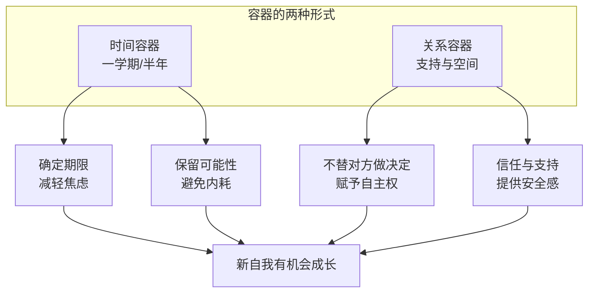

# 第08课：容器——如何培育新自我

很多人以为选择只是一个结果，但其实选择是一个过程。它背后是旧自我的逐渐消退和新自我的逐渐成长。很多时候我们不知道自己要什么，或者没有办法做选择，或许不是因为我们优柔寡断，而是因为**新的自我还不够成熟**，选择的时机还没有到来。

怎么能够在保留旧自我的情况下，先把新自我培育得更成熟？接下来两讲我们会讲到自我转变的第三站——**容器**。

## 什么是容器

就像一个胎儿要发育成熟，需要一个子宫来孕育它；一棵种子要长成苍天大树，需要一块肥沃的土地来培育它——一个新自我的诞生，也需要一个安全的环境来激发它。如何为自己营造一个这样的环境？

它可能是一段特定的时间、一段关系、一个空间。无论什么样的形式，它都是我们刻意打造的、用于培育新自我的环境，就叫做**容器**。

> [!EXAMPLE] 贾雷德·戴蒙德的故事
> 著名生物学家和作家贾雷德·戴蒙德，在《巨变》一书中描述了他差点放弃学术生涯的经历。他本科毕业后去剑桥读研究生，做了一年的生物学实验，发现自己什么都做不好，开始怀疑自己，甚至想退学去做同声传译（他有语言天赋）。
>
> 他把决定告诉父母。他的父亲是一个开明的学者，没有贸然帮他做决定，而是温和地说："你确实对科研生涯产生了困惑，但这只是你在剑桥的第一年。不如再给自己一学期时间，好好做你的实验，等春季学期再来做决定。你不需要现在就做这个无法回头的重要选择。如果一学期以后你发现自己确实不喜欢，那我们也支持你。"
>
> 这半年的时间，戴蒙德努力做实验，加上运气，实验有了重大突破，给了他很大信心。后来他博士毕业，成了成功的生物学家和作家。这半年的时间奠定了他后来的人生走向。

## 容器是一段可供探索的时间

当戴蒙德面临选择时，他是在一个"尚未被验证的旧自我"和一个"尚未成熟的新自我"之间做选择。这样的选择是痛苦的——某种程度上，他几乎是要凭着想象做出对人生至关重要的选择。

而"可以一学期后再做决定"，就帮他创造了一个容器。这个容器可以同时容纳两个自我，让新的事情发生，让新的自我变得清晰，让选择变得容易一些。

```mermaid
flowchart LR
    A[艰难选择] --> B[容器：一学期的时间]
    B --> C[容纳新旧两个自我]
    C --> D{容器如何起作
    
    D --> E[减轻选择焦虑<br/>"不是逃避，是一学期后再决定"]
    D --> F[创造确定性<br/>具体时间点让心理放下负担]
    D --> G[避免内耗<br/>保留可能性才能全力以赴]
    E --> H[全心投入实验<br/>创造新经验]
    F --> H
    G --> H
    H --> I[新的自我逐渐成熟]
```

确定一学期的时间，可以减轻他选择的焦虑。他对自己说："我不是选择逃避，而是选择一学期以后再做决定。"一学期后这个具体的时间点，为他在不确定中创造了一种确定性。而对于确定的东西，我们就可以在心理上放下它。

最重要的是，新旧自我造成的内耗是转变期常见的心理现象，而创造一个容器能够帮助我们避免这种内耗。正因为保留了"可能去做同声传译"的可能性，戴蒙德才能把所有精力都放到实验上，去创造属于他的新经验。

## 容器是一段安全的关系

容器不只是时间，它还可以是一段既能提供支持、又能给你空间的关系。在戴蒙德的例子中，他父亲的做法非常明智。试想，如果父亲坚持要他走学术道路，告诉他"你绝不能退缩，我比你多吃这么多年的饭，我是为你好"，结果会怎么样？

也许戴蒙德会听从父亲的话，但他可能会想"这不是我要走的路，这是我父亲要我走的路"，那样他就很难全力以赴。他也可能不听，心想"凭什么我要听你的，你为什么要否定我的梦想"——本来还在犹豫的，可能马上就选择了另一个方向。

戴蒙德父亲的高明之处在于：他没有为儿子做决定，在保留可能性的同时，把决定权最终给了儿子，并表示无论如何都会支持儿子的决定。这种宽容和支持，就创造了一种**关系的容器**。

> [!TIP] Key Insight
> 容器看起来什么都没有给，可是对于探索新自我，它非常珍贵。关系的容器的核心不是指导或推动，而是**信任与允许**——相信对方会找到自己的办法。



## 不打扰的信任

我曾遇到一个年轻的朋友，考研失败后陷入抑郁，什么也不想干就回到了家里。父母已经分开了，他先去妈妈家，妈妈对他的状态很着急，不停地指导他要振作、要找工作，却让他更加心烦意乱。

后来他去了爸爸家。爸爸什么也没说，不催他早睡早起，不管他打游戏，只是每天帮他做饭，吃完饭叫他一起去散散步随意聊几句。总的来说，爸爸听得多说得少。就这样过了一个月，他忽然觉得自己不能再这样浑浑噩噩下去，就出来找了一份工作。

表面上看爸爸什么也没有做，但正是这个"什么也没有做"帮助了他复原。爸爸给了他一个容器去整理和修复自己。这种不打扰的背后是一种信任："我相信我儿子已经长大了，我相信他会找到自己的办法。"

> [!WARNING]
> 在转变期，人最需要的就是一个宽松的、带着允许的、能够让你思考和探索的容器。这种容器远远比任何急切的评价更有疗效。如果你正在陪伴一个处于转变期的人，请记得：有时候"不作为"恰恰是最有帮助的作为。

---

> [!QUESTION] 自我检查
> 1. 在你过去的经历中，有没有一段"容器式"的时间或关系，培育了你的新自我？
> 2. 如果你现在面临一个艰难的选择，你能否为自己创造一个"一学期"的容器？
> 3. 你身边有没有处于转变期的朋友或家人？你能否为他们提供一段"关系容器"？

<details>
<summary>参考答案</summary>

1. 回想那些让你感到"安全"和"允许"的时期——可能是一段gap year、一份不那么忙的工作、或者一个理解你的朋友或导师。那时的宽松环境可能恰恰帮助你理清了自己想要什么。
2. 容器不一定是"什么都不做"。它可以是：告诉自己"三个月内先不辞职，全力把当前工作做出成绩"；或者"半年内先不急着找新关系，好好享受单身"。关键是给自己一个明确的时间界限和探索的自由。
3. 提供"关系容器"最重要的是克制住"指导"的冲动。真正的支持不是告诉对方该怎么做，而是相信对方有能力找到自己的答案，同时让对方知道"无论你选什么，我都支持你"。
</details>

---

继续学习：[[0009-pei-yu|第09课：培育——如何在容器中探索自我]] | [[reference/glossary|核心术语表]]