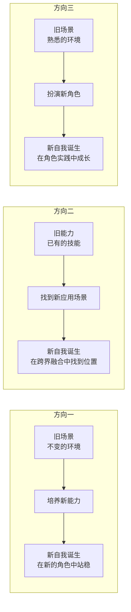
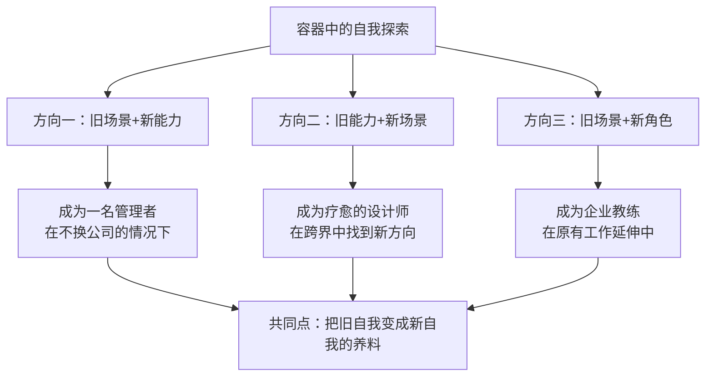

# 第09课：培育——如何在容器中探索自我

上节课讲了，所谓的容器就是为自己创造一个空间——也许是一段时间，也许是一段关系。在这个空间里，你能允许新旧自我的共存，来培育新自我。也许你要问了：我已经给了自己一段时间，可是怎么做探索呢？怎么培育新自我？

容器背后有一个理念：**新自我的成长，都有它自己的阶段和规律**。如果你正在犹豫要不要辞职、要不要转行、要不要离开一段关系，不要把这种犹豫看作你无法做决定，而要看作你决定的时机还不成熟。因为新的自我是逐渐长成的，你还需要一些重要的经验被创造出来，需要一个可以做决定的依据、一个契机。

在容器中探索新自我，典型的探索方向有三种。

## 方向一：在旧场景中培育新能力

我有一个读者在互联网大厂工作，在原来的部门做得不错，可被老板派去做新业务并开始带团队。业务不熟，又没有带团队的经验，他焦虑到想要辞职。幸亏老板让他休养了一段时间，告诉他这是很多新人管理者都会遇到的问题。于是他给了自己半年时间为容器——如果半年后还没有起色就辞职。

这半年里，老板给了他很多指点，他沉下心来学习带团队，终于慢慢站稳了脚跟。现在他已经习惯了作为管理者的新自我。

这个读者的转变，是从一个员工变成了一个管理者，但他面对的场景并没有变——仍然是他的公司。他的容器就是在**旧场景中培育新能力**，而这个新能力变成了新自我的核心。

所以每当有人问我要不要换工作时，我总是会问：你到底是不喜欢这份工作（它与你的自我有核心冲突），还是缺少能力去胜任它？如果是缺少能力，那就通过培养一种新能力来完成转变。

## 方向二：旧能力的新应用

有时候你想要的新自我和旧自我之间并没有完全的联系，这时就需要你发挥想象力，如何拓展自己原有的能力，让它变成新自我的资源。

我认识一个建筑师，很喜欢心理学，一直希望转型做心理咨询师。我问他为什么，他说："我被心理学疗愈过，所以我也希望能够去疗愈人。"

我说："如果当心理咨询师，你需要很多训练，这条路太长了。可是如果你想要的是疗愈，那你现在就能做一些事。你是学设计的，设计本身就可以产生很多疗愈的作品。"

他真的去做了。他把疗愈自己的某些经验变成设计的理念，做了很多室内的小摆件。这些有心理学意味的小摆件受到了很多人的欢迎，他也因此找到了一个新的自我。

设计是他的旧能力，现在他在心理疗愈的领域找到了新的应用。而这个新的应用，帮助他探索了新自我。

> [!TIP] Key Insight
> 如何找到旧能力的新应用？有一个诀窍：把你的能力用一种很抽象的方法说出来。越是抽象的东西，它的迁移性越大，可能性也越广。比如：如果你是一个HR，你可以把HR抽象成"跟人打交道的工作"，那你的能力就可以迁移到很多跟人打交道的工作上。如果你是一个设计师，你可以说"我的工作是通过作品与人对话"，那任何你想表达的东西都可以用于这种对话。

## 方向三：在旧场景中扮演新角色

我们能够用于新自我探索的资源不只是旧自我的能力，也有我们所熟悉的场景。如果在熟悉的场景中能安排一个新的角色，让这个角色更靠近新的自我，那这个新角色本身也就变成了一个可靠的容器。

我有一个朋友，多年来一直负责训练营课程的开发。他去参加一个教练工作坊，发现自己真正想要的是去帮助人。他想做企业教练，这和做课程设计是完全不一样的工作。

怎么办呢？他每次在设计课程的时候，给自己安排一个类似教练的角色，来练习教练技术，也能深入了解学员的问题。最开始大家对这个角色有疑问，但因为他是课程设计者，他在课程逻辑上尽量让这个角色显得合理。慢慢地大家接受了这个新角色，时间久了，甚至有学员在课程以外也来找他咨询。

他的做法就是把旧场景当做一个容器，在旧场景中扮演一个新的角色，慢慢把新的自我孕育出来。

## 三个方向的共同点

转变的方向不只这三种，还有其他很多可能性。但你会发现这三个方向的共同点：**把旧自我变成新自我的养料**——把你旧自我中有用的、你欣赏的、你也想保留的那部分自我，嫁接到新自我中来，变成一个可能的探索方向。

如果容器孕育的新自我成熟了，会发生什么？什么时候我们该做出重要的决定？下节课我们就进入转变的第四站——**契机**。

---

> [!QUESTION] 自我检查
> 1. 你目前正在培育的新自我是什么？它更适合哪个探索方向？
> 2. 你当前的旧场景或旧能力中，有哪些可以被嫁接到新自我中去？
> 3. 试着把你的一项核心能力用抽象的语言说出来，然后思考它还能在哪些新的场景中应用？

参考答案

1. 新自我不必是"完全不同的自己"。很多时候，转变是在旧自我的基础上增加新的维度——比如一个工程师学习与人沟通，一个会计学习创意表达。找到旧自我和新自我之间的连接点，会让转变容易很多。
2. 旧自我中那些你"不想放弃"的部分，往往就是最好的嫁接点。比如你想要更自由，但也不想失去现在的专业积累——那就可以在现有专业领域内寻找"自由"的表达方式。
3. 抽象化是一种强大的思维工具。比如"会计"="跟数字打交道+发现问题"="数据侦探"，这个新身份可以用于数据分析、审计咨询甚至数据新闻。当你用新的语言定义自己的旧能力时，新的可能性就打开了。

---

继续学习：[[0010-qi-ji|第10课：契机——决定的时刻何时到来]] | [[reference/glossary|核心术语表]]