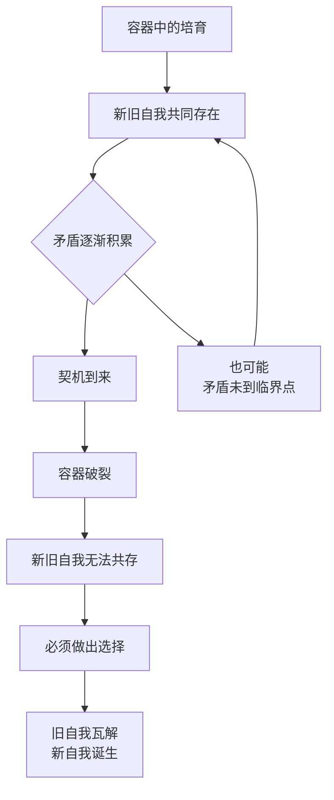
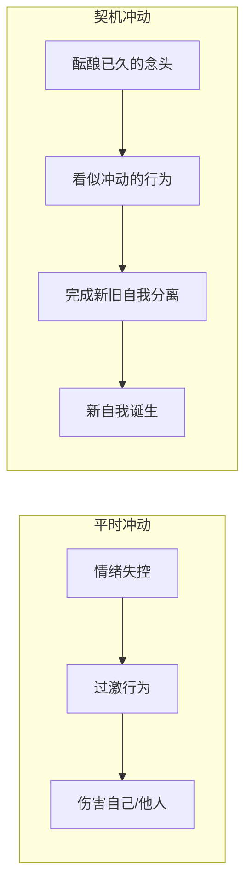

# 第10课：契机——决定的时刻何时到来

上一站我们讲了容器。当新自我还不够成熟时，我们通过一个新旧自我共存的容器来培育新自我。可是总有一天你会面临这样的时刻：**容器破裂了，新旧自我再也无法共存**，你需要做出自己的选择。

这些决定性的时刻，常常伴随着一些偶然事件，逼迫你做出决定——这就是转变的第四个环节：**契机**。

## 什么是契机

我们容易以为转变是在容器里探索，然后按计划按部就班地完成新旧自我的分离。可事实上只有很少的情况是这样。大部分时候，转变是由一件事忽然发生——无论这件事是来自外界的变化，还是来自你的选择——它让矛盾开始加剧，让新旧自我再也无法共存。

它像什么呢？它像古人在做重要事情之前会做的一个仪式：把碗里的酒一饮而尽，然后把碗摔得粉碎。这个仪式代表的是一种决心，也是一种冲动。它更像一种隐喻：摔碎的酒杯再也不能复原，从此以后，我的生活也再也回不去了。

契机的到来，就是我们摔碎了生活的酒杯，并有一个瞬间明白了自己是谁。

## 契机的三个特征

### 特征一：以加剧矛盾的方式出现

日常生活中我们做事情的逻辑是：发现问题、解决问题；关系受损了就去修补，矛盾发生了就去化解——我们尽一切可能让事情不要变得不可收拾。但契机完全不同，它是通过把一个小问题变成一个大问题，把一件小事变成一场大冲突，让一切变得不可收拾，来完成新旧自我的分离。

还记得前面讲保护性价值观时那个学员的故事吗？她嫁入一个不错的家庭，但公婆控制欲很强。以往她都是隐忍，用隐忍维持着家庭平衡。直到有一次，她因为一件小事跟公婆发生矛盾，这一次她就是不肯像以前那样道歉，直到事情失控。

我问她："最后一次跟你公婆吵架的小事究竟是什么？"她说："我完全不记得了，我只记得那时候的委屈。"

那件根本记不起来的小事，成了她转变的契机，成了她人生的分水岭。这不是偶然。在很多人的转变中，都有那么一点"借题发挥"。有时候他们所坚持的事情之小，与所引发的后果之大形成了鲜明对比。

> [!WARNING]
> 如果你知道他们所坚持的绝不是表面上的那件小事，而是小事背后那个已经酝酿了很久的新自我，你就不会对这样的现象感到惊讶。

### 特征二：非理性的冲动

我有一个设计师朋友，在小公司工作。每次做设计，老板总会提意见，哪怕跟他的审美不符，他也总是听从。可有一次设计稿讨论会上，老板又提意见，他却坚持不肯改动一个很小的细节。最后老板说："如果你坚持不听，那你就别在这干了。"他当场说："好，那我辞职。"

很多人以为这个朋友是不是早就想好了要辞职才借题发挥，其实不是。在这件事发生的前一天，他还在想下个月的工作计划，想着年终奖去哪里玩。这件事的发生，对他自己也是一个很新奇的经验。

很多人以为转变是一个按部就班的过程——设置容器去探索新自我，时机成熟时理性做出选择。但真实的转变常常不是这样。

契机中的冲动和我们平时说的冲动不同。平时说的冲动，常常是因为控制不了情绪做出了过激行为。但契机中的冲动伴随着新旧自我的更替，它提供了推动新旧自我分离的力量。

### 特征三：偶然中的必然

契机看起来像是偶然和意外，但它的背后却是新旧自我矛盾所推动的**必然**。

用生孩子做比喻：十月怀胎，我们都知道某个时刻孩子会生下来，这是一种必然。可是当孩子诞生的时候，其剧烈的混乱程度仍然让它看起来像个偶然。新自我的诞生也是这样的。

也因为契机看起来像偶然和意外，当它发生的时候你会觉得恐慌。契机把你带到一个新的陌生的世界，你并不知道要面对什么，却发现自己已经跨越了这个门槛，再也不能回头。

我们总以为自我的转变是水到渠成后理性选择的结果，也误以为当契机来临的时候新自我已经足够成熟了，成熟到可以独自去面对世界了。其实你永远不会准备好。一个婴儿诞生成为独立的个体，他准备好了吗？他只是准备好了脱离母体，但对于新世界，他仍然只是一个婴儿。

如果明白了这个过程，你就会知道那些发生在你生活中的契机——无论多么激烈和意外——都不是偶然。

> [!TIP] Key Insight
> 契机不是我们主动选择的结果，而是新旧自我矛盾积累到临界点后的必然爆发。它在理性之外，在计划之外，却恰恰在规律之中。

---

> [!QUESTION] 自我检查
> 1. 你过去的生活中，有没有经历过类似"契机"的时刻？那件看似偶然的小事后来改变了什么？
> 2. 你当前的生活中，有没有一些"酝酿了很久的念头"，只是还没有足够的冲动去实现它？
> 3. 如果从"偶然中的必然"的角度来看待你经历过的某个重大转折，你能看到什么规律？

参考答案

1. 回想那些"一念之差"就改变人生轨迹的时刻——一次脱口而出的离职、一次没忍住说出的真话、一次偶然的相遇。那些看似偶然的时刻，背后往往有漫长的心理准备期。
2. 如果你有一个念头反复出现，却总被理性压制，它可以被理解为一个"即将到来的契机"在酝酿。你不一定要等它爆发，但你可以尊重它的存在，提前为它做一些心理和实际的准备。
3. 用"必然"的视角看过去，你会发现：原来那次"冲动辞职"不是因为一时气愤，而是因为委屈已经积累了太久；原来那次"突然分手"不是因为一时赌气，而是因为关系早已名存实亡。偶然是表象，必然是规律。

---

继续学习：[[0011-qi-ji-yi-yi|第11课：契机的意义——如何利用它发现自我]] | [[reference/glossary|核心术语表]]