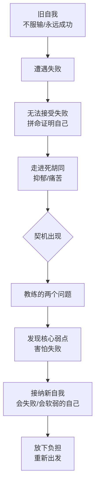
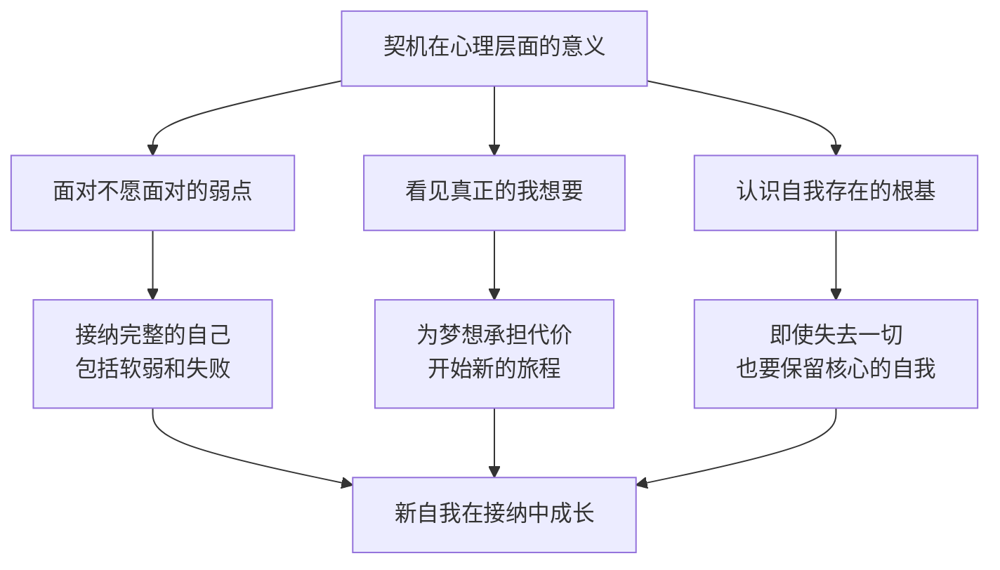

# 第11课：契机的意义——如何利用它发现自我

上节课讲了契机的三个特征。其实契机同时发生在现实层面和心理层面。在现实层面，契机是一件偶然发生的事情，帮助我们完成新旧自我的脱离。在心理层面，契机有另一个重要的含义——它是一个启发，帮你发现新的自我。

正如阿根廷文豪博尔赫斯所说："任何命运无论多么漫长复杂，实际上只反映于一个瞬间，那就是它大彻大悟自己究竟是谁的瞬间。"契机就是这样一个瞬间。

如果日常是漫长无边的黑夜，那契机就像划过夜空的一道闪电。借着这道闪电，你看见了你自己。

## 契机让我们面对自己的弱点

为什么我们平时看不见自我，非要借着偶然和冲动？因为契机让我们面对那些我们不愿意面对的东西——有时候是我们自身不愿意面对的弱点。这个弱点常常是旧自我重要的组成部分，我们甚至是借着这个弱点获得过成功，所以我们不想改变它。

吴士宏老师的故事就是一个例证。她是前微软中国区总经理，连续两年被《财富》杂志评为全球50位最具影响力商业女性。后来她从大众视野里消失了，再次知道她是因为她的书《越过山丘》——她陷入重度抑郁，又通过教练技术把自己拽出低谷。

从微软离开后，她去国企做了职业经理人，遭遇互联网泡沫破灭，创业失败欠下巨款。那段经历让她陷入长期抑郁，甚至想过用死亡解脱。直到一次偶然机会，她误入一个教练技术的课堂。

教练问了她两个问题：
1. 你取得今天的成就，内心最重要的因素是什么？
2. 你觉得可能阻碍你最大程度发挥潜力的自身因素会是什么？

这两个问题击中了吴老师的内心。她一个人在房间里思考良久，答案慢慢浮现——她一直以来的障碍是**害怕失败**。

## 契机让我们看见真正的"我想要"

有时候契机会帮我们发现内心真正的"我想要"。追求这个"我想要"会付出巨大艰辛和代价，所以我们一直不愿意看到它。知道自己的梦想有时候是一种折磨——因为你在现实中会担惊受怕，会承担很多焦虑和不确定。可它同时给你一种意义，一种值得努力投入的生活。

我有一个朋友，在国外的名校读心理学时就想要学心理咨询，但因为各种原因读了认知神经科学。他劝说自己"既来之则安之"，顺利毕业后回国到互联网大厂工作。

刚开始他告诉自己："无论如何，我要干满两年再考虑其他。"可是慢慢地，身体出现信号——他变得很焦虑，每次上班前都要给自己鼓很长时间的劲。那个遥远的梦想变得越来越强烈。

契机来了。他所在的公司发生了很大的变动，他努力的项目忽然被裁撤。在那一刻他忽然想通了："无论我选择坚持还是离职，都不能说明我是一个什么样的人。我不用坚持在这里痛苦工作来证明自己是一个不怕困难的好人。"

想通了这一点，他想起自己当初为什么要学心理咨询——就是想成为一个助人者。他一直想向自己证明那个遥远的梦想是对现实工作的逃避，其实并不是。那是他一直努力想做的事情，从他上大学甚至更遥远的童年就开始了。

> [!TIP] Key Insight
> 为什么最开始看不到这个梦想？因为这个梦想意味着和常规生活的脱离，意味着一系列麻烦和不确定。而契机把它从潜意识深处拉到了意识层面——让你再也无法假装看不见它。

## 契机让我们面对自我存在的根基

有时候契机会帮我们去面对最艰难的选择，帮我们看到"我之所以存在"的根基。为了保留这个根基，我们需要舍弃一些重要的东西。很多时候为了避免这种舍弃的痛苦，我们不愿意去看到这个"我"。

婚姻的破裂是最艰难的转变。我曾经接待过一个离婚的妈妈，从结婚第一天她就觉得自己的婚姻是个错误，一直觉得很孤独。周围的人都劝她："你已经不再年轻了，不要再折腾。"连她自己也开始怀疑自己的感觉。

她有女儿，一想到女儿会因为自己的决定失去完整的家，她就心如刀绞。她没法做这个决定，直到整个人渐渐失去了生气。去医院检查，医生说她有严重的抑郁症——这个抑郁症成了转变的契机。

她凭着仅有的力气搬出了家门。我跟她说："好像如果你要承担起作为妈妈的责任，你就必须否定你自己的感觉。"她说："不是否定我的感觉，而是否定我作为整个人的存在。如果是这样，我整个人就不在了。"

她说："我几乎是用生命做这个决定。我跟自己说：既然没有人来爱你，那就让你自己来爱你自己。既然没有人理解你，从今以后，就让你自己来理解你自己。"

我被她的话深深震撼。我说："你得先有你自己，才有这个家，才有责任。如果连你自己都不存在了，那哪来的家呢？"

契机之所以重要，就是因为它让我们不得不去面对那些我们一直在回避的东西。无论是弱点、梦想还是存在的根基，契机都像一道闪电，照亮了它们。借着这道光，我们看见了自己——那个一直存在却一直被忽略的自己。

---

> [!QUESTION] 自我检查
> 1. 你的生活中是否有一个"不愿意面对的弱点"？契机会不会帮你面对它？
> 2. 你内心深处的"真正想要"是什么？如果承认它，你会面临哪些代价？
> 3. 假设失去了所有外在的东西——工作、关系、身份——那个仍然存在的"自我"是什么？

参考答案

1. 那个弱点往往是你最大的优势的背面——比如勤奋变成了过度劳累、坚强变成了不会示弱、独立变成了难以合作。契机不是要你否定这个弱点，而是要你看到它，从而超越它。
2. 承认"真正想要"的代价可能是：需要打破现有的稳定、面对周围人的不理解、承担经济上的不确定。但正如吴士宏老师所经历的一样，承认本身就是一种解放。
3. 这是一个触及灵魂的问题。失去一切外在标签后剩下的那个"自我"，就是你最核心的自我。它往往不是一个"什么"，而是一个"方向"——比如"我想要成长"、"我想要连接"、"我想要创造"。这个方向就是你重建生活的起点。

---

继续学习：[[0012-qi-ji-ling-yi-mian|第12课：契机的另一面——不做选择也是选择]] | [[reference/glossary|核心术语表]]