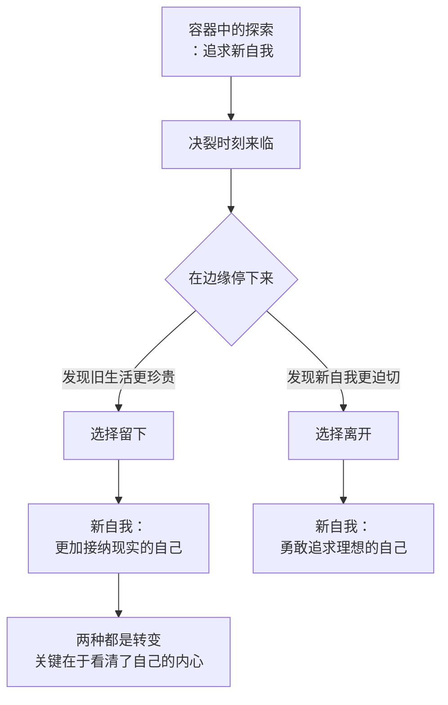

# 第12课：契机的另一面——不做选择也是选择

前两节课讲了契机的两种意义：在现实层面帮你完成新旧自我的脱离，在心理层面帮你发现新的自我。也许你要问：前面所讲的契机似乎都以脱离作为最终结果，有没有哪种契机会让我们放弃幻想、更加接纳现实呢？

有的。今天这节课就来讲讲这种契机。

## 在决裂边缘明白自己真正想要什么

新旧自我的矛盾冲突中，如果有这样一件事能够让你发现原来的生活是比所谓的远方更好的选择，这同样是一种转变。这种转变虽然没有帮你从旧环境和旧关系中脱离，但能帮你从矛盾冲突和内耗中脱离，帮你发展出一个更加接纳现实的新自我。

我有一个朋友在互联网大厂工作，是公司元老，创造了足够财富，多少有些厌倦了。他很想尝试新生活——喜欢农业，想做一个有机农场。这是他为自己设计的容器。他为此考察了场地，找了专家咨询，忙了很长时间。

直到最后要做决定的那一刻，他在公司系统里提交辞职申请。最后一步，网页弹出一个醒目的弹窗，提醒他这是一件郑重的事，一旦提交无法撤回。这时候他忽然发现没有勇气去点那个"是"的按钮。

他一个人到园区走了一下午。这个园区是从他工作开始从无到有建立起来的，他熟悉其中的一草一木。他不停地问自己：我真的要离开这个我奋斗过的地方吗？一直走到天黑，园区的灯亮起来。他回到办公室，默默关闭了那个申请离职的窗口。

现在这件事已经过去好多年了，他还在那里工作。回顾时他说："现在我不想离职的事了。离开的那一刻我才发现，这个工作对我意味着那么多。"



每次有人告诉我"我离职了"，我会恭喜他——恭喜他有新的未来。如果有人告诉我"我决定不离职了"，我也会恭喜他——恭喜他看清了自己的内心。

## 不做选择也是一种选择

曾经有一位女士问我："我跟先生过得并不好，生活索然无味，像两个人搭伙过日子。可是我们有孩子，想要靠近很难，想要分开也很难。不知道该怎么选择。"

我问："你们有尝试改善关系吗？"
她说："尝试过，没有效果，现在已经不想做这种努力了。"
我又问："那你们现在有特别要分开的理由吗？"
她想了想说："好像也没有。这样的日子也还是能过的。"
我说："那不如先这样过吧。不做选择也是一种选择。等分开的契机到来，再看看会发生什么。"

为什么我说不做选择也是一种选择？有时候它像一种警醒——告诉你如果不及时转变，事情会沿着现在的轨迹发展到无可挽回的地步。可有时候它也是一句智慧的提醒——选择不是凭空产生的，很多时候人并没有足够的力量为自己做艰难的选择。选择需要契机，需要积累足够的痛苦和冲动。既然选择这么难，现在又不是最佳时机，那干脆就先不做选择，享受当下，顺其自然。

> [!WARNING]
> 接纳现实也可以是一种好的转变。不做选择也是一种选择。我们不需要强迫自己转变——能在稳定有序的环境中生活，是一种幸运。

## 两种不同的自我观

选择与不选择背后，其实是两种不同的自我观。

**第一种自我观**：不同的自我之间是相互替代的。当契机来临，你就不得不在新旧自我之间做选择。

**第二种自我观**：不同的自我之间不是相互替代的，而是相互补充和拓展的——也就是我们前面讲的容器。就像现在流行的"斜杠青年"，你没有做选择，而是拓展和增加了一个新的自我。你在不同的场景中表现不同的自我，用不同的自我应对不同的难题，用不同的关系满足不同的自我。

```mermaid
graph TD
    subgraph TD
    A[两种自我观] --> B[替代型：<br/>选择=放弃一个]
    A --> C[补充型：<br/>选择=增加一个]
    B --> D[自我在放弃中净化<br/>非此即彼]
    C --> E[自我在积累中丰富<br/>兼容并包]
    D --> F[适合：<br/>矛盾不可调和时]
    E --> G[适合：<br/>矛盾可以管理时]
```

## 一个思想实验

如何才能靠近那个决裂的时刻来明白自己真正想要的是什么？

给你推荐一个思想实验：**想象有两个不同的"我"，代表着你的两个不同选择。它们下面各有一个按钮，一旦你按下这个按钮，它所代表的自我就会消失。你会按哪个按钮？**

如果你选择保留原来的我，就告诉自己：也许时机还没有到，不如先享受当下，等有事情发生再说。

如果你决绝地选择了新的自我，那就恭喜你——你完成了新旧自我的脱离，将要走上一条更难的道路。它不会马上有收获，因为你首先面临的是失去的痛苦。

做完这个思想实验后——无论结果是什么——你都已经对自己有了更深的了解。

> [!TIP] Key Insight
> 选择不是凭空产生的。很多时候，人并没有足够的力量为自己做艰难的选择。选择需要契机，需要积累足够的痛苦和冲动。如果现在不是选择的最佳时机，那就不选。顺其自然也是一种选择。

---

> [!QUESTION] 自我检查
> 1. 你目前是否面临一个"不知道该不该选"的困境？试试那个"按下按钮"的思想实验。
> 2. 你内心更倾向于"替代型"还是"补充型"的自我观？这会如何影响你的选择？
> 3. 如果"不做选择"本身就是一个选择，目前在你不做选择的背后，你在等待什么？

<details>
<summary>参考答案</summary>

1. 思想实验的价值在于绕开理性的利弊分析，直接触达你的情感偏好。如果你无论如何也按不下某个按钮，那就说明那个自我对你来说是不可舍弃的——即使你没有选择它。
2. 这两种自我观没有对错之分。替代型适合矛盾不可调和的时候，补充型适合矛盾尚可管理的时候。关键在于你能否诚实地评估自己的处境。
3. 等待"不做选择"背后的东西——可能是一个更明确的契机出现，可能是新自我更加成熟，也可能是外部条件发生变化。等待不是被动，而是在为未来的选择积蓄力量。只要你在等待时没有完全放弃自我探索，这个等待就是有价值的。
</details>

---

继续学习：[[0013-hai-xian-wen-da-zhe-teng|第13课：海贤问答——折腾或者躺平]] | [[reference/glossary|核心术语表]]