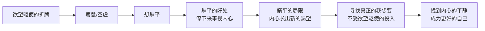

# 第13课：海贤问答——折腾或者躺平

我们已经完成了自我转变第一阶段的学习，走过四站：我想要、做出选择、容器和契机。不过，不是每一个想要转变的人都会顺利走过这四站。这里面会有很多纠结和犹豫。这一讲来回应一些比较有共性的问题。

## 问题一：折腾与躺平的纠结

**学员问：** "现实中有更多的是欲望在控制着自己，啥都想要，所以总是折腾。但内心却很想躺平，躺平了就觉得非常安逸。我纠结于折腾与安逸，到底该选哪一个？"

**海贤回答：**

当我们知道某个东西我们不想要的时候，常常会自然地以为它的反面就是我们想要的东西。但其实未必，答案是在别处。

同样的，虽然你说内心很想躺平，但我觉得**躺平并不是你真正想要的**。你真正想要的是不受欲望控制的"折腾"。

有欲望驱使的工作是让人厌烦的，因为欲望总是不会满足，它会不断给我们带来新的问题，让我们内心没有办法平静。于是我们就想，是不是躺平就会好一点？

躺平好在哪里？好在它会让你从欲望和利益驱使的外部活动中停下来，拒绝成为欲望的提线木偶，重新来审视自己的内心。但是如果你能挨过躺平的失落，慢慢你就会想：这些东西是我真的想要的吗？它能给我带来持久的快乐吗？为它付出这么大的代价值得吗？

可是为什么说躺平只是好了那么一点？因为躺平久了，你的内心就会空虚，内心里会慢慢长出一个新的东西想要实现。这回不再是欲望，而是人与生俱来的、根植于内心的潜能。这时候你心里会想：**如果欲望下的折腾不是我想要的，那什么是我想要的？**

当你这么问的时候，你就会发现这个问题不是躺平所能回答的。它会让你走出安逸，重新起身去寻找——寻找能够让你投入的工作、让你受益的关系、让你能够寄托其中的意义感和价值感。



## 问题二：离婚家庭中孩子的自我迷失

**学员问：** "孩子因为我们离婚的事受到影响，他六年级了，现在怎么讨好父母、察言观色，反而把学习放到了次要的位置。我看到了孩子没有找到自我，被关系裹挟。我不知道怎么教育他，不希望他像我一样长大再后悔。"

**海贤回答：**

我知道你在讲什么。在课程里我们曾说，人为什么会没有自我？因为一段不安全的关系很难让他们长出自我。对于孩子来说，父母是头等大事，他们过得不好会一直牵动孩子的情感。他们会关心父母多过关心自己，想要维护这个家而不是发展他们自己。

这些孩子会以各种方式嵌入一段不愉快的关系里：如果讨好管用，他们就会讨好；如果逃避管用，他们就会逃避；如果把自己变成一个病孩子管用，他们就会生病。

如果你知道孩子现在的状况是对父母关系的反应，你就会知道：**如果只是教育他、告诉他要做这做那是没有用的。** 你们需要建立一种新的关系来影响他。

几条建议供参考：

**第一**，和孩子的爸爸划清教育的界限。和他商量哪些地方他来负责、哪些你来负责。在他负责的地方，哪怕你再觉得他做得不对，也要把眼睛闭上。清晰的界限才能帮助孩子从你们的纠纷中解脱出来。

**第二**，不要一直盯着孩子。孩子是不能细看的，细看一定有各种毛病。给他一些空间，让他自己来调整自己，让他的同伴来影响他。

**第三**，你也要让自己充实起来。你是孩子的容器，孩子的心情一定会受到你的影响。让你自己快乐起来，去寻找你自己的出路，这也是给孩子最大的帮助。

> [!TIP] Key Insight
> 离婚本身是一个很大的转变。你们选择离婚，一定是因为相比原来这会是更好的选择。那就努力去把生活过好，去寻找新的自我。这样孩子也会逐渐接受父母分开的事实，去寻找他自己。

## 问题三：保护性价值观的冲突

**学员问：** "我不能接受婚姻中的背叛和谎言。可是我有一个孩子，跟爸爸的感情也很好。每当看到他们无忧无虑的亲子时光，我就很失落。我不知道我的保护性价值观到底是什么。我原来以为忠诚是我始终如一的坚持，可是如今我竟然在是否离婚中挣扎。"

**海贤回答：**

你所遇到的很痛苦，会让你陷入两难的选择。如果要说保护性价值观：不能接受背叛是保护性价值观，想要给孩子一个完整的家也是保护性价值观。

我没有具体建议给你，但可以给你一些思考的方向。

婚姻中的背叛是很大的创伤，却不一定要离婚。要看这是什么样情况下的背叛：你们的感情基础还好吗？他想回家吗？你们有修复的意愿吗？如果有，无论多难，还是值得试试。这个委屈不代表你背叛了自己，而代表你对这份感情有多珍惜——珍惜到大过了你的伤痛和委屈。

如果你们不爱了，他也不想回家了，那你就没有办法在"要不要离婚"之间做选择——**你没有选择，你只能在面对现实和不面对现实之间做选择**。这时候保护性价值观才会起作用，它会让你勇敢地面对现实。

如果是这种情况，孩子一定是痛苦的。你不想让他失去一个完整的家，可是他已经失去了完整的家——不是从你们离婚开始，而是从你们不爱了开始。不爱了，这个家就已经名存实亡了。

所以你要诚实地问自己：我和他还有爱吗？还有修复的可能吗？如果还有爱，就尽最大的努力。这样就算有一天你们真的分开了，你也可以说：我尽力了。

```mermaid
flowchart TD
    A[婚姻中的背叛] --> B{感情还在吗<br/>有修复意愿吗}
    B -->|是| C[努力修复<br/>珍惜大过伤痛]
    B -->|否| D[没有选择<br/>只能面对现实]
    C --> E[原谅/道歉/靠近<br/>寻求专业帮助]
    D --> F[保护性价值观启动<br/>勇敢面对]
    E --> G[无论结果如何<br/>"我尽力了"]
    F --> G
```

## 问题四：契机的冲动与后悔

**学员问：** "契机发生以后，如果是非常猛烈的、不理智的，会不会有做了选择之后的后悔？那不就是冲动了吗？是不是不管哪一种，最后都会让人后悔？"

**海贤回答：**

这个问题在契机的课程里已经有所回答。区分冲动和契机的关键是：那些让我们后悔的冲动，最好给它加一个定语——叫**意识冲动**，意思是它是因为控制不了自己的情绪，做了伤害自己和别人的事情。

但契机不同。契机不是意识的，它常常是长久的新旧自我更替——是一个你已经酝酿了很久的念头，一直没有勇气和当前决裂，所以才借着这个冲动完成了新旧自我的分离。

至于后不后悔——很多人会失落，但不一定会后悔。失落是对失去的反应，后悔是觉得自己做错了事。如果你的新旧自我更替已经酝酿了很长时间，你并不会觉得自己做错了事。

当然，会不会后悔还取决于未来要怎么创造。既然契机已经来了，有了新的开始，就要努力去创造新的自我，不让自己后悔。否则的话，就算后悔也不代表这个契机不该发生，而只代表我们沉溺于过去、无法跟过去告别——而这正是课程下一阶段要讲的内容：**如何告别旧自我**。

> [!WARNING]
> 契机不是冲动。冲动的背后是失控的情绪，契机的背后是酝酿已久的自我更迭。如果你发现自己做了选择后是"失落"而不是"后悔"，那很可能就是契机而非冲动。

---

> [!QUESTION] 自我检查
> 1. 你的"折腾"背后是什么——是欲望驱使，还是真正的"我想要"？
> 2. 如果你正处于一段亲密关系的困境中，你能诚实地回答"还有爱吗"这个问题吗？
> 3. 回顾你过去做的重大选择，哪些是"冲动"，哪些是"契机"？区别是什么？

<details>
<summary>参考答案</summary>

1. 欲望驱使的折腾停下来后会让人想躺平，而真正"我想要"的投入即使辛苦也会让人感到充实和意义。二者的区别在于：你是被外在目标驱动，还是被内心热情引领。
2. 诚实回答这个问题很难，因为你可能有太多顾虑——孩子、家庭、社会的眼光。但只有诚实面对这个问题，你才能做出真正属于自己的选择。如果答案模糊，不妨多给自己一些时间去感受。
3. "冲动"带来的是事后懊悔（"我怎么会那样做"），而"契机"带来的是"终于发生了"的解脱感——哪怕伴随失落，你也不会觉得那个选择是错误的。这个区别可以帮助你在未来识别真正的契机。
</details>

---

继续学习：[[0001-yuan-qi-wo-xiang-yao|返回第01课：缘起]] | [[reference/glossary|核心术语表]]