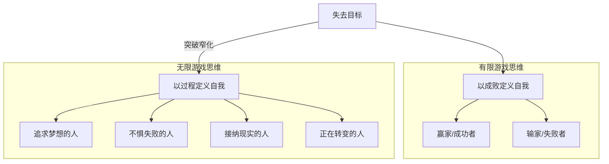

# 第14课：思维窄化——如何告别旧的目标

转变的第二阶段"脱离旧自我"，核心议题是**如何处理失去**。当你终于响应内心的召唤、离开旧系统，迎来的不是新生活的喜悦，而是失去的痛苦——失去了旧的目标、旧的身份、旧的关系。就像装修一所房子，必须先把旧家具腾空，才能让新家具搬进来。告别旧自我，正是为新自我的诞生腾出空间。

这节课从告别**旧的目标**开始。

## 目标是尚未兑现的自我

目标是自我很重要的一部分。它不仅是你要达到的一个状态，更是一种**定义自我的方式**——它是尚未兑现的自我，是你组织生活的方式，也是你意义感的来源。它连接着你过去的经验，也寄托着你对未来的期望。

当你失去一个目标时，你失去的是一个**定义自己的机会**。

我有一个朋友，曾经是一个很风光的创业者。他全力以赴做了一家公司，后来因为各种原因失败了。之后他环球旅行、拜访朋友、参加各种活动，过着很多人退休后梦想的自由生活。可是他并不快乐。他唯一感觉快乐一点的时刻，是参加创业者的局——跟人交流创业经验。在那些局里，他还是创业者的一员。可局散了，他就发现自己不是了。

那次创业失败对他意味着什么？不是钱，甚至不是世俗意义的成败。而是他失去了一个成为他想成为的那个人的机会。从此以后，他要跟这个目标背后的自我正式告别，去别的地方重新寻找"我是谁"。

## 思维窄化：目标戴上的"眼罩"

重要的目标会塑造你，让你为适应追求这个目标而活。你的生活根据一个又一个重要目标组织起来。一旦失去这个目标，自我就"散"了——你需要重新找一个目标，把自我重新拼凑起来。

这就像赛马场上的赛马。为了让赛马跑得更快，赛马会戴上一种特别的眼罩，遮住旁边的视线，只盯着眼前的赛道，心无旁骛。

眼罩的优点是聚焦，缺点也是聚焦。当你为一个目标努力时，你也给自己戴上了这样的眼罩——你通过它来看什么是成功、什么是失败、什么是顺利、什么是不顺。当你失去这个目标时，就像比赛结束的赛马，你仍然习惯地盯着眼前的跑道，不知道该往哪里去，只是觉得自己输掉了比赛。

心理学中这被称为**思维的窄化**——目标太重，重到只能看到跟目标有关的东西，只能想跟目标相关的事情，看不到生活的其余部分。

```mermaid
flowchart LR
    A[设定重要目标] --> B[戴上"眼罩"\n思维窄化]
    B --> C[聚焦目标\n全力以赴]
    C --> D{目标达成？}
    D -->|成功| E[获得定义自我的机会]
    D -->|失败/失去| F[眼罩仍在\n看不到其他可能]
    F --> G[陷入失败感\n失去人生意义]
    G --> H[摘掉眼罩\n突破窄化]
    H --> I[看到更大的世界\n重新定义自我]
```

> [!WARNING]
> 思维窄化的危险在于：当目标失去时，你会觉得整个人生都失去了意义。你很难相信目标以外自己还拥有什么，也很难相信自己有重建生活的能力。

## 从有限游戏到无限游戏

电影《心灵奇旅》（Soul）讲了一个很好的故事。主人公Joe Gardner一心要成为真正的爵士钢琴家，把所有自我都寄托在这个梦想上。当校长告诉他可以转正——有编制、有退休金——他一点也高兴不起来。和梦想相比，现实如此平庸且让人失望。

故事有一个转折：当他终于获得梦寐以求的登台机会，却在演出前夕意外去世。他的灵魂带着不甘偷渡回人间，而重回人间的过程，就是**摘下梦想这个眼罩**的过程。摘掉眼罩后，他发现原来错过了这么多重要的东西：披萨的香味、普通人友好的关系、妈妈的爱。

以前当他过于执着目标时，生活被分成两半——实现目标之前和实现目标之后。实现目标之前，一切都是匮乏的、没有意义的。可这一次他发现，自己原先一直就生活在富足里。这种富足来自生命本身——只要你活着，它就是富足。

哲学家詹姆斯·卡斯在《有限与无限的游戏》中区分了两种游戏：

- **有限游戏**：有明确规则、明确起点和终点。玩家的目标是尽快结束游戏，成为赢家。
- **无限游戏**：没有明确胜负，也没有明确的起点和终点。玩家的目标是**让游戏继续下去**。

有限游戏用目标成败来定义自我——你要么是赢家，要么是输家。而无限游戏的定义方式变了：你是一个**玩游戏的人**。这个自我不会因为短暂的成功或失败而失去。

## 如何突破思维的窄化

应对目标失去最好的方式，就是**更新你对自我的定义**。你不再以"成功者"或"失败者"来定义自己——你知道这种定义是目标带来的思维窄化的产物。现在你要学习用新的方式来定义自己。

你可以是：
- 追求梦想的人
- 不惧失败的人
- 接纳现实的人
- 正在转变中的人

当你摘下思维窄化的眼罩，你会发现你处在一个更广阔的世界。你有更多的可能性，这些可能性等着你去创造新的自我。



> [!TIP] 关键转变
> 从"我是一个失败者"转向"我是一个正在转变的人"。前者是终点，后者是过程。前者让你停滞，后者让你继续前行。

> [!QUESTION] 自我检查
> 你曾经或正在为什么目标而努力？这个目标如何塑造了你的自我定义？如果有一天你失去了这个目标，你会怎么看待这一段追求目标的经历？

<details>
<summary>思考方向</summary>

重要的目标至少从三个方面定义了自我：**身份认同**（我是一个创业者/艺术家/专业人士）、**生活组织方式**（时间、精力、社交圈都围绕目标展开）、**意义感来源**（目标赋予生活方向和价值）。当目标失去时，这三者同时崩塌，所以痛苦是正常的。突破窄化的关键在于：把"失去目标"重新定义为"结束了一个有限游戏"，而不是"人生失败了"。追求目标的经历本身已经塑造了你——它带来的能力、见识、关系，都不会因为目标的失去而消失。这些才是你在无限游戏中积累的"资产"。
</details>

---

继续学习：[[0015-qiu-bu-de-gan|第15课：求不得感——如何应对失去目标的痛苦]] | [[reference/glossary|核心术语表]]